# Personal self-hosting guide


This project describes my personal **self-hosted** infrastructure setup, running on a **mini PC** (**N100** based).

This was meant to be just a reminder for me, but I wrote it as a guide, in case it might help someone.

It uses only **free** and **open source** software.

<picture>
  <source media="(prefers-color-scheme: dark)" srcset="images/logo-open-source-initiative.svg" height="128"/>
  <source media="(prefers-color-scheme: light)" srcset="images/logo-open-source-initiative-black.svg" height="128"/>
  
</picture>

> [!IMPORTANT]
> The content of this repository is provided "as is", with no guarantee that the information is complete or error-free.
> The techniques and tools discussed here come with inherent risks.
> The author takes absolutely no responsibility for possible consequences due to the use of the related software.

# Table of Content

1. [Overview](#overview)
2. [Install and prepare system](#install-and-prepare-system)
3. [Docker & Docker Compose](#docker--docker-compose)
4. [Network configuration](#network-configuration)
5. [Reverse proxy](#reverse-proxy)
6. [VPN and ad-blocking](#vpn-and-ad-blocking)
7. [Test the network](#test-the-network)
8. [Contributing](#contributing)
9. [Acknowledgments](#acknowledgments)
10. [License](#license)

# Overview

## Plan

This project is based on my previous **home lab** setup running on a **Banana pi** board, it contains similar but maybe more up-to-date instructions.
The old project can still be found [here](https://github.com/Yann39/self-hosted).

The goal is still the same : learning, and have an environment :

- **100% self-hosted** (privacy preserving, full control over data and software)
- **Secure** (authentication, SSL/TLS, reverse proxy, firewall, ad blocking, DDOS protection, rate limiting, custom DNS resolver, ...)
- **Lightweight** (runs smoothly with minimal hardware and software requirements)
- **Container-ready** (isolated, portable, scalable applications)
- **Accessible** (some services accessible only locally, some only through VPN, some publicly)
- **Supervised** (monitoring, alerting, tracking, backup tools)

These are the tools we are going to run :

|                                       Logo                                        | Name           | Repository                                     | Description                                          |
|:---------------------------------------------------------------------------------:|----------------|------------------------------------------------|------------------------------------------------------|
|                  | Docker         | https://github.com/docker                      | Help to build, share, and run container applications |
|  | Docker Compose | https://github.com/docker/compose              | Run multi-container applications with Docker         |
|            | Portainer      | https://github.com/portainer/portainer         | Management platform for containerized applications   |
|                | Sablier        | https://github.com/acouvreur/sablier           | Workload scaling on demand                           |
|                | Traefik        | https://github.com/traefik/traefik             | Modern HTTP reverse proxy and load balancer          |
|            | Wireguard      | https://github.com/WireGuard                   | Simple yet fast and modern VPN                       |
|                 | Pi-hole        | https://github.com/pi-hole/pi-hole             | Network-wide ad blocking                             |
|                | Unbound        | https://github.com/NLnetLabs/unbound           | Validating, recursive, and caching DNS resolver      |
|        | Uptime Kuma    | https://github.com/louislam/uptime-kuma        | Easy-to-use self-hosted monitoring tool              |
|                    | Homer          | https://github.com/bastienwirtz/homer          | Static application dashboard                         |
|                | Dashdot        | https://github.com/MauriceNino/dashdot         | Minimal server dashboard and monitoring              |
|                    | Ackee          | https://github.com/electerious/Ackee           | Analytics tool that cares about privacy              |
|                  | Lychee         | https://github.com/LycheeOrg/Lychee            | Free photo-management tool                           |
|          | PhpMyAdmin     | https://github.com/phpmyadmin/phpmyadmin       | Web user interface to manage MySQL databases         |
|                    | Kopia          | https://github.com/kopia/kopia                 | Fast and secure open-source backup/restore tool      |
|      | Stirling       | https://github.com/stirling-tools/stirling-pdf | Web-based PDF manipulation tool                      |

And also some personal applications :

- My first **PHP** / **MySQL** website from the early 2000's ! : https://github.com/Yann39/defrag-life
- A **GraphQL API**  (**Java** / **Spring Boot**) for one of my **Flutter** mobile applications : https://github.com/Yann39/ccteam-graphql

All of this runs on a **Trigkey G4 mini PC** ! With the following specifications :

<table>
  <tr>
    <td>
      
    </td>
    <td>
      <ul>
        <li>Intel Alder Lake N100 12th gen (4Core, up to 3.4 GHz)</li>
        <li>Integrated Intel UHD GPU handling 4K@60Hz</li>
        <li>16GB DDR4 3200MHz</li>
        <li>500GB M.2 NVME SSD</li>
        <li>1 GbE ethernet & Wifi 6</li>
        <li>4 x USB 3.2 Gen2</li>
      </ul>
    </td>
  </tr>
</table>

> [!NOTE]
> This hardware is not designed for high loads,
> I only have a few users on my public applications,
> of course if you need to handle more load you might consider a better machine.

It should also work on many other **x86** based mini PCs.

## Network architecture

Here is a chart representing the global network "architecture" we are going to set up, simplified with only the most relevant services.
See [Network flow](#network-flow) for more detailed schemas.

This architecture allows exposing applications to the internet while restricting access to some of them only through **VPN** or from the local network.
It's up to you to choose the accessibility level you need for each service, you may want some to be accessible only from your local network,
some only via VPN, and others to anyone from the internet.

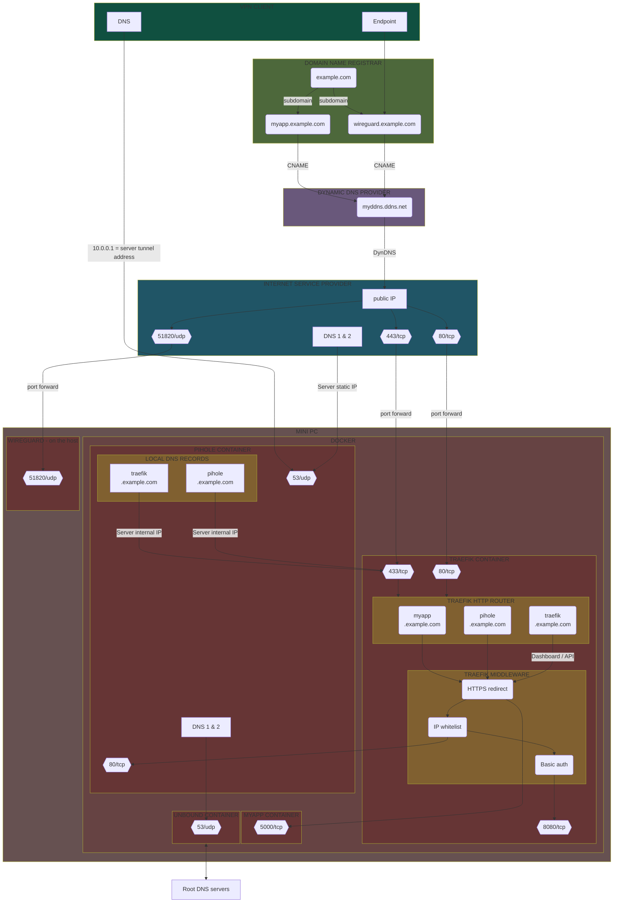

Basically all services will be accessible via dedicated subdomains which will point to our local network, either through **dynamic DNS** or through **local DNS records**,
then a **reverse proxy** will be responsible for routing the requests to the right application running in **Docker** containers.

We make the **ISP upstream DNS** (from **router** configuration) point to the server **IP address**,
so that we reroute the entire Internet traffic through **Pi-hole** and thus take advantage of its benefits.

In this example **Traefik** (_traefik.example.com_) and **Pi-Hole** (_pihole.example.com_) are only accessible
through VPN and from the local network thanks to local DNS records and IP whitelisting,
while **Myapp** (_myapp.example.com_) is also accessible from the internet publicly.

You will find more details on how all this has been implemented later in this guide.

# Install and prepare system


By default, the Mni PC came with **Windows 11**, I simply installed **Debian 12** instead (backup the Windows key before, just in case).

- Download latest **Debian** image for amd64 :
    - _debian-12.5.0-amd64-netinst.iso_
- Download **Rufus** or equivalent software to be able to write the image to a USB key
- Simply select the image in **Rufus** and write it to the USB key with the default proposed options
- Insert the USB key into the mini PC and start it, you may need to access the bios to change the boot device priority, to boot on the USB key
- Then follow the Debian installation instructions, I personally installed the basic system without GUI (no desktop environment)

## User

When installing **Debian**, you should have been asked to create a **regular user account**.
We will simply use that user for the whole guide.

For security reasons, do not use the `root` user directly.
If you run a program as root and a security flaw is exploited, the attacker has access to the whole system without restriction.
Using a regular user, even with sudo enabled, will require running `sudo` and will still prompt for the account password as an additional security step.
It is also safer in case you unintentionally issue a command that could hurt the system (like deleting system files, etc.).

> [!NOTE]
> We may also create specific users inside **Docker containers** for some applications, specially when creating our own **Dockerfile**,
> but we'll clarify then whether additional permissions need to be added in case they need access to the local filesystem through a **bind mount**.

`sudo` is not installed on Debian by default. You have to install it.
So, become root and install sudo :

```shell
su -
apt install sudo
```

Then add user in the sudoers :

```shell
/sbin/adduser username sudo
```

## SSH access

Generally, you'll want to leave your machine in a cool, quiet corner,
rather than letting it land around in your feet and having to connect a keyboard/mouse/screen every time you want to access it.

A solution is simply to access it as a remote computer via **SSH**, from your main computer.

In the normal **Debian** images, SSH is not enabled by default, so you need to install **openssh** server to allow SSH connections :

```shell
apt update
apt install openssh-server
```

Then simply use the `ssh` command from the client machine to establish a secure and authenticated SSH connection to the mini PC (here named `n100`) :

```shell
ssh username@n100
```

Enter your password then you are ready to go !

You can also use your preferred **SSH client**.

Unless you want to be able to do some operations from outside your local network, there is no need to open the SSH port to the internet.
If you do so consider using it behind a VPN (even if SSH itself is very secure).

## Basic tools

We need to install some basic tools we will need later.

Install **vim** (improved **vi**) :

```shell
sudo apt install vim
```

Install **curl** (for transferring data through URLs) :

```shell
sudo apt install curl
```

Install **netstat** (to check network connections) :

```shell
sudo apt install net-tools
```

## Directory structure

We will place every application configuration into the _/opt/apps_ directory, as follows :

 ```
 /
 |- opt
     |- apps
         |- traefik
         |- portainer
         |- phpmyadmin
         |- dashdot
         |- ...
 ```

Usually this directory (_/opt_) is reserved for any software and packages that are not part of the default installation,
but feel free to choose another location.

You can already create the directory :

```shell
sudo mkdir /opt/apps
```

We will create the subdirectories associated with each application when we install them.

# Docker & Docker Compose

<table>
  <tr>
    <td>
      
    </td>
    <td>
      
    </td>
  </tr>
</table>

We will use **Docker** to containerize and run our different applications.

Docker enables to separate applications from the infrastructure, it provides the ability to package and run an application in an isolated environment called a **container**.
Containers contain everything needed to run the application, so you don't need to rely on what's installed on the host.

Docker provides an installation script, just run it :

```shell
curl -fsSL https://get.docker.com -o get-docker.sh
sudo sh get-docker.sh
sudo rm get-docker.sh
sudo docker version
```

> [!NOTE]
> You can use https://get.docker.com/rootless to install it in rootless mode (run the Docker daemon as a non-root user)
> to mitigate potential vulnerabilities in the daemon and the container runtime.

Then also install **Docker-Compose**, so we can define and run multi-container Docker applications :

```shell
sudo apt install docker-compose -y
sudo docker-compose version
```

That's it :

```shell
sudo docker info
```

```console
Client:
Context:    default
Debug Mode: false
Plugins:
buildx: Docker Buildx (Docker Inc.)
Version:  v0.10.4
Path:     /usr/libexec/docker/cli-plugins/docker-buildx
compose: Docker Compose (Docker Inc.)
Version:  v2.17.3
Path:     /usr/libexec/docker/cli-plugins/docker-compose
```

> [!NOTE]
> In this guide I systematically use latest images (`:latest`tag), but usually you better want to avoid using `:latest` tags in production.
> Anyway if you use `latest` tags and want to update an image in the future, simply pull it again and rerun your container / compose file, i.e. :
>
> ```shell
> sudo docker-compose pull
> sudo docker-compose up -d
> ```
>
> Then remove any old images.

# Network configuration

Before installing our services, we need to configure the network, so we can reach our applications from different locations.

The idea is to have :

- A main **domain** name
- A **subdomain** name for each application that must be reachable from the internet
- A **dynamic DNS** name to avoid having to use a **static** public IP address
- A **Traefik** reverse proxy to handle HTTP request that will be port forwarded to the applications

For services that will not be accessible to the internet, we will use **Pi-Hole**’s ability to manage **local DNS records**
(each record will point to server's internal IP address) so that they are also reachable using a subdomain name.

Here is an overview of the route for each case, when a client request _myapp.example.com_ :

:small_blue_diamond: Internet access :

```mermaid
flowchart LR
    style HOSTING_PROVIDER fill: #4d683b
    style DDNS_PROVIDER fill: #69587b
    style INTERNET_SERVICE_PROVIDER fill: #205566
    style TRAEFIK_CONTAINER fill: #663535
    style APPLICATION fill: #663535
    style SERVER_DEVICE fill: #665151
    CLIENT((Client))
    SUBDOMAIN_MYAPP(myapp\n.example.com)
    DDNS(myddns\n.ddns.net)
    ROUTER[public IP]
    ROUTER_PORT{{port}}
    DOCKER_TRAEFIK_PORT{{port}}
    APPLICATION_PORT{{port}}

    subgraph HOSTING_PROVIDER[DOMAIN NAME REGISTRAR]
        SUBDOMAIN_MYAPP
    end

    subgraph DDNS_PROVIDER[DYNAMIC DNS PROVIDER]
        DDNS
    end

    subgraph INTERNET_SERVICE_PROVIDER[INTERNET SERVICE PROVIDER]
        ROUTER
        ROUTER_PORT
    end

    subgraph SERVER_DEVICE[MINI PC]
        subgraph TRAEFIK_CONTAINER[TRAEFIK]
            DOCKER_TRAEFIK_PORT
        end

        subgraph APPLICATION[APPLICATION]
            APPLICATION_PORT
        end
    end

    CLIENT --> SUBDOMAIN_MYAPP
    SUBDOMAIN_MYAPP -->|CNAME| DDNS
    DDNS -->|DynDNS| ROUTER
    ROUTER --> ROUTER_PORT
    ROUTER_PORT -->|port forward| DOCKER_TRAEFIK_PORT
    DOCKER_TRAEFIK_PORT -->|HTTP router| APPLICATION_PORT
```

:small_blue_diamond: VPN access :

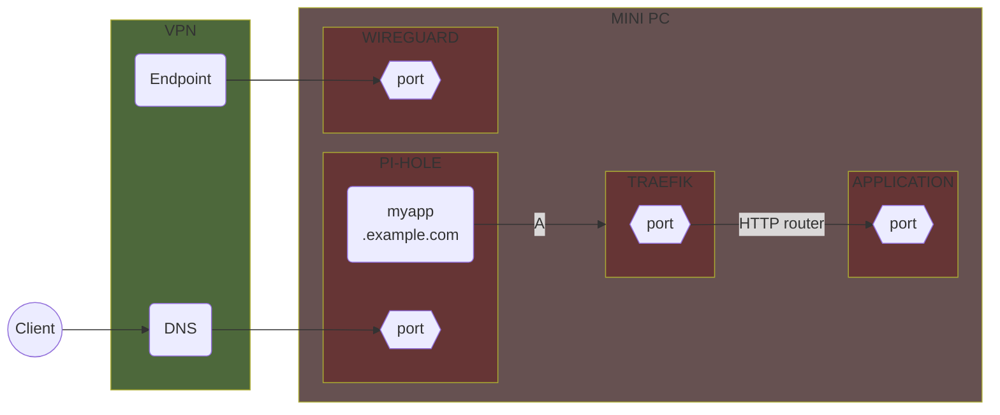

:small_blue_diamond: Local network access :

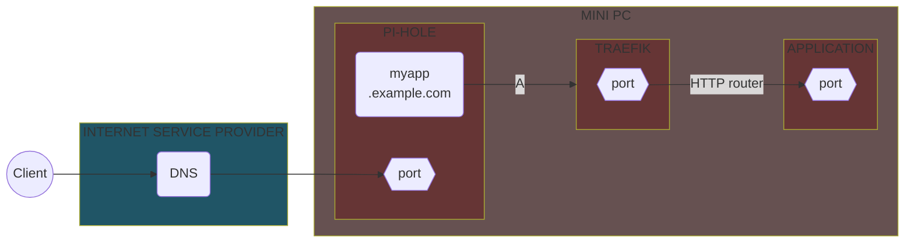

> [!NOTE]
> My router offers all the required features (DHCP server, DNS server, port forwarding, dynDNS, etc.) for the steps described below.
> Most of the routers also have those features (they rarely purely route packets),
> but if this is not your case, you may have to perform **double NAT** to allow more advanced configurations.
> I obviously cannot go through the configuration specific to each router.

## IP settings

The following changes to the IP settings are required if you want the **DNS requests** of your whole local network to go through
**Pi-Hole** and the custom **DNS resolver** (**Unbound**) (only the DNS requests : the ad blocking is done at DNS level, the traffic itself does not need to go through the mini PC) :

- Assign a **static IP address** to the mini PC, for example `192.168.0.16` (I have local **DHCP** enabled)
- Make the devices use the mini PC as **DNS server** (`192.168.0.16`), either through the router (the DNS server it hands out with DHCP), or manually on each device

Of course Pi-Hole container have to expose port **53** to receive incoming DNS requests. Refer to [Pi-hole](#pi-hole) setup for more details.

> [!WARNING]
> Setting the mini PC as "DNS server" in the router configuration is **not always enough** : many ISP boxes
> keep answering the DNS queries of the LAN devices themselves with the ISP resolvers, and the devices silently bypass Pi-Hole.
> Always verify from a device which server actually answers :
>
> ```cmd
> nslookup doubleclick.net
> ```
>
> The answering server must be the mini PC (`192.168.0.16`), and a domain from the block lists must resolve to `0.0.0.0`.
> If the router does not hand out the mini PC address, set the DNS manually on each device
> (on Windows : _Settings -> Network -> Ethernet -> DNS server assignment -> Manual_). In that case :
>
> - leave the **alternate DNS empty** : Windows does not strictly respect the primary/secondary order, a public secondary DNS ends up bypassing Pi-Hole
> - leave "**DNS over HTTPS**" **off** : Pi-Hole only speaks plain DNS on port `53`, and this leg never leaves your LAN anyway (the privacy part is Unbound resolving directly from the root servers)
> - disable "secure DNS" / DNS-over-HTTPS in the **browsers** too, else they use their own resolver and bypass Pi-Hole

If you don't want the whole network to use Pi-Hole, skip the second point, then only the VPN clients (and the devices you configure manually) will use it.

## Dynamic DNS

When connecting from outside our network (from the internet), we need to know the **public IP address** of our router to connect to.
But unless we have a **static** public IP (not necessarily the safest option), we are getting dynamically-assigned public IP addresses (via **DHCP**),
so we would need to update the configuration everytime the IP changes, which is very uncomfortable.

Fortunately we can register a **dynamic host record** (DynDNS), and configure it in our router configuration so that when the public IP address changes, a call is made to the
DynDNS service provider to update the record. That way our network will always be reachable from the internet via the **DynDNS** record no matter the IP address.

Well, simply register a **dynamic DNS** hostname from a provider (there are free ones), for example **No-IP**, **DuckDNS**, etc. :

- hostname : `myddns.ddns.net`
- IP / target : _internet box external IP (public IP)_
- type : `A`

Then activate **DynDNS** on the router :

- Service provider : `No-IP` (adapt to your provider)
- Hostname : `myddns.ddns.net`
- Username : _xxxxxxxx_
- Password : _xxxxxxxx_

The IP will be updated automatically when a change will be detected.

> [!NOTE]
> Your ISP may only support some dynamic DNS provider that can be configured in the router, so you may want to pick one that is supported natively,
> else you will have to set up an **update client** that will be responsible to regularly check for IP change.

## Domain and subdomains

You will need to buy a **domain** from you preferred domain provider, for this guide I will use `example.com`.

> [!IMPORTANT]
> I advise you to also subscribe to a **domain privacy** option in order to hide you personal data.
> Domain Privacy protects the contact information of the owner of a domain name in the **WHOIS directory**.
> Normally, this public database is used to verify the availability of a domain name and who it belongs to,
> but marketing companies and scammers can also exploit it for other purposes, like sending spam or identity theft.

You can check the information that are available publicly about your domain using the `whois` command :

```shell
whois example.com
```

Right, we will then use **subdomains** to locate each service as a separate website to avoid having to buy a new domain name for each.
A subdomain is simply a prefix added to the original domain name, it functions as a separate website from its domain.

So, let's create **subdomains** from the domain name registrar settings, for every service to be exposed on the internet :

- `wireguard.example.com` : To access the [WireGuard](#wireguard) server
- `quake.example.com` : To access the [Defrag-life](#defrag-life) website
- `lychee.example.com` : To access the [Lychee](#lychee) website
- `ccteam.example.com` : To access the [CCTeam](#ccteam) APIs

Then add corresponding **CNAME records** to point to the dynamic DNS `myddns.ddns.net` :

- `CNAME	wireguard	    myddns.ddns.net`
- `CNAME	quake	        myddns.ddns.net`
- `CNAME	lychee	        myddns.ddns.net`
- `CNAME	ccteam	        myddns.ddns.net`

A **CNAME record** is just a records which points a name to another name instead of pointing to an IP address (like **A** records).

> [!NOTE]
> Services that will only be accessible from the local network or through VPN do **not** need to have a subdomain defined at this level.
> We will use Pi-Hole's **local DNS records** for that. See [Pi-Hole configuration](#pi-hole).
>
> However, while the VPN stuff is fully functional and to be able to do the configuration easily from your client machine,
> you may want to temporarily create subdomains and add CNAME records for the following subdomains
> (also remove the IP whitelisting middleware in the corresponding service configuration), else you will be blocked by IP whitelisting :
>
> - `portainer.example.com` : To manage Docker containers (start/stop, check logs, etc.)
> - `pihole.example.com` : To configure the local DNS

## Port forwarding

For our services to be reachable from the internet, we need to **forward incoming requests** to our mini PC so that they will be handled by our **Traefik** reverse proxy.
This can be done through **port forwarding**.

Port forwarding directs the **router** to send any incoming data from the internet to a specified device on the network.
It is safe to forward ports on your router as long as you have a **reverse proxy** or a **firewall** running in between.

### Allow access without VPN

If you decide that at least one of the applications must be reachable from the outside directly through **HTTP** or **HTTPS** without requiring a **VPN**,
then simply port forward the related **TCP** ports to the mini PC.

Go to your router configuration and add a **port forward rule** for the **TCP** port `80` :

- Name : `Traefik`
- Input port : `80`
- Target port : `80`
- Device : `n100`
- Protocol : `TCP`

and `443` :

- Name : `Traefik SSL`
- Input port : `443`
- Target port : `443`
- Device : `n100`
- Protocol : `TCP`

We will configure **Traefik** later to **redirect** HTTP requests to HTTPS.
But if you prefer you can only open the HTTPS port (if you are going to use Let's encrypt' **HTTP challenge**,
it's enough for the TLS certificates to be generated, see the warning box a little further below though).

### Allow access through VPN

If you want some applications to be available from the outside **through VPN**, then open the **VPN** port :

Go to your router configuration and add a **port forward rule** for the **UDP** port `51820` :

- Name : `VPN`
- Input port : `51820`
- Target port : `51820`
- Device : `n100`
- Protocol : `UDP`

Of course if you want the applications to be available **only through VPN**, then only open the VPN port, remove any opened HTTP/HTTPS port.

> [!WARNING]
> Note that if you use Let's Encrypt' **HTTP challenge** to issue and renew **SSL/TLS certificates**, target websites must be reachable from the internet.
> That mean you will have to open the HTTP(S) port at least when issuing/renewing certificates,
> you could also keep them open and restrict access to the necessary IP ranges, if your router supports that.
> If you really don't want to open HTTP(S) ports (better for security), then you will have to configure **DNS challenge** instead of HTTP challenge,
> if your DNS provider support it.
> See [HTTP challenge](#http-challenge) and [DNS challenge](#dns-challenge) below when configuring **Traefik**.

# Reverse proxy


**Traefik** is an open source **HTTP reverse proxy** and **load balancer** that can integrate easily with our Docker infrastructure.
We will use it to intercept and route every incoming request to the corresponding backend services.

It will listen to our services and instantly generates the **routes**, so that they are connected to the outside world.
We will also use it to automatically generate and renew **SSL/TLS certificates** through **Let's Encrypt**.

Here is an overview of the network flow on our setup :

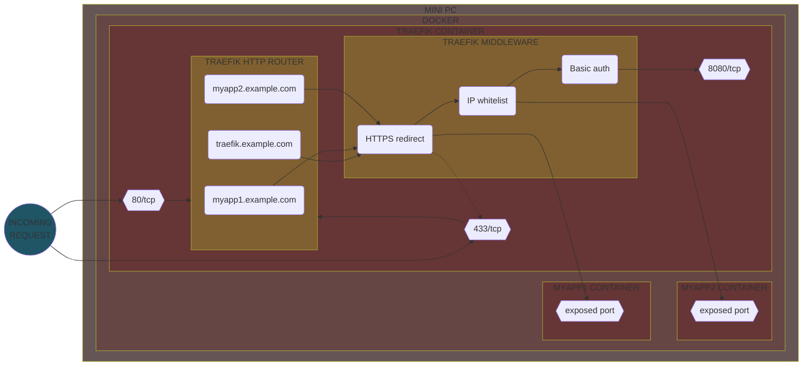

It handles HTTP to HTTPS redirection, IP whitelisting and basic authentication through custom **middlewares**.
In this example `myapp1` is accessible from the internet, `myapp2` is accessible only through VPN,
and Traefik (dashboard and APIs) is accessible only through VPN after basic authentication.

### Installation

First, create a folder to hold data and configuration :

```bash
sudo mkdir /opt/apps/traefik
```

Then copy the files from this project's _traefik_ directory into the _/opt/apps/traefik_ directory :

- _docker-compose.yml_ : The Traefik service definition
- _traefik.yml_ : The Traefik static configuration
- _credentials.txt_ : A file that will hold users credentials to access the Traefik dashboard (restricted with **basic authentication**),
  see [Generate basic authentication credentials](#generate-basic-authentication-credentials)

Files should be ready to use, simply replace the e-mail address (`admin@example.com`) in the _traefik.yaml_ file with your e-mail address.

You will also need to create the **JSON** file to hold the certificates, see [TLS certificates](#tls-certificates).

Anyway you will find below more details about each file (see [Configuration files details](#configuration-files-details)) and some further configuration.

### Generate basic authentication credentials

As we configured the Traefik dashboard to be protected with **basic authentication**, allowed users have to be added to the _credentials.txt_ file.

You can generate a user/password using **htpasswd** :

1. Install the needed package if not present :

    ```bash
    sudo apt install apache2-util
    ```

2. Generate the credentials (we use **bcrypt** with a computing time of 10) :

    ```bash
    htpasswd -nbBC 10 admin xxxxxxxx
    ```

Then copy the output to the _credentials.txt_ file.

> [!NOTE]
> Actually as Traefik will be accessible only from local network and through VPN, we don't really need to set up basic authentication,
> but it's more for demonstration, and it's always better to have 2 layers of security than one.

### TLS certificates


To enable **HTTPS** on our websites, we need to get **TLS certificates** from a **certificate authority**.
A TLS certificate certifies, in a way, the authenticity of a website (actually it proves that we have the ownership of the public key used for TLS encryption),
preventing hackers from intercepting any data transmitted between a device and the site.

We will use **Let's Encrypt**, a nonprofit certificate authority which provide free TLS certificates.

**Let's Encrypt** can automatically generate certificates via Traefik, for that we need to create a `acme.json` file that will hold the generated certificates
(file is mapped to a volume in the**Compose** file),
so that the certificates are persisted between container restarts (not generated each time which could raise Let's Encrypt rate limits), we also need to change
the permissions so that Traefik can access and edit this file :

```bash
cd /opt/apps/traefik
touch /opt/apps/traefik/acme.json
chmod 600 /opt/apps/traefik/acme.json
```

#### HTTP challenge

If you use **HTTP challenge**, Let's Encrypt will validate that you control the domain names by trying to reach the web server through HTTP or HTTPS.
So you must open and port forward ports `80` or `443` for the TLS certificate to be issued correctly.

The corresponding certificate resolver configuration would be :

```yaml
tlsChallenge: { }
```

> [!WARNING]
> Note that Let’s Encrypt will not let you use this challenge to issue wildcard certificates.

#### DNS challenge

When using **DNS challenge**, Let's Encrypt will validate that you control the domain names by querying the DNS system for a TXT record under the target domain name.
So you **don't** need to open HTTP or HTTPS port on your router.

First, check that your DNS provider is supported by Traefik to automate the DNS verification, a list can be found here : https://doc.traefik.io/traefik/https/acme/.

Then :

1. Create an **access token** / **API key** from your provider interface
2. Add the necessary **environment variables** required by your provider, to the Traefik service configuration, i.e. :
   ```yaml
   environment:
     MYPROVIDER_ACCESS_TOKEN: <access_token_here>
   ```

The corresponding certificate resolver configuration would be :

```yaml
dnsChallenge:
  provider: <your_provider_here>
```

### IP whitelisting

We will set up **IP whitelisting** so that we can allow only traffic from the local network or from the VPN for some of our services.
Indeed, even if we do not have defined public subdomains for these services, they can still be reached via the IP address
(actually in that case Traefik will not route the request, but it is still better to have this additional security).

Basically it involves creating a **Traefik middleware** for defining the IP whitelist and apply it to the needed services.

So we need to allow 2 **IP ranges** :

- The **local IP range** : IPs assigned to the devices on your local network (computers, mobile devices, ...)
- The **Traefik Docker bridge network IP range** : IPs assigned by Docker to any container in the Traefik network

For the Traefik Docker network IP range, you can either take the default assigned one, or assign a static subnet when creating the Traefik network, i.e. :

```yaml
networks:
  traefik-net:
    name: traefik-net
    ipam:
      config:
        - subnet: 172.22.0.0/16
```

That way :

- Requests coming from the local network will come with a local address assigned by the router DHCP, and will be **accepted**.
- Requests coming from the internet through VPN will go through Pi-Hole and will be redirected to Traefik (Pi-hole's local DNS records)
  and thus come with a Traefik Docker network assigned IP address, and will be **accepted**.
- Requests coming from the internet without VPN will come with a public IP address and will be **rejected** as it will not match any whitelisted address.

### Configuration files details

#### Static configuration file :

:page_facing_up: _traefik.yaml_ :

```yaml
api:
  dashboard: true

entryPoints:
  web:
    address: ':80'

  websecure:
    address: ':443'

providers:
  docker:
    watch: true
    exposedByDefault: false

certificatesResolvers:
  default:
    acme:
      email: admin@example.com
      storage: acme.json
      caServer: 'https://acme-v02.api.letsencrypt.org/directory'
      dnsChallenge:
        provider: <your_provider_here>

log:
  level: info
```

This config file :

- enables the Traefik **dashboard** (UI that provides a detailed overview of the current configuration)
- defines 2 **entrypoints**, named `web` (for port `80`) and `websecure` (for port `443`) so that we can receive requests on these ports
- defines a `docker` provider so that we can use **container labels** for retrieving routing configuration. We have configured it to **not** expose containers by default, so
  that containers that do not have a `traefik.enable=true` label are ignored from the resulting routing configuration
- defines a `default` **certificate resolver** for Let's Encrypt to automatically generate certificates
- set log level to `info` (you can set it to `debug` when you need more information on what's going on)

#### Service definition :

:page_facing_up: _docker-compose.yml_ :

```yaml
services:

  traefik:
    image: traefik:latest
    container_name: traefik
    restart: unless-stopped
    ports:
      - "80:80"
      - "443:443"
    volumes:
      - /var/run/docker.sock:/var/run/docker.sock:ro    # So that Traefik can listen to the Docker events
      - ./traefik.yml:/etc/traefik/traefik.yml:ro       # Traefik configuration
      - ./acme.json:/acme.json                          # For Let's Encrypt certificate storage
      - ./credentials.txt:/credentials.txt:ro           # For Traefik dashboard credentials
    networks:
      - traefik-net
    environment:
      MYPROVIDER_ACCESS_TOKEN: <access_token_here>
    labels:
      - "traefik.enable=true"

      # Redirect all HTTP requests to HTTPS
      - "traefik.http.middlewares.httpsonly.redirectscheme.scheme=https"
      - "traefik.http.middlewares.httpsonly.redirectscheme.permanent=true"
      - "traefik.http.routers.httpsonly.rule=HostRegexp(`{any:.*}`)"
      - "traefik.http.routers.httpsonly.middlewares=httpsonly"

      # Configure dashboard with HTTPS
      - "traefik.http.routers.dashboard.rule=Host(`traefik.example.com`)"
      - "traefik.http.routers.dashboard.entrypoints=websecure"
      - "traefik.http.routers.dashboard.service=dashboard@internal"
      - "traefik.http.routers.dashboard.tls=true"
      - "traefik.http.routers.dashboard.tls.certresolver=default"

      # Configure API with HTTPS
      - "traefik.http.routers.api.rule=Host(`traefik.example.com`) && PathPrefix(`/api`)"
      - "traefik.http.routers.api.entrypoints=websecure"
      - "traefik.http.routers.api.service=api@internal"
      - "traefik.http.routers.api.tls=true"
      - "traefik.http.routers.api.tls.certresolver=default"

      # IP whitelist for services to be accessible only through VPN and from the local network, have to be applied on each service configuration that need it
      - "traefik.http.middlewares.vpn-whitelist.ipwhitelist.sourcerange=192.168.0.0/24, 172.18.0.0/16"

      # Secure dashboard/API with authentication
      - "traefik.http.routers.dashboard.middlewares=auth"
      - "traefik.http.routers.api.middlewares=auth"
      - "traefik.http.middlewares.auth.basicauth.usersfile=/credentials.txt"

networks:

  traefik-net:
    name: traefik-net
```

This **Compose** file mainly :

- exposes ports `80` and `443` to receive incoming HTTP/HTTPS requests
- defines a `traefik-net` **network** (which will have to be shared with the services that will use Traefik)
- defines an environment variable to hold the DNS provider access token to be able to issue Let's Encrypt certificates through **DNS challenge**
- defines an HTTP **router** that will match `traefik.example.com` URL on our `websecure` **entrypoint** to point to our service
- defines `httpsonly` **router** and **middleware** responsible for automatically redirecting HTTP requests to HTTPS
- configures `dashboard` and `api` routers to use secure HTTPS endpoint with our certificate resolver to generate related Let's Encrypt certificates
- secures dashboard and API endpoints by defining a `auth` middleware that will handle basic authentication (from _credentials.txt_ file)
- defines a `vpn-whitelist` **middleware** responsible for whitelisting IPs, so that it can be used by services that will be exposed to the internet to allow only local traffic and
  VPN traffic

> [!CAUTION]
> The order in which the middlewares are defined in relation to a router is important, they will be applied in the same order as their declaration.

### Run

Finally, run the Compose file :

```bash
sudo docker-compose -f /opt/apps/traefik/docker-compose.yml up -d
# You may need to force recreate if you changed a config from an already running configuration
sudo docker-compose -f /opt/apps/traefik/docker-compose.yml up -d --force-recreate
```

You should end-up with a running `traefik` container.

It should also have generated the needed Let's Encrypt certificates in the _acme.json_ file.

So you can reach the dashboard at https://traefik.example.com.


# VPN and ad-blocking

<table>
  <tr>
    <td>
      
    </td>
    <td>
      
    </td>
    <td>
      
    </td>
  </tr>
</table>

We will install **WireGuard**, **Pi-hole** and **Unbound** to create a virtual private network (VPN) with ad-blocking and DNS privacy/caching capabilities.

**WireGuard** is a free and open-source modern VPN that utilizes state-of-the-art cryptography to securely encapsulates **IP packets** over **UDP**,
in order to lower the environment attack surface. As a VPN it establishes a secure connection between a computer and the internet
by making all the traffic going through an encrypted **tunnel**. The point of self-hosting our own VPN server is to ensure
a **private** and **secure** connection to our services from the internet, without having to trust third-party VPN providers,
and to keep complete freedom and control over the browsing data.

**Pi-hole** is a network-level ad blocking and internet tracker blocking application.
It has the ability to block traditional website advertisements as well as advertisements in unconventional places such as mobile apps ads.
It can also be used as a **DNS** server and has a built-in **DHCP** server.

**Unbound** is a validating, recursive, caching **DNS resolver**, that has the ability to contact **DNS authority** servers directly
in order to validate and cache the queries on your network and serve them to you directly,
so you don’t have to rely on your ISP or third-party DNS resolvers (like Cloudflare or Google).

So the idea is that every client in any network can use the VPN to reach our applications while taking advantage of Pi-Hole and Unbound :

```mermaid
flowchart TB
    style WINDOWS11 fill: #205566
    style LAPTOP fill: #205566
    style MOBILE fill: #205566
    style MACOS fill: #205566
    style WIREGUARD_SERVER fill: #764545
    style PIHOLE fill: #663535
    style UNBOUND fill: #562525
    style INTERNET fill: #4d683b
    style HOME_NETWORK fill: #263555
    style 5G_NETWORK fill: #263555
    style WORK_NETWORK fill: #263555
    style MINI_PC fill: #504255
    WINDOWS11(Peer 1 \n Home PC - Windows 11)
    LAPTOP(Peer 2 \n Home laptop - Ubuntu 22)
    MOBILE(Peer 3 \n Phone - Android 14)
    MACOS(Peer 4 \n Work PC - MacOS 13)
    WIREGUARD_SERVER(WireGuard server - Secure VPN)
    PIHOLE(Pi-Hole - Firewall & ad-blocking)
    UNBOUND(Unbound - Custom DNS resolver)
    INTERNET((Internet))

    subgraph HOME_NETWORK[Home network]
        WINDOWS11
        LAPTOP
    end

    subgraph 5G_NETWORK[Mobile network]
        MOBILE
    end

    subgraph WORK_NETWORK[Work network]
        MACOS
    end

    subgraph MINI_PC[Mini PC]
        WIREGUARD_SERVER
        PIHOLE
        UNBOUND
    end

    WINDOWS11 -- WireGuard tunnel --> WIREGUARD_SERVER
    LAPTOP -- WireGuard tunnel --> WIREGUARD_SERVER
    MOBILE -- WireGuard tunnel --> WIREGUARD_SERVER
    MACOS -- WireGuard tunnel --> WIREGUARD_SERVER
    WIREGUARD_SERVER -- DNS queries --> PIHOLE
    PIHOLE -- Filtered DNS queries --> UNBOUND
    UNBOUND -- DNS resolution --> INTERNET
```

**WireGuard** runs directly on the host (kernel module, managed by `wg-quick`), **Pi-Hole** and **Unbound** run as two small **Compose** stacks.
Everything about performance is in [VPN connection speed](#vpn-connection-speed).

### Installation

First, create the folders that will hold data and configuration :

```bash
sudo mkdir -p /opt/apps/pihole /opt/apps/unbound
```

Then from this project's _pihole_ and _unbound_ directories, copy the _docker-compose.yml_ files into _/opt/apps/pihole_ and _/opt/apps/unbound_ respectively.
For more details about these files, see [Configuration files details](#configuration-files-details-1).

WireGuard itself is a Debian package :

```bash
sudo apt install wireguard
```

Now let's take a look at the configuration for each service.

### Configuration

#### WireGuard


WireGuard runs **directly on the host** : the kernel module is part of Debian, `wg-quick` manages the interface, and the peers are managed in the configuration file
(or with the `wg` command). Compared to running it in a container, this removes a few hops for every packet (Docker bridge, `veth` pair, a second NAT layer and the userland proxy)
and makes the network stack much easier to observe and tune.

Generate the keys (`wg genkey | tee private.key | wg pubkey > public.key`, on the server and on each peer) and create the configuration :

```bash
sudo nano /etc/wireguard/wg0.conf
```

:page_facing_up: _/etc/wireguard/wg0.conf_ (`enp1s0` is the LAN interface of the mini PC, `%i` is replaced by the interface name) :

```ini
[Interface]
Address = 10.0.0.1/24
ListenPort = 51820
MTU = 1420
PrivateKey = <server private key>
PostUp = iptables -N DOCKER-USER 2>/dev/null || true; iptables -C DOCKER-USER -i %i -j ACCEPT 2>/dev/null || iptables -I DOCKER-USER 1 -i %i -j ACCEPT; iptables -C DOCKER-USER -o %i -j ACCEPT 2>/dev/null || iptables -I DOCKER-USER 2 -o %i -j ACCEPT; iptables -A FORWARD -i %i -j ACCEPT; iptables -A FORWARD -o %i -j ACCEPT; iptables -t nat -C POSTROUTING -s 10.0.0.0/24 -o enp1s0 -j MASQUERADE 2>/dev/null || iptables -t nat -A POSTROUTING -s 10.0.0.0/24 -o enp1s0 -j MASQUERADE; iptables -t mangle -C FORWARD -p tcp --tcp-flags SYN,RST SYN -j TCPMSS --clamp-mss-to-pmtu 2>/dev/null || iptables -t mangle -A FORWARD -p tcp --tcp-flags SYN,RST SYN -j TCPMSS --clamp-mss-to-pmtu; iptables -t raw -C PREROUTING -i enp1s0 -p udp --dport 51820 -j NOTRACK 2>/dev/null || iptables -t raw -A PREROUTING -i enp1s0 -p udp --dport 51820 -j NOTRACK; iptables -t raw -C OUTPUT -o enp1s0 -p udp --sport 51820 -j NOTRACK 2>/dev/null || iptables -t raw -A OUTPUT -o enp1s0 -p udp --sport 51820 -j NOTRACK; tc qdisc replace dev %i root cake bandwidth 860mbit besteffort || true
PostDown = iptables -D DOCKER-USER -i %i -j ACCEPT || true; iptables -D DOCKER-USER -o %i -j ACCEPT || true; iptables -D FORWARD -i %i -j ACCEPT || true; iptables -D FORWARD -o %i -j ACCEPT || true; iptables -t nat -D POSTROUTING -s 10.0.0.0/24 -o enp1s0 -j MASQUERADE || true; iptables -t mangle -D FORWARD -p tcp --tcp-flags SYN,RST SYN -j TCPMSS --clamp-mss-to-pmtu || true; iptables -t raw -D PREROUTING -i enp1s0 -p udp --dport 51820 -j NOTRACK || true; iptables -t raw -D OUTPUT -o enp1s0 -p udp --sport 51820 -j NOTRACK || true

[Peer]
# desktop-home
PublicKey = <peer public key>
AllowedIPs = 10.0.0.2/32

[Peer]
# phone
PublicKey = <peer public key>
AllowedIPs = 10.0.0.3/32
```

Then protect and enable it :

```bash
sudo chmod 600 /etc/wireguard/wg0.conf
sudo systemctl enable --now wg-quick@wg0
```

The `PostUp` line looks scary, but each piece has a reason (and `wg-quick` runs the hooks with `set -e`, so anything that may legitimately fail has to be guarded with `|| true` or a `-C` check, else the interface is torn down) :

- `DOCKER-USER` **fast path** : Docker sets the `FORWARD` policy to `DROP` and inserts about a hundred rules (four per bridge network) that **every relayed packet** walks through.
  The `DOCKER-USER` chain is evaluated first and is never flushed by Docker, so accepting the tunnel traffic there short-circuits the whole chain.
  The plain `FORWARD` rules are a fallback in case `wg0` comes up before Docker at boot.
- **NAT** : the peers' traffic leaves with the mini PC address (on my machine the rule was already set globally, keeping it here makes the file self-contained).
- **TCPMSS clamp** : TCP inside the tunnel can carry `1380` bytes per segment at most, clamping the MSS on the SYN packets prevents fragmentation and black holes for the relayed connections.
- `NOTRACK` : connection tracking is useless for the encrypted UDP flow (WireGuard authenticates every packet itself), this saves a lookup per packet.
- `cake` : gives every flow inside the tunnel its own queue and keeps the latency low. Without it, the `fq_codel` queue of the physical interface sees the whole tunnel as a **single flow**,
  so a big download can starve a video stream or a call. `860mbit` is what a gigabit link carries once the tunnel overhead is added, it costs nothing measurable.

The **DNS** pushed to the peers is the tunnel address of the server, `10.0.0.1` : Docker publishes Pi-Hole's port `53` on **every** address of the host, including this one,
so the peers reach Pi-Hole (then Unbound) without any extra route, and it also works in split tunnel mode since the address is inside the tunnel subnet.

##### Peers configuration

On each device, the client configuration looks like this :

```ini
[Interface]
PrivateKey = <peer private key>
Address = 10.0.0.2/32
DNS = 10.0.0.1
MTU = 1420

[Peer]
PublicKey = <server public key>
Endpoint = 192.168.0.16:51820
# full tunnel : 0.0.0.0/1, 128.0.0.0/1 — split tunnel : 10.0.0.0/24
AllowedIPs = 0.0.0.0/1, 128.0.0.0/1
PersistentKeepalive = 25
```

> [!TIP]
> A few things I learned the hard way about the peers configuration :
>
> - At home, use the **LAN IP address** of the server as endpoint (`192.168.0.16:51820`), not the public hostname : going through the public IP from inside the LAN
>   makes the router do **NAT loopback** (hairpin) in software, which cost me about half of the throughput (350/440 Mbit/s instead of 570/860).
>   Easiest is to keep two tunnels on the device : a "home" one with the LAN endpoint and an "away" one with the public hostname.
> - At home, a **full tunnel** brings nothing : the traffic leaves through the same router anyway, it only adds encryption and relaying work for the server
>   (and costs about 40 % of the download speed, see [VPN connection speed](#vpn-connection-speed)).
>   Use a **split tunnel** (`AllowedIPs` limited to the VPN subnet, here `10.0.0.0/24`, which contains the DNS address so that the DNS still goes through the tunnel), or simply no tunnel at all
>   with the device DNS pointing to the mini PC : the ad blocking is done at DNS level, it is identical in all cases.
> - `0.0.0.0/1, 128.0.0.0/1` also disables the **kill switch** and the **DNS leak protection** of the Windows client (only a `0.0.0.0/0` route enables them),
>   so Windows silently falls back to the router DNS if Pi-Hole does not answer within about a second.
> - Never point a client to an address the server holds on a **secondary interface** (Wi-Fi, USB adapter), see the warning below.

> [!WARNING]
> Connect the server to the LAN through **one interface only**. I had the Wi-Fi of the mini PC connected to the same network "just in case", plus a USB Ethernet adapter left over from a test.
> Linux answers ARP requests for **all** its addresses on **all** its interfaces, so the router could deliver traffic for the main address through the Wi-Fi or the USB adapter ;
> NetworkManager detected its own Wi-Fi as an address conflict and dropped the USB adapter address for hours at each DHCP renewal ; and the client I had pointed to that address
> lost its tunnel at random and got a fraction of the throughput when it worked. Disable the Wi-Fi (`sudo nmcli radio wifi off`) and unplug what you don't use.

#### Pi-hole


The Compose file will run a **Pi-Hole** instance which need to be configured.

First, Pi-Hole must accept the queries coming from other interfaces than its own Docker network (the VPN peers, the LAN) :
by default it only answers "local" requests, and "local" for Pi-Hole is the Docker bridge network. The Compose file sets this once and for all with the
`FTLCONF_dns_listeningMode: 'all'` environment variable (the equivalent of _Settings -> DNS -> Interface settings -> "Permit all origins"_ in the web UI).

The web UI is reachable at https://pihole.example.com through **Traefik** : the Compose file does not carry Traefik labels anymore, the router is declared in a file of
Traefik's **dynamic configuration** directory instead (see [Traefik routing](#traefik-routing) below), restricted to the local network and the VPN peers.
I don't set a Pi-Hole **password** : authentication is handled in front of it by the reverse proxy (a forward-auth middleware with **PocketID** in my case, not covered in this guide).
The image generates a random password at first start, remove it (or set yours) with :

```bash
sudo docker exec -it pihole pihole setpassword
```

In _Settings -> DNS_, untick every public upstream and add **Unbound** as custom upstream DNS server : `10.2.0.200#53`
(its static address in the `pihole-net` Docker network, see [Services definition](#services-definition)).

Then we need to add **local DNS records** so that the domain names can be resolved from VPN or local network (remember the DNS requests of the VPN peers and of the configured devices go through Pi-Hole).
We simply need to associate domain names with the internal IP address of the mini PC, so they can be handled by the reverse proxy.

Go to _local DNS -> DNS records_ and add a **DNS record entry** for every subdomain that should be available through VPN :

```
ackee.example.com                   192.168.0.16
dashboard.example.com               192.168.0.16
dashdot.example.com                 192.168.0.16
kuma.example.com                    192.168.0.16
phpmyadmin.example.com              192.168.0.16
pihole.example.com                  192.168.0.16
portainer.example.com               192.168.0.16
traefik.example.com                 192.168.0.16
```

No need to add domains that are reachable from the internet as they will be reachable directly over HTTPS without going through our Pi-Hole.

You can also configure rate limiting (default to **1000 queries per minute**), domain whitelisting, DNS settings, etc. but I will not go through all Pi-Hole configuration, the
default should work just fine.

If it is working you should be able to see activity in the dashboard.


#### Unbound


The first time you will run **Unbound**, it may fail because a few files included in the default configuration will be missing (at least in the image version I'm using),
indeed the following files are included in the default _unbound.conf_ file (which should have been created correctly in _/etc/unbound/unbound.conf_) :

- _/opt/unbound/etc/unbound/a-records.conf_
- _/opt/unbound/etc/unbound/srv-records.conf_
- _/opt/unbound/etc/unbound/forward-records.conf_

You could manually create these files (you can find default ones from the Unbound **GitHub** repository),
and then mount them into the Unbound container, before running again the Compose file.

But that way it would run Unbound in **forwarder** mode, meaning that the DNS server will forward all the queries to **Cloudflare**.
This was my first try and a **DNS leak test** confirmed that it uses Cloudflare, indeed the default _forward-records.conf_ file includes the following forwarding rules :

```
forward-addr: 1.1.1.1@853#cloudflare-dns.com
forward-addr: 1.0.0.1@853#cloudflare-dns.com
```

So, if you want to run Unbound **without forwarding**, just remove or comment the lines that includes the above files from the _unbound.conf_ file.
Do not create any of these files at all and do not bind them in the container, just remove the includes from the _unbound.conf_ file.

A DNS leak test should now show your IP address as DNS server.

> [!IMPORTANT]
> If you use the default _forward-records.conf_ file, Unbound will run in **forwarder** mode, meaning that it will forward all queries to **Cloudflare**.
> To remove the default forwarding to Cloudflare and make your unbound container a recursive-only server,
> edit the _unbound.conf_ file and remove include of the _forward-records.conf_ file.

Then there are a few settings in _unbound.conf_ that are **essential** when Unbound runs in a container. I ran for months with a resolver that returned
`SERVFAIL` for most names that were not already in cache (`login.live.com`, `www.apple.com`, the Twitch video servers, ...), cached names being served fine,
which made streams randomly fail to start and Windows painfully slow at boot when the tunnel was up :

```
server:
    # the container has no IPv6 connectivity : without this, Unbound keeps trying the IPv6 addresses of the authoritative
    # servers, burns its retry budget and ends up with SERVFAIL ("exceeded the maximum number of sends")
    do-ip6: no
    # 0x20 case randomization breaks with load balanced domains (Microsoft, Akamai, Twitch, ...) that answer differently
    # on each query, Unbound then cannot validate its fallback ("0x20 failed, then got different replies in fallback")
    use-caps-for-id: no
    # 1 is plenty, 5 (debug) formats a huge amount of text for every single query, even when it ends up in /dev/null
    verbosity: 1
    # log the reason of each SERVFAIL to the container output (sudo docker logs unbound)
    log-servfail: yes
    logfile: ""
    use-syslog: no
```

A quick way to validate such changes without touching the running resolver is to start a **throwaway** Unbound with the modified file on the same Docker network,
and to compare both on names that are not cached :

```bash
sudo docker run -d --name unbound-test --network wireguard_net -v /tmp/unbound-test.conf:/opt/unbound/etc/unbound/unbound.conf:ro mvance/unbound:latest
dig @$(sudo docker inspect unbound-test --format '{{range .NetworkSettings.Networks}}{{.IPAddress}}{{end}}') login.live.com
sudo docker logs unbound-test | grep SERVFAIL
sudo docker rm -f unbound-test
```

With my original file 9 names out of 16 failed, with `do-ip6: no` alone all 16 succeeded, and `use-caps-for-id: no` on top made them faster.

Do not enable `log-queries` for daily use, Unbound logs a lot.

### Configuration files details

#### Services definition

:page_facing_up: _pihole/docker-compose.yml_ :

```yaml
services:

  pihole:
    container_name: pihole
    image: pihole/pihole:latest
    restart: unless-stopped
    ports:
      - "53:53/tcp"
      - "53:53/udp"
    environment:
      TZ: "Europe/Zurich"
      FTLCONF_dns_listeningMode: 'all'
    networks:
      pihole-net:
        ipv4_address: 10.2.0.100
      traefik-net:
    volumes:
      - "./etc-pihole/:/etc/pihole/"
    cap_add:
      - NET_ADMIN
      - SYS_TIME
      - SYS_NICE

networks:

  pihole-net:
    name: pihole-net
    ipam:
      driver: default
      config:
        - subnet: 10.2.0.0/24

  traefik-net:
    name: traefik-net
    external: true
```

This **Compose** file :

- defines the `pihole-net` **network** with the subnet `10.2.0.0/24` (shared with Unbound)
- references the `traefik-net` Traefik network so that the web UI can be reached through the reverse proxy (the router itself is declared on the Traefik side, see below)
- defines the `pihole` service :
    - publishes port `53` (TCP and UDP) on **every address of the host**, which is what makes Pi-Hole reachable from the LAN (`192.168.0.16`)
      and from the VPN peers (`10.0.0.1`) without any extra rule
    - sets the timezone and `FTLCONF_dns_listeningMode: 'all'` (see [Pi-hole](#pi-hole))
    - assigns the **static IP address** `10.2.0.100`
    - binds the _/etc/pihole_ folder to keep the configuration and the databases
    - adds the `NET_ADMIN`, `SYS_TIME` and `SYS_NICE` capabilities recommended by the Pi-Hole image (DHCP server, time synchronisation, scheduling priority)

> [!NOTE]
> Do not lower the MTU of the Docker networks "to fit the tunnel" (I had `com.docker.network.driver.mtu: "1280"` on all of them for a long time) : the containers don't need it,
> MSS clamping and PMTU discovery take care of TCP through the tunnel and DNS answers fit anyway. A small bridge MTU only means more packets for the same data
> and a dependency on ICMP for the inbound traffic, and back when WireGuard itself ran in a container it forced the kernel to fragment every single encrypted packet.

:page_facing_up: _unbound/docker-compose.yml_ :

```yaml
services:

  unbound:
    image: "mvance/unbound:latest"
    container_name: unbound
    restart: unless-stopped
    hostname: "unbound"
    volumes:
      - "./unbound:/opt/unbound/etc/unbound/"
    networks:
      pihole-net:
        ipv4_address: 10.2.0.200

networks:

  pihole-net:
    name: pihole-net
    external: true
```

This **Compose** file only defines the `unbound` service, on the same (external) `pihole-net` network with the **static IP address** `10.2.0.200`,
and binds the configuration folder so that _unbound.conf_ can be edited (see [Unbound](#unbound)). Unbound is not exposed at all, only Pi-Hole talks to it.

#### Traefik routing

:page_facing_up: _traefik/dynamic/pihole.yml_ (to copy into _/opt/apps/traefik/dynamic/_, the directory watched by the `file` provider of _traefik.yml_) :

```yaml
http:
  services:
    pihole:
      loadBalancer:
        servers:
          - url: http://pihole:80

  routers:
    pihole:
      rule: 'Host(`pihole.example.com`)'
      entryPoints:
        - websecure
      tls:
        certResolver: default
      service: pihole
      middlewares:
        # restrict the web UI to the local network and the VPN peers, replace it with a forward-auth
        # middleware (I use PocketID in front of it) if you prefer an authentication
        - vpn-whitelist@docker
```

It declares the `pihole` **service** pointing to the container on port `80` (reachable by name thanks to the shared `traefik-net` network) and the **router** matching
`pihole.example.com` on the `websecure` entrypoint with a Let's Encrypt certificate, exactly what the Traefik labels used to do, but Traefik picks up the file
without restarting anything. The `vpn-whitelist` middleware keeps the web UI private (local network and VPN peers only).

### Run

Once the tunnel is up (see [WireGuard](#wireguard)), run the two Compose files :

```bash
sudo docker-compose -f /opt/apps/pihole/docker-compose.yml up -d
sudo docker-compose -f /opt/apps/unbound/docker-compose.yml up -d
```

You should end up with the `wg0` interface (`sudo wg show`) and **2** running containers, `pihole` and `unbound`.
Unbound is not exposed, Pi-Hole is reachable at https://pihole.example.com.

# Test the network

## DNS resolution

Each service should be resolvable through its **subdomain name**.

When a user enters the URL in the browser, the browser need to know the IP address corresponding to the domain name, so it can send the queries to. For that it :

1. Checks the **browser cache** (most browsers cache DNS data by default), and use the address corresponding to the provided name if found
2. Checks the **OS cache** and return the address to the browser if found
3. Checks the **local host table file** (usually _/etc/hosts_ on Linux/Mac systems and _C:\Windows\System32\Drivers\etc\hosts_ on Windows)
   to see if an entry matches the specified name, if so, it will directly return it to the browser
4. Invokes the **local resolver**, on Windows, it is defined at the network adapter level, usually
   _Control Panel > Network and Internet > Network Connections_ then in the advanced properties of the desired connection (Higher Priority Connection).
   On Linux/Mac it is usually _/etc/resovl.conf_. In my Windows system it is automatically configured to point to my router local IP Address.
   The resolver checks its cache to see if it already has the address for this name. If it does, it returns it immediately to the browser
5. Checks the **router cache** and return the address to the browser if found
6. Checks the **ISP cache** and return the address to the browser if found
7. Checks the **ISP resolving name server** which will call the **root DNS servers** (root server <--> TLD server <--> Authoritative Name Server)
   to find the IP address from the DNS server responsible for the domain name

In our case the requests from the **local network** should reach **Pi-hole** (directly, or through the router if it really forwards them, see [IP settings](#ip-settings)),
so the IP resolving goes through **Pi-Hole** and **Unbound**. See [Network flow](#network-flow) later below for a more graphical representation of the network flow.

You can first test that each service is resolvable using `nslookup` command, i.e. :

```cmd
C:\Users\Yann39>nslookup myapp.example.com
Server :   pi.hole
Address:  10.2.0.100

Name :     myapp.example.com
Address:  192.168.0.16
```

If the answering server is the router instead of Pi-Hole, the router does not forward the queries (see [IP settings](#ip-settings)).
If names resolve fine once cached but fail (`SERVFAIL`) or take a second the first time, the problem is on Unbound's side, see the settings in [Unbound](#unbound).

Then you can look for DNS leak using any online checker, to determine which DNS servers the browser is using to resolve domain names,
it should end up showing your **public IP address**, not Cloudflare or Google, etc. as we use **Unbound** (see [Unbound](#unbound) for configuration).

You could also use tools like **Wireshark** to look closely at DNS resolution or to confirm that the traffic is effectively going through the VPN when connected
(in that case the "Protocol" column should be `WireGuard` for all queries). I will not go through a Wireshark tutorial, but it is a very
useful and interesting tool for viewing what going on in your network.

## Reachability

To verify that the network is set up correctly, we can simply try to access some services and see if we can reach them or not,
from different device and connection type.

> [!NOTE]
> I simply temporarily added a `CNAME` record in my domain name registrar for the services to be checked, to point to my DDNS for testing the IP whitelisting,
> Traefik will not route request if you try to access a service via the public IP address.

For example if we try to access a service that must be accessible only through VPN (and local network), here are the results :

| Device | Connection | VPN status        | Public IP     | Remote address (request header) | Traefik       | Response                  |
|--------|------------|-------------------|---------------|---------------------------------|---------------|---------------------------|
| PC     | cable      | :red_circle: off  | 144.12.117.3  | 192.168.0.16                    | 192.168.0.11  | :heavy_check_mark: 200 OK |
| PC     | cable      | :green_circle: on | 144.12.117.3  | 192.168.0.16                    | 192.168.0.11  | :heavy_check_mark: 200 OK |
| Mobile | wifi       | :red_circle: off  | 144.12.117.3  | 192.168.0.16                    | 192.168.0.12  | :heavy_check_mark: 200 OK |
| Mobile | wifi       | :green_circle: on | 144.12.117.3  | 192.168.0.16                    | 172.22.0.1    | :heavy_check_mark: 200 OK |
| Mobile | 4G         | :red_circle: off  | 81.165.84.189 | 144.12.117.3                    | 81.165.84.189 | :x: 403 Forbidden         |
| Mobile | 4G         | :green_circle: on | 144.12.117.3  | 192.168.0.16                    | 172.22.0.1    | :heavy_check_mark: 200 OK |

- `192.168.0.16` is the mini PC's private IP address
- `144.12.117.3` is the router's public IP address
- `192.168.0.11` is the desktop PC's local IP address
- `192.168.0.12` is the mobile phone's local IP address
- `172.22.0.1` is the Traefik Bridge network IP address
- `81.165.84.189` is the public IP address on the mobile 4G network

These are expected results, we can see that the service is reachable from the local network and from anywhere when using the VPN,
and it is not accessible outside the local network if we don't use the VPN.

We can also confirm this by looking at the **Traefik logs** (you have to set `level` to `debug` in _traefik.yml_ file to see the debug logs)
which shows that the `vpn-whitelist` **middleware** blocks any IP address that is not whitelisted :

> ```
> level=debug msg="Authentication succeeded" middlewareType=BasicAuth middlewareName=auth@docker
> level=debug msg="Accepting IP 192.168.0.16" middlewareName=vpn-whitelist@docker middlewareType=IPWhiteLister
> level=debug msg="Accepting IP 172.22.0.1" middlewareName=vpn-whitelist@docker middlewareType=IPWhiteLister
> level=debug msg="Rejecting IP 81.165.84.189: \"81.165.84.189\" matched none of the trusted IPs" middlewareName=vpn-whitelist@docker middlewareType=IPWhiteLister
> ```

## VPN connection speed

To verify that the VPN is not killing the connection speed, first run an online **speed test** with and without the tunnel, from a **wired** device
(Wi-Fi adds its own variability). These are my results with a symmetric gigabit fiber line, from the home PC :

| Test (home PC, Ethernet)                                 | Download / upload (Mbit/s) |
|----------------------------------------------------------|----------------------------|
| No VPN                                                   | 920 / 920                  |
| Split tunnel (only the VPN subnet routed)                | 910 / 920                  |
| Full tunnel, endpoint = LAN IP of the server             | 570 / 860                  |
| Full tunnel, endpoint = public hostname (router hairpin) | 350 / 440                  |

The upload is fine, the hairpin case is explained in [Peers configuration](#peers-configuration), and the download ceiling took me an evening of measurements to understand.
Here is what I learned, so you don't have to.

### Configure MTU

Most **Ethernet** connections have an MTU of `1500`. You can confirm this on your network by running the `ping` command with the right parameters :

```console
ping www.google.com -f -l 1472
ping www.google.com -f -l 1473
```

`1472` will work and `1473` will warn that the packet needs to be fragmented, because the **IPv4 header** is `20` bytes and the **ICMP header** is `8` bytes (`1472 + 20 + 8 = 1500`).

WireGuard adds its own headers, `60` bytes on IPv4 and `80` bytes on IPv6, so the tunnel MTU must be `1500 - 80 = 1420` (the `wg-quick` default).
Beware of tools defaulting to `1450` (WireGuard UI did) : that produces `1510` bytes packets that get fragmented, and a **fragmented tunnel is dramatically slow** (a few percent of the line rate).
Set `1420` on the server and on every peer, and don't go lower : a smaller MTU only means more packets for the same data.

### Measure where the limit is

Speed tests only give the end result. To know **which part** of the path limits, use **iPerf 3** between the peer and the server, in both directions, in **UDP** and in **TCP**.
Install `iperf3` on the server (`sudo apt install iperf3`) and on the client (Windows builds are available on iperf.fr), run `iperf3 -s` on the client (allow it in the Windows firewall),
then from the server, with the tunnel up (`10.0.0.2` being the tunnel address of the peer and `192.168.0.12` its LAN address) :

```bash
# reference : LAN, no tunnel, both directions
iperf3 -c 192.168.0.12 -t 10 -P 4
iperf3 -c 192.168.0.12 -t 10 -P 4 -R
# through the tunnel, UDP at a fixed rate : does the path carry the packets at all ?
iperf3 -c 10.0.0.2 -u -b 900M -l 1350 -t 10
# through the tunnel, TCP : what does a real transfer get ?
iperf3 -c 10.0.0.2 -t 10 -P 4
iperf3 -c 10.0.0.2 -t 10 -P 4 -R
```

And while a test runs, watch the receive drops of the network card and the state of the TCP connections on the server :

```bash
ethtool -S enp1s0 | grep rx_missed      # before / after : frames the card dropped because its receive ring was full
ss -ti dst 10.0.0.2                     # rtt, cwnd and retrans of the running connections
```

My results on the N100 :

- LAN without tunnel : **940 Mbit/s** both ways, zero retransmission. Card, cable, router and PC are fine.
- Tunnel, UDP : **900+ Mbit/s** both ways with **0.00 % loss** at line rate. The whole path, encryption on the N100 and decryption on the PC included, carries the full gigabit.
- Tunnel, TCP, upload (peer to internet) : 860 to 930 Mbit/s.
- Tunnel, TCP, download (internet to peer) : **550 to 600 Mbit/s**, whatever I tried, with `rx_missed` climbing on the server (50 to 1000 per second) while the CPU never went above 70 % on the busiest core.

So the limit is neither the CPU nor WireGuard, it is the **network card**. The Realtek RTL8168H of this mini PC (`r8169` driver) has a **single queue**,
a single interrupt handled by a single core, and a **receive ring of 256 descriptors** (hardware maximum), which holds about 3 ms of gigabit traffic.
When the card receives *and* transmits at ~600 Mbit/s at the same time, which is exactly what relaying a download through the tunnel does, the ring overflows during the small
scheduling gaps of the receive path, and the dropped frames make the TCP senders on the internet back off. "Polite" senders (speed test servers) settle around 560 Mbit/s,
aggressive ones (public iPerf servers with 10 Gbit/s uplinks) push ~850 Mbit/s through at the price of tens of thousands of retransmissions.
The upload is not affected because the plaintext sent out benefits from segmentation offload (far fewer packets to handle), and UDP is not affected because it does not react to drops.

For the record, here is what does **not** move that ceiling (I measured each one) : pinning the card interrupt to a dedicated core and steering the rest with RPS, interrupt coalescing
(receive coalescing even multiplied the drops by 30), threaded NAPI with real-time priority, real-time `ksoftirqd`, a bigger NAPI budget, disabling Ethernet flow control, TSO/GSO,
`cake` on the tunnel interface, an ingress shaper, a fast path in iptables. Some of them lower the CPU usage, none of them changes the size of the receive ring.

What does help :

- **Don't use a full tunnel at home**, see [Peers configuration](#peers-configuration) : a split tunnel, or no tunnel at all with the DNS pointing to Pi-Hole, gives the same ad blocking at 920 Mbit/s.
  Away from home, the remote connection is the limit anyway.
- If you really want line rate through the tunnel, the fix is hardware : a **multi-queue** network card (for example an Intel i226 on an M.2 A+E adapter, in place of the unused Wi-Fi card,
  brings 4 queues and receive rings up to 4096 descriptors).

### Network card settings

Two settings of the `r8169` driver are worth changing anyway, they lower the CPU cost of the upload and of the LAN traffic. Put them as `post-up` commands of the interface
in _/etc/network/interfaces_ so that they survive a reboot :

```
iface enp1s0 inet dhcp
    # the driver keeps scatter-gather and TCP segmentation offload off by default because of old reports of transmit timeouts, they work fine on the RTL8168H
    post-up ethtool -K enp1s0 sg on tso on gso on || true
    # one interrupt per transmitted packet by default : coalesce them (but do NOT coalesce the receive side, it makes the receive drops worse)
    post-up ethtool -C enp1s0 tx-usecs 120 tx-frames 16 || true
```

If `dmesg` ever shows `NETDEV WATCHDOG` for the interface, remove the first line.

## Network flow

For the following examples, we will consider that the **user** enters http://myapp.example.com in the **browser** for the first time (no **DNS record** found in cache).

### Without VPN

Here is what happen when you try to reach a service which is **open to the internet**, without using any VPN,
from your local network holding your homelab (on the left), or from any other location (on the right) :

<table>
<tr>
<td>


</td>
<td>


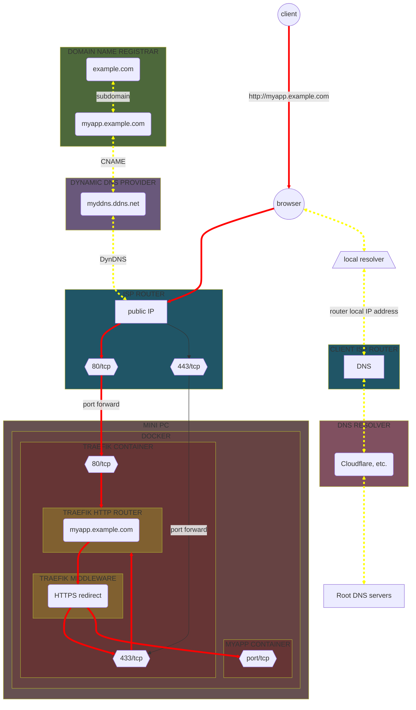

</td>
</tr>
</table>

Once the **resolving name server** got the **IP address** through **DNS resolver** (yellow dotted line),
the request reaches the mini PC on port **80** (HTTP) after being **port forwarded** by the **ISP router**,
to be handled by the **reverse proxy**, and is then redirected to port **443** (HTTPS) thanks to the **HTTPS redirect middleware**,
which finally route it to the target application (red line)

### With VPN

If you try to reach the service through the **WireGuard** VPN, the flow will look like the following :

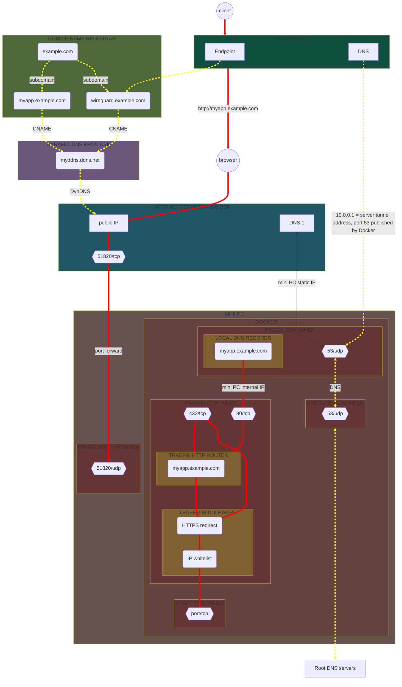

Here, first the client needs to connect to the **VPN server** through his preferred **VPN client**.
The request for VPN connection reaches the mini PC on UDP port **51820** (VPN port)
after being routed by the **CNAME record** to our **dynamic DNS** and then **port forwarded** by our **router**.

The **DNS resolving** always go through **Pi-Hole** and **Unbound** (yellow dotted line), to resolve the VPN server and the application.

The request for the application is handled by Pi-Hole DNS local record which route it to the mini PC IP address,
to be handled by the **reverse proxy**, and is then redirected to port **443** (HTTPS) thanks to the **HTTPS redirect middleware**,
which finally route it to the target application (red line).

If in any way the request arrives to Traefik with an unauthorized IP address, it will be rejected thanks to the **IP whitelist** middleware.

# Install services

## Portainer


We will use **Portainer** to easily manage our Docker containers.

Portainer is an open source web interface that allows to create, modify, restart, monitor... Docker containers, images, volumes, networks and more.

Here is an overview of the network flow :

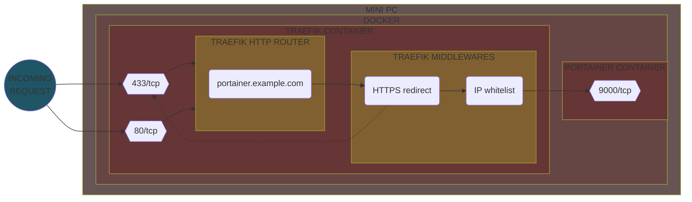

### Setting up

Create a folder to hold the configuration :

```bash
sudo mkdir /opt/apps/portainer
```

Then simply copy the _docker-compose.yml_ file from this project's _portainer_ directory into the _/opt/apps/portainer_ directory.

### Details

#### Service definition

:page_facing_up: _docker-compose.yml_ :

```yaml
version: "3.7"

services:

  portainer:
    image: portainer/portainer-ce:latest
    container_name: portainer
    volumes:
      - portainer-vol:/data
      - /var/run/docker.sock:/var/run/docker.sock
    restart: unless-stopped
    networks:
      - portainer-net
      - traefik-net
    labels:
      - "traefik.enable=true"
      - "traefik.http.routers.portainer.rule=Host(`portainer.example.com`)"
      - "traefik.http.routers.portainer.entrypoints=websecure"
      - "traefik.http.routers.portainer.tls.certresolver=default"
      - "traefik.http.routers.portainer.middlewares=vpn-whitelist"
      - "traefik.http.services.portainer.loadbalancer.server.port=9000"
      - "traefik.docker.network=traefik-net"

volumes:
  portainer-vol:
    name: portainer-vol

networks:

  portainer-net:
    name: portainer-net

  traefik-net:
    name: traefik-net
    external: true
```

Things to notice :

- Portainer's data is bound to a **Docker volume** named `portainer-vol`
- It uses Traefik **labels** to :
    - create a **service** which will point to our container application running on port `9000`
    - create an HTTP **router** that will match `portainer.example.com` URL on our `websecure` **entrypoint** to point to our service
    - assign the `vpn-whitelist` **middleware** so that the traffic will be restricted to allowed IPs only (application reachable only from local network or through VPN)
    - add a **TLS** configuration that will use our `default` **certificates resolver**, so it can generate Let's encrypt certificates
- It runs in its own **network** (`portainer-net`) but must also share the same network as Traefik (`traefik-net`) so it can be auto discovered

### Run

Finally, simply run the Compose file :

```bash
sudo docker-compose -f /opt/apps/portainer/docker-compose.yml up -d
```

You should end-up with a running `portainer` container.

It should also have generated the needed Let's Encrypt certificates in the _acme.json_ file in the Traefik folder.

The application is available at https://portainer.example.com.

On first start, you will be asked to create the **initial administrator user**.


## Dashdot


**Dashdot** is a modern application to monitor server resources through a basic UI.


### Setting up

Create a folder to hold the configuration :

```bash
sudo mkdir /opt/apps/dashdot
```

Then simply copy the _docker-compose.yml_ file from this project's _dashdot_ directory into the _/opt/apps/dashdot_ directory.

### Details

#### Service definition

:page_facing_up: _docker-compose.yml_ :

```yaml
services:

  dashdot:
    image: mauricenino/dashdot:latest
    container_name: dashdot
    restart: unless-stopped
    volumes:
      - /:/mnt/host:ro
    networks:
      - dashdot-net
      - traefik-net
    labels:
      - "traefik.enable=true"
      - "traefik.http.routers.dashdot.rule=Host(`dashdot.example.com`)"
      - "traefik.http.routers.dashdot.entrypoints=websecure"
      - "traefik.http.routers.dashdot.tls.certresolver=default"
      - "traefik.http.routers.dashdot.middlewares=vpn-whitelist"
      - "traefik.http.services.dashdot.loadbalancer.server.port=3001"
      - "traefik.docker.network=traefik-net"

networks:

  dashdot-net:
    name: dashdot-net

  traefik-net:
    name: traefik-net
    external: true
```

Things to notice :

- Dashdot's data is bound to the current directory (read-only)
- It uses Traefik **labels** to :
    - create a **service** which will point to our container application running on port `3001`
    - create an HTTP **router** that will match `dashdot.example.com` URL on our `websecure` **entrypoint** to point to our service
    - add a **TLS** configuration that will use our `default` **certificates resolver**, so it can generate Let's encrypt certificates
    - assign the `vpn-whitelist` **middleware** so that the traffic will be restricted to allowed IPs only (application reachable only from local network or through VPN)
    - create a **middleware** to whitelist an IP range via the `sourceRange` option which sets the allowed IPs to be the local and VPN client IPs (by using **CIDR** notation)
- It runs in its own **network** (`dashdot-net`) but must also share the same network as Traefik (`traefik-net`) so it can be auto discovered

### Run

Finally, simply run the Compose file :

```bash
sudo docker-compose -f /opt/apps/dashdot/docker-compose.yml up -d
```

You should end-up with a running `dashdot` container.

It should also have generated the needed Let's Encrypt certificates in the _acme.json_ file in the Traefik folder.

The application is available at https://dashdot.example.com.


## Homer


**Homer** is a simple application that allows to generate a static homepage from a simple `yaml` configuration file.

We will use it as a dashboard to list our services.


### Setting up

First, create a folder to hold the configuration :

```bash
sudo mkdir /opt/apps/homer
```

Also create an _assets_ directory to hold the application assets and the main configuration file, it will be mounted in the container.

```bash
mkdir /opt/apps/homer/assets
```

By default, on first run, it installs in this directory some example configuration files and assets (favicons, ...), we have disabled this by setting the environment
variable `INIT_ASSETS` to `0` (default `1`).

Note that this _assets_ directory **must** have the same **gid** / **uid** that the container user have (default `1000:1000`), so make sure to execute :

```bash
chown -R 1000:1000 /opt/apps/homer/assets/
```

Then copy :

- the _docker-compose.yml_ file from this project's _homer_ directory into the _/opt/apps/homer_ directory
- the _config.yml_ file from this project's _homer_ directory into the _/opt/apps/homer/assets_ directory

### Details

#### Service definition

:page_facing_up: _docker-compose.yml_ :

```yaml
services:

  homer:
    image: b4bz/homer:latest
    container_name: homer
    volumes:
      - ./assets/:/www/assets
    user: 1000:1000
    restart: unless-stopped
    environment:
      - INIT_ASSETS=0
      - IPV6_DISABLE=1
    networks:
      - homer-net
      - traefik-net
    labels:
      - "traefik.enable=true"
      - "traefik.http.routers.homer.rule=Host(`dashboard.example.com`)"
      - "traefik.http.routers.homer.entrypoints=websecure"
      - "traefik.http.routers.homer.tls.certresolver=default"
      - "traefik.http.routers.homer.middlewares=vpn-whitelist"
      - "traefik.http.services.homer.loadbalancer.server.port=8080"
      - "traefik.docker.network=traefik-net"

networks:

  homer-net:
    name: homer-net

  traefik-net:
    name: traefik-net
    external: true
```

Things to notice :

- Homer's assets data is bound to a local directory named `assets`
- It sets the `INIT_ASSETS` environment variable to `0` to avoid generating default example data
- It sets the `IPV6_DISABLE` environment variable to `1`to disable listening on IPv6 (we don't use IPv6)
- It sets a user with **uid** and **gid** `1000` to run the application in the container
- It uses Traefik **labels** to :
    - create a **service** which will point to our container application running on port `8080`
    - create an HTTP **router** that will match `dashboard.example.com` URL on our `websecure` **entrypoint** to point to our service
    - assign the `vpn-whitelist` **middleware** so that the traffic will be restricted to allowed IPs only (application reachable only from local network or through VPN)
    - add **TLS** configuration that will use our `default` **certificates resolver**, so it can generate Let's encrypt certificates
- It runs in its own network (`homer-net`) but must also share the same network as Traefik (`traefik-net`) so it can be auto discovered

#### Configuration file

:page_facing_up: _config.yml_ :

```yaml
header: false
footer: false

# Optional theme customization
theme: default
colors:
  light:
    highlight-primary: "#3367d6"
    highlight-secondary: "#4285f4"
    highlight-hover: "#5a95f5"
    background: "#f5f5f5"
    card-background: "#ffffff"
    text: "#363636"
    text-header: "#ffffff"
    text-title: "#303030"
    text-subtitle: "#424242"
    card-shadow: rgba(0, 0, 0, 0.1)
    link: "#3273dc"
    link-hover: "#363636"
  dark:
    highlight-primary: "#3367d6"
    highlight-secondary: "#515185"
    highlight-hover: "#50668b"
    background: "#131313"
    card-background: "#2b2b2b"
    text: "#eaeaea"
    text-header: "#ffffff"
    text-title: "#fafafa"
    text-subtitle: "#f5f5f5"
    card-shadow: rgba(0, 0, 0, 0.4)
    link: "#3273dc"
    link-hover: "#ffdd57"

services:
  - name: "Admin tools"
    icon: "fas fa-cloud"
    items:
      - name: "Dashdot"
        logo: "https://getdashdot.com/img/logo512.png"
        subtitle: "Minimal server monitoring"
        tag: "dashboard"
        url: "https://dashdot.example.com"
      - name: "Traefik"
        logo: "https://cdn.worldvectorlogo.com/logos/traefik-1.svg"
        subtitle: "HTTP reverse proxy"
        tag: "network"
        url: "https://traefik.example.com"
      - name: "Portainer"
        logo: "https://cdn.worldvectorlogo.com/logos/portainer.svg"
        subtitle: "Container management platform"
        tag: "tool"
        url: "https://portainer.example.com"
      - name: "Uptime Kuma"
        logo: "https://uptime.kuma.pet/img/icon.svg"
        subtitle: "Application monitoring tool"
        tag: "monitoring"
        url: "https://kuma.example.com/status/dashboard"
      - name: "Pi-Hole"
        logo: "https://pihole.example.com/admin/img/logo.svg"
        subtitle: "Network-wide ad blocking"
        tag: "network"
        url: "https://pihole.example.com/admin"
      - name: "Ackee"
        logo: "https://s.electerious.com/images/ackee/icon.png"
        subtitle: "Analytics tool that cares about privacy"
        tag: "analytics"
        url: "https://ackee.example.com"
      - name: "Sablier"
        logo: "https://upload.wikimedia.org/wikipedia/commons/thumb/3/32/Circle-icons-hourglass.svg/240px-Circle-icons-hourglass.svg.png"
        subtitle: "Workload scaling on demand"
        tag: "tool"
      - name: "Unbound"
        logo: "https://i.imgur.com/cnsNS1O.png"
        subtitle: "Validating, recursive, and caching DNS resolver"
        tag: "network"
      - name: "PhpMyAdmin"
        logo: "https://icon-library.com/images/phpmyadmin-icon/phpmyadmin-icon-24.jpg"
        subtitle: "MySQL database management"
        tag: "tool"
        url: "https://phpmyadmin.example.com"
      - name: "Lychee"
        logo: "https://avatars.githubusercontent.com/u/37916028?s=200&v=4"
        subtitle: "Photo management tool"
        tag: "tool"
        url: "https://lychee.example.com"
  - name: "Applications"
    icon: "fas fa-globe"
    items:
      - name: "Motoclub GraphQL API"
        logo: "https://cdn-icons-png.flaticon.com/512/705/705647.png"
        subtitle: "GraphQL API for our motoclub mobile application"
        tag: "app"
        url: "https://ccteam.example.com/ccteam-gql/graphql"
      - name: "Defrag-life"
        logo: "https://cdn2.steamgriddb.com/file/sgdb-cdn/icon_thumb/946af3555203afdb63e571b873e419f6.png"
        subtitle: "Quake 3 arena Defrag website"
        tag: "app"
        url: "https://quake.example.com"
```

This is simply the configuration file that is used by the application to display the dashboard page.

### Run

Finally, simply run the Compose file :

```bash
sudo docker-compose -f /opt/apps/homer/docker-compose.yml up -d
```

You should end-up with a running `homer` container.

It should also have generated the needed Let's Encrypt certificates in the _acme.json_ file in the Traefik folder.

The application will be available at https://dashboard.example.com.


## PhpMyAdmin


As our services will use some MySQL/MariaDB databases, we will use **PhpMyAdmin** to easily manage our databases.

**PhpMyAdmin** is a free software tool intended to handle the administration of MySQL over the Web, it supports a wide range of operations on **MySQL** and **MariaDB** (managing
databases,
tables, columns, relations, indexes, users, permissions, etc.).

Here is an overview of the network flow :


### Setting up

Create a folder to hold the configuration :

```bash
sudo mkdir /opt/apps/phpmyadmin
```

Then simply copy the _docker-compose.yml_ file from this project's _phpmyadmin_ directory into the _/opt/apps/phpmyadmin_ directory.

### Details

#### Service definition

_docker-compose.yml_ :

```yaml
services:

  phpmyadmin:
    image: phpmyadmin:latest
    container_name: phpmyadmin
    environment:
      - PMA_ARBITRARY=1
    restart: unless-stopped
    volumes:
      - ./darkwolf/:/var/www/html/themes/darkwolf/
    networks:
      - phpmyadmin-net
      - traefik-net
    labels:
      - "traefik.enable=true"
      - "traefik.http.routers.phpmyadmin.rule=Host(`phpmyadmin.example.com`)"
      - "traefik.http.routers.phpmyadmin.entrypoints=websecure"
      - "traefik.http.routers.phpmyadmin.tls.certresolver=default"
      - "traefik.http.routers.phpmyadmin.middlewares=vpn-whitelist"
      - "traefik.http.services.phpmyadmin.loadbalancer.server.port=80"
      - "traefik.docker.network=traefik-net"

networks:

  phpmyadmin-net:
    name: phpmyadmin-net

  traefik-net:
    name: traefik-net
    external: true
```

Things to notice :

- We mount a _theme_ directory to use a custom theme (dark theme named `darkwolf`), so just copy the theme data from official repository https://www.phpmyadmin.net/themes/
- It uses Traefik **labels** to :
    - create a **service** which will point to our container application running on port `80`
    - create an HTTP **router** that will match `phpmyadmin.example.com` URL on our `websecure` **entrypoint** to point to our service
    - assign the `vpn-whitelist` **middleware** so that the traffic will be restricted to allowed IPs only (application reachable only from local network or through VPN)
    - add a **TLS** configuration that will use our `default` **certificates resolver**, so it can generate Let's encrypt certificates
- It runs in its own **network** (`phpmyadmin-net`) but must also share the same network as Traefik (`traefik-net`) so it can be auto discovered
- The `phpmyadmin` network will have to be added to any MySQL/MariaDB database container that we want to make reachable from PhpMyAdmin
- We set the environment variable `PMA_ARBITRARY` to `1` to tell PhpMyAdmin to allow connection to any arbitrary database server (we will be able to specify the server on login
  screen)

### Run

Finally, simply run the Compose file :

```bash
sudo docker-compose -f /opt/apps/phpmyadmin/docker-compose.yml up -d
```

You should end-up with a running `phpmyadmin` container.

It should also have generated the needed Let's Encrypt certificates in the _acme.json_ file in the Traefik folder.

The application is available at https://phpmyadmin.example.com.

> [!IMPORTANT]
> You will have to use the database **service name** as host to connect to a database


## Stirling


**Stirling-PDF** is a robust, locally hosted web-based PDF manipulation tool.
It enables you to carry out various operations on PDF files, including splitting, merging, converting, reorganizing, adding images, rotating, compressing, and more.


### Setting up

First, create a folder to hold the configuration :

```bash
sudo mkdir /opt/apps/stirling
```

Then copy the _docker-compose.yml_ file from this project's _homer_ directory into the _/opt/apps/stirling_ directory.

### Details

#### Service definition

:page_facing_up: _docker-compose.yml_ :

```yaml
services:

  stirling:
    image: frooodle/s-pdf:latest
    container_name: stirling
    volumes:
      - ./trainingData:/usr/share/tessdata
      - ./extraConfigs:/configs
    restart: unless-stopped
    networks:
      - stirling-net
      - traefik-net
    environment:
      - DOCKER_ENABLE_SECURITY=false
      - INSTALL_BOOK_AND_ADVANCED_HTML_OPS=false
      - LANGS=en_GB
    labels:
      - "traefik.enable=true"
      - "traefik.http.routers.stirling.rule=Host(`stirling.example.com`)"
      - "traefik.http.routers.stirling.entrypoints=websecure"
      - "traefik.http.routers.stirling.tls.certresolver=default"
      - "traefik.http.routers.stirling.middlewares=vpn-whitelist"
      - "traefik.http.services.stirling.loadbalancer.server.port=8080"
      - "traefik.docker.network=traefik-net"

networks:

  stirling-net:
    name: stirling-net

  traefik-net:
    name: traefik-net
    external: true
```

Things to notice :

- It binds some volumes for extra OCR languages (_trainingData_) and configuration (_extraConfigs_)
- It sets some environment variables :
  - `DOCKER_ENABLE_SECURITY` to `false` to tell docker to NOT download security jar (required for auth login, but we don't use it)
  - `INSTALL_BOOK_AND_ADVANCED_HTML_OPS ` to `false` as we don't need pdf to/from book and advanced html conversion
  - `LANGS` to `en_GB` to use english font libraries for document conversions
- It uses Traefik **labels** to :
    - create a **service** which will point to our container application running on port `8080`
    - create an HTTP **router** that will match `stirling.example.com` URL on our `websecure` **entrypoint** to point to our service
    - assign the `vpn-whitelist` **middleware** so that the traffic will be restricted to allowed IPs only (application reachable only from local network or through VPN)
    - add **TLS** configuration that will use our `default` **certificates resolver**, so it can generate Let's encrypt certificates
- It runs in its own network (`stirling-net`) but must also share the same network as Traefik (`traefik-net`) so it can be auto discovered

### Run

Finally, simply run the Compose file :

```bash
sudo docker-compose -f /opt/apps/stirling/docker-compose.yml up -d
```

You should end-up with a running `stirling` container.

It should also have generated the needed Let's Encrypt certificates in the _acme.json_ file in the Traefik folder.

The application will be available at https://stirling.example.com.

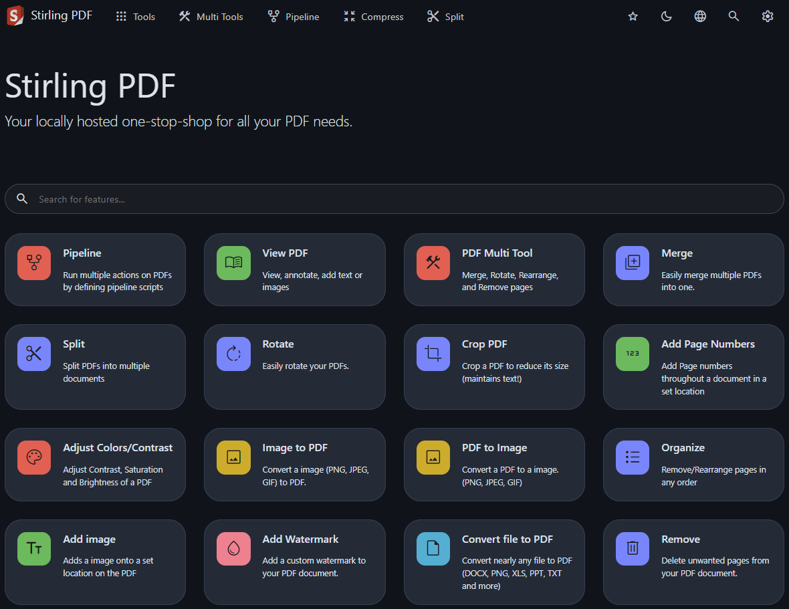

## Defrag-life

<table>
  <tr>
    <td>
      
    </td>
    <td>
      
    </td>
  </tr>
</table>

**Defrag-life** is a **PHP** / **MySQL** website I made in the early 2000's, about the **DeFRaG** mod of the **Quake 3 arena** game.
The project can be found here : https://github.com/Yann39/defrag-life
I simply keep hosting it as a _souvenir_, but it is a static snapshot, it is not intended to be used anymore.

We will use **Nginx** as **HTTP server** along with the **PHP-FPM** module (**FastCGI Process Manager**) for processing PHP files.
At the time of writing this is the preferred method of processing PHP pages with Nginx and is faster than traditional CGI-based methods.

The website also requires a **MySQL** or **MariaDB** database, we will use MariaDB.

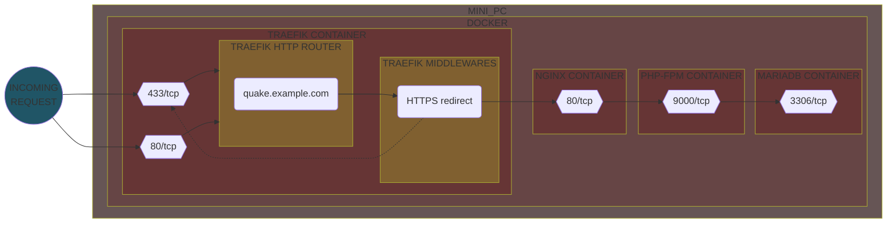

### Setting up

First, create a folder to hold the configuration :

```bash
sudo mkdir /opt/apps/defrag-life
```

Also create a _data_ directory to hold the application files (PHP, HTML, CSS, Javascript files) :

```bash
mkdir /opt/apps/defrag-life/data
```

and copy inside that folder the content from https://github.com/Yann39/defrag-life.

Then copy the files from this project's _defrag-life_ directory into the _/opt/apps/defrag-life_ directory :

- _Dockerfile_ : The file responsible for building image of PHP-FPM
- _docker-compose.yml_ : The definition of the services
- _.env_ : The environment variables (for database connection)
- _default.conf_ : The Nginx configuration
- _www\.conf_ : The PHP-FPM pool configuration

### Details

#### Dockerfile

:page_facing_up: _Dockerfile_ :

```dockerfile
FROM php:8.2-fpm-alpine

LABEL maintainer="Yann39"

# Install mysqli extension
RUN docker-php-ext-install mysqli

RUN addgroup --gid 1000 --system phpuser && \
    adduser --uid 1000 --system phpuser --ingroup phpuser && \
    chown -R phpuser:phpuser /var/www/html && \
    chmod -R 644 /var/www/html

USER 1000

# Start PHP-FPM
CMD ["php-fpm"]
```

This **Dockerfile** allows us to create the Docker image for the **PHP-FPM** service,
the image is based on the popular **Alpine Linux** project, which is much smaller than most distribution base images.

In this Dockerfile we also install the **mysqli** extension which will be required to connect to the MariaDB database from PHP.

Finally, we create a `phpuser` user that will run the process (for security purposes we always ensure that our images run as non-root).

In order to use this image, an **HTTP server** or a **reverse proxy** (such as **Nginx**, **Apache**, or other tool which speaks the **FastCGI** protocol) is required,
that's why we use Nginx.

#### Service definition

:page_facing_up: _docker-compose.yml_ :

```yaml
services:

  nginx:
    image: nginx:latest
    container_name: defrag-life-nginx
    volumes:
      - ./data/:/var/www/html/
      - ./default.conf:/etc/nginx/conf.d/default.conf
    restart: unless-stopped
    networks:
      - defrag-life-net
      - traefik-net
    labels:
      - "traefik.enable=true"
      - "traefik.http.routers.defrag-life.rule=Host(`quake.example.com`)"
      - "traefik.http.routers.defrag-life.entrypoints=websecure"
      - "traefik.http.routers.defrag-life.tls.certresolver=default"
      - "traefik.http.services.defrag-life.loadbalancer.server.port=80"
      - "traefik.docker.network=traefik-net"

  php-fpm:
    build:
      context: .
      dockerfile: ./Dockerfile
    container_name: defrag-life-php
    networks:
      - defrag-life-net
    volumes:
      - ./data/:/var/www/html/
      - ./www.conf:/usr/local/etc/php-fpm.d/www.conf

  mariadb:
    image: mariadb:latest
    container_name: defrag-life-db
    restart: unless-stopped
    env_file: ./.env
    environment:
      - MARIADB_AUTO_UPGRADE="1"
      - MARIADB_ROOT_PASSWORD=$MARIADB_ROOT_PASSWORD
      - MARIADB_DATABASE=$MARIADB_DATABASE
      - MARIADB_USER=$MARIADB_USER
      - MARIADB_PASSWORD=$MARIADB_PASSWORD
    volumes:
      - defrag-life-db-vol:/var/lib/mysql
    networks:
      - defrag-life-net
      - phpmyadmin-net

volumes:

  defrag-life-db-vol:
    name: defrag-life-db-vol

networks:

  defrag-life-net:
    name: defrag-life-net

  traefik-net:
    name: traefik-net
    external: true

  phpmyadmin-net:
    name: phpmyadmin-net
    external: true
```

Here we define 3 services :
- `nginx` : the HTTP server which will speak with the PHP-FPM service to interpret PHP files (whenever the server gets a PHP script request, it utilizes a proxy,
  FastCGI connection to pass that request on to the PHP-FPM service)
  - It defines 2 volumes to bind the website files and the Nginx configuration file (see [Nginx configuration file](#nginx-configuration-file))
  - It uses Traefik **labels** to :
    - create a **service** which will point to our container application running on port `80`
    - create an HTTP **router** that will match `quake.example.com` URL on our `websecure` **entrypoint** to point to our service
    - add **TLS** configuration that will use our `default` **certificates resolver**, so it can generate Let's encrypt certificates
- `php-fpm` : the PHP-FPM service responsible for processing PHP scripts
  - It uses our own Dockerfile, see [Dockerfile](#dockerfile)
  - It defines 2 volumes to bind the website files and the PHP-FPM pool configuration file (see [PHP-FPM configuration file](#php-fpm-configuration-file))
  - It will run by default on port `9000`
- `mariadb` : The MariaDB database that will hold the application data
  - It uses our _.env_ file to retrieve environment variables values for database connection
  - It defines a named volume `defrag-life-db-vol` that will hold the database data
  - It will run by default on port `3306`

All services will run in a `defrag-life-net` **network**, but must also share the same network as Traefik (`traefik-net`) so it can be auto discovered,
and `phpmyadmin-net` so that the database is reachable from PhpMyAdmin, see [PhpMyAdmin](#phpmyadmin).

#### Environment variables

:page_facing_up: _.env_ :

```env
MARIADB_ROOT_PASSWORD=<root_password>
MARIADB_DATABASE=<db_name>
MARIADB_USER=<username>
MARIADB_PASSWORD=<password>
```

It simply set environment variable values (used in the `mariadb` service in the Compose file).

#### Nginx configuration file

:page_facing_up: _www\.conf_ :

```conf
; Start a new pool named 'www'.
[www]
; Unix user/group of the child processes.
user = www-data
group = www-data
; The address on which to accept FastCGI requests.
listen = 127.0.0.1:9000
; Choose how the process manager will control the number of child processes.
pm = dynamic
pm.max_children = 5
pm.start_servers = 2
pm.min_spare_servers = 1
pm.max_spare_servers = 3
; The ping URI to call the monitoring page of FPM.
ping.path = /ping
; This directive may be used to customize the response of a ping request.
ping.response = pong
```

This is a quite basic configuration file for Nginx, we just enabled **ping**,
so we can ping the service from monitoring tool like **Uptime-Kuma**.

#### PHP-FPM configuration file

:page_facing_up: _default.conf_ :

```conf
server {
    listen 80 default_server;
    listen [::]:80 default_server;
    server_name _;

    root /var/www/html;
    index index.php index.html;

    error_log  /var/log/nginx/error.log;
    access_log /var/log/nginx/access.log;

    location ~ \.php$ {
        include fastcgi_params;
        try_files $uri =404;
        fastcgi_index index.php;
        fastcgi_param SCRIPT_FILENAME $document_root$fastcgi_script_name;
        fastcgi_param PATH_INFO $fastcgi_path_info;
        fastcgi_pass php-fpm:9000;
        fastcgi_split_path_info ^(.+\.php)(/.+)$;
    }

    location ~ ^/ping$ {
        access_log off;
        include fastcgi_params;
        fastcgi_param SCRIPT_FILENAME $document_root$fastcgi_script_name;
        fastcgi_pass php-fpm:9000;
    }
}
```

This is also a quite basic configuration file for PHP-FPM :
- it listens for incoming requests on port `80` (and set it as default server, although it is the only one)
- it sets the server name to an invalid server names which never intersect with any real name
  (as they are only one server blocks for port `80`, Nginx will not even bother comparing `server_name` with a request's Host header,
  all the requests would be directed there anyway)
- it sets the root directory to `/var/www/html` for static content in the file system
- it defines files that will be used as an index (_index.php_ and _index.html_)
- it defines the location of error and access log files
- it sets a location to match PHP files (`.php$` will match files ending with _.php_, _.php3_, etc.) to be processed by our PHP-FPM service
- it sets a location to match _/ping_ endpoint to ping our PHP-FPM service

### Run

Finally, simply run the Compose file :

```bash
sudo docker-compose -f /opt/apps/defrag-life/docker-compose.yml up -d
```

You should end-up with 3 running containers :
- `defrag-life-nginx` : The HTTP server
- `defrag-life-php` : The PHP-FPM service
- `defrag-life-mariadb` : The MariaDB database

It should also have generated the needed Let's Encrypt certificates in the _acme.json_ file in the Traefik folder.

The application will be available at https://quake.example.com.


# Contributing

You are invited to contribute fixes or updates.
I'm also open to any criticism or suggestion for improvement.

Please familiarize yourself with the README file before attempting a pull request.
Also make sure to not include any sensitive information.

You can also simply fork the project and continue on your own.

# Acknowledgments

Mainly :

- Some cool **GitHub** projects related to self-hosting :
    - https://github.com/awesome-selfhosted/awesome-selfhosted
    - https://github.com/awesome-foss/awesome-sysadmin
    - https://github.com/mikeroyal/Self-Hosting-Guide
- Various threads on **Reddit**, but especially in :
    - [r/selfhosted](https://www.reddit.com/r/selfhosted/)
    - [r/homelab](https://www.reddit.com/r/homelab/)
    - [r/pihole](https://www.reddit.com/r/pihole/)
    - [r/raspberry_pi](https://www.reddit.com/r/raspberry_pi/)
- **StackExchange** network (particularly **Stack Overflow**, **Superuser**, and **Server Fault**):
    - [Q&A communities](https://stackexchange.com/sites)
- Blog post about WireGuard performance tuning :
    - https://www.procustodibus.com/blog/2022/12/wireguard-performance-tuning/
- Lots of **Google** searches

Of course every upstream project (especially the ones with good documentation :grin:) also deserve credit :beer:

# License

Please refer to the license of each product mentioned in this guide.

Otherwise, the **GPL v3** license applies.

[General Public License (GPL) v3](https://www.gnu.org/licenses/gpl-3.0.en.html)

This program is free software: you can redistribute it and/or modify it under the terms of the GNU
General Public License as published by the Free Software Foundation, either version 3 of the
License, or (at your option) any later version.

This program is distributed in the hope that it will be useful, but WITHOUT ANY WARRANTY; without
even the implied warranty of MERCHANTABILITY or FITNESS FOR A PARTICULAR PURPOSE. See the GNU
General Public License for more details.

You should have received a copy of the GNU General Public License along with this program. If not,
see <http://www.gnu.org/licenses/>.