# Personal self-hosting guide


This project describes my personal **self-hosted** infrastructure setup, running on a **mini PC** (**N100** based).

This was meant to be just a reminder for me, but I wrote it as a guide, in case it might help someone.

It uses only **free** and **open source** software.

<picture>
  <source media="(prefers-color-scheme: dark)" srcset="images/logo-open-source-initiative.svg" height="128"/>
  <source media="(prefers-color-scheme: light)" srcset="images/logo-open-source-initiative-black.svg" height="128"/>
  
</picture>

> [!NOTE]
> This project is based on my previous **home lab** setup running on a **Banana Pi** board, this one contains more
up-to-date instructions.<br>
> The original project can be found at [https://github.com/Yann39/self-hosted](https://github.com/Yann39/self-hosted).

> [!IMPORTANT]
> The content of this repository is provided "as is", with no guarantee that the information is complete or error-free.
> The techniques and tools discussed here come with inherent risks.
> The author takes absolutely no responsibility for possible consequences due to the use of the related software.

# Table of Content

1. <details>
   <summary><a href="#overview">Overview</a></summary>

    1. [Plan](#plan)
    2. [Target architecture](#target-architecture)

   </details>
2. <details>
   <summary><a href="#install-and-prepare-system">Install and prepare system</a></summary>

    1. [System user](#system-user)
    2. [SSH access](#ssh-access)
    3. [Basic tools](#basic-tools)
    4. [Directory structure](#directory-structure)
    5. [Docker & Docker Compose](#docker--docker-compose)

   </details>
3. <details open>
   <summary><a href="#network-configuration">Network configuration</a></summary>

    1. [IP settings](#ip-settings)
    2. [Dynamic DNS](#dynamic-dns)
    3. [Domain and subdomains](#domain-and-subdomains)
    4. [Port forwarding](#port-forwarding)
    5. [Reverse proxy](#reverse-proxy)
    6. [VPN and ad-blocking](#vpn-and-ad-blocking)
    7. [Test the network](#test-the-network)
    8. [Network flow](#network-flow)

   </details>
4. <details open>
   <summary><a href="#install-services">Install services</a></summary>

    1. [PocketID](#pocketid)
    2. [CrowdSec](#crowdsec)
    3. [CrowdSec Web UI](#crowdsec-web-ui)
    4. [Portainer](#portainer)
    5. [PhpMyAdmin](#phpmyadmin)
    6. [Homer](#homer)
    7. [Dashdot](#dashdot)
    8. [Lychee](#lychee)
    9. [Homebox](#homebox)
    10. [Goatcounter](#goatcounter)
    11. [Prometheus](#prometheus)
    12. [Grafana](#grafana)
    13. [Defrag-life](#defrag-life)
    14. [CCTeam](#ccteam)

   </details>
5. <details>
   <summary><a href="#scale-to-zero-with-sablier">Scale to zero with Sablier</a></summary>

    1. [Install Sablier](#install-sablier)
    2. [Install Traefik plugin](#install-traefik-plugin)
    3. [Configure target applications](#configure-target-applications)

   </details>
6. <details>
   <summary><a href="#backup">Backup</a></summary>

    1. [Files](#files)
    2. [Volumes](#volumes)
    3. [Databases](#databases)

   </details>
7. <details>
   <summary><a href="#contributing">Contributing</a></summary>
   </details>
8. <details>
   <summary><a href="#acknowledgments">Acknowledgments</a></summary>
   </details>
9. <details>
   <summary><a href="#license">License</a></summary>
   </details>

# Overview

## Plan

The goal is still the same : learning, and have an environment :

- **100% self-hosted** (privacy preserving, full control over data and software)
- **Secure** (authentication, SSL/TLS, reverse proxy, firewall, ad blocking, DDOS protection, rate limiting, custom DNS
  resolver, ...)
- **Lightweight** (runs smoothly with minimal hardware and software requirements)
- **Container-ready** (isolated, portable, scalable applications)
- **Accessible** (some services accessible only locally, some only through VPN, some publicly)
- **Supervised** (monitoring, alerting, tracking, backup tools)

These are the tools we are going to run :

|                                        Logo                                         | Name            | Repository                                      | Description                                          |
|:-----------------------------------------------------------------------------------:|-----------------|-------------------------------------------------|------------------------------------------------------|
|                    | Docker          | https://github.com/docker                       | Help to build, share, and run container applications |
|    | Docker Compose  | https://github.com/docker/compose               | Run multi-container applications with Docker         |
|              | Portainer       | https://github.com/portainer/portainer          | Management platform for containerized applications   |
|                  | Traefik         | https://github.com/traefik/traefik              | Modern HTTP reverse proxy and load balancer          |
|                  | Sablier         | https://github.com/sablierapp/sablier           | Workload scaling on demand                           |
|                | PocketID        | https://github.com/pocket-id/pocket-id          | Simple OIDC provider for passkey authentication      |
|                | CrowdSec        | https://github.com/crowdsecurity/crowdsec       | Collaborative intrusion prevention, bans attackers   |
|  | CrowdSec Web UI | https://github.com/TheDuffman85/crowdsec-web-ui | Web dashboard for CrowdSec alerts and decisions      |
|              | Wireguard       | https://github.com/WireGuard                    | Simple yet fast and modern VPN                       |
|          | WGDashboard     | https://github.com/WGDashboard/WGDashboard      | Web interface to manage WireGuard peers              |
|                   | Pi-hole         | https://github.com/pi-hole/pi-hole              | Network-wide ad blocking                             |
|                  | Unbound         | https://github.com/NLnetLabs/unbound            | Validating, recursive, and caching DNS resolver      |
|                      | Homer           | https://github.com/bastienwirtz/homer           | Static application dashboard                         |
|         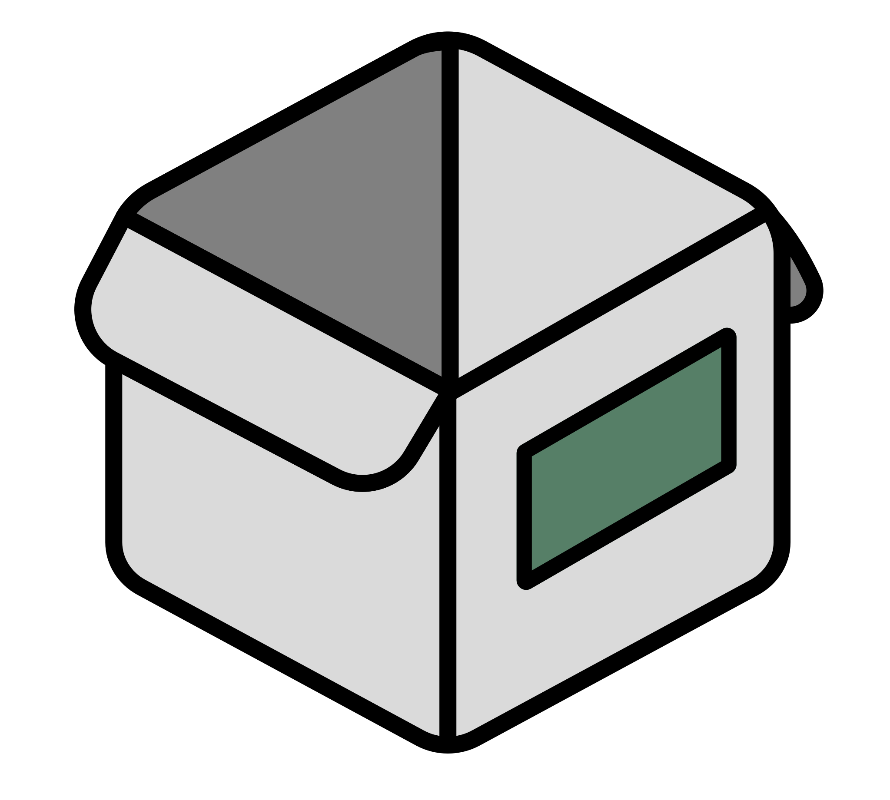         | Homebox         | https://github.com/sysadminsmedia/homebox       | Inventory and organisation system for the home       |
|              | Omnitools       | https://github.com/iib0011/omni-tools           | Various online tools for everyday tasks              |
|                  | Dashdot         | https://github.com/MauriceNino/dashdot          | Minimal server dashboard and monitoring              |
|            | Prometheus      | https://github.com/prometheus/prometheus        | Metrics collection and time series database          |
|                  | Grafana         | https://github.com/grafana/grafana              | Dashboards and visualization for metrics             |
|          | GoatCounter     | https://github.com/arp242/goatcounter           | Privacy-friendly web analytics, no cookies           |
|                    | Lychee          | https://github.com/LycheeOrg/Lychee             | Free photo-management tool                           |
|            | PhpMyAdmin      | https://github.com/phpmyadmin/phpmyadmin        | Web user interface to manage MySQL databases         |

And also some personal applications :

- My first **PHP** / **MySQL** website from the early 2000's ! : https://github.com/Yann39/defrag-life
- A **GraphQL API**  (**Java** / **Spring Boot**) for one of my **Flutter** mobile
  applications : https://github.com/Yann39/ccteam-graphql

All of this runs on a **Trigkey G4 mini PC** ! With the following specifications :

<table>
  <tr>
    <td>
      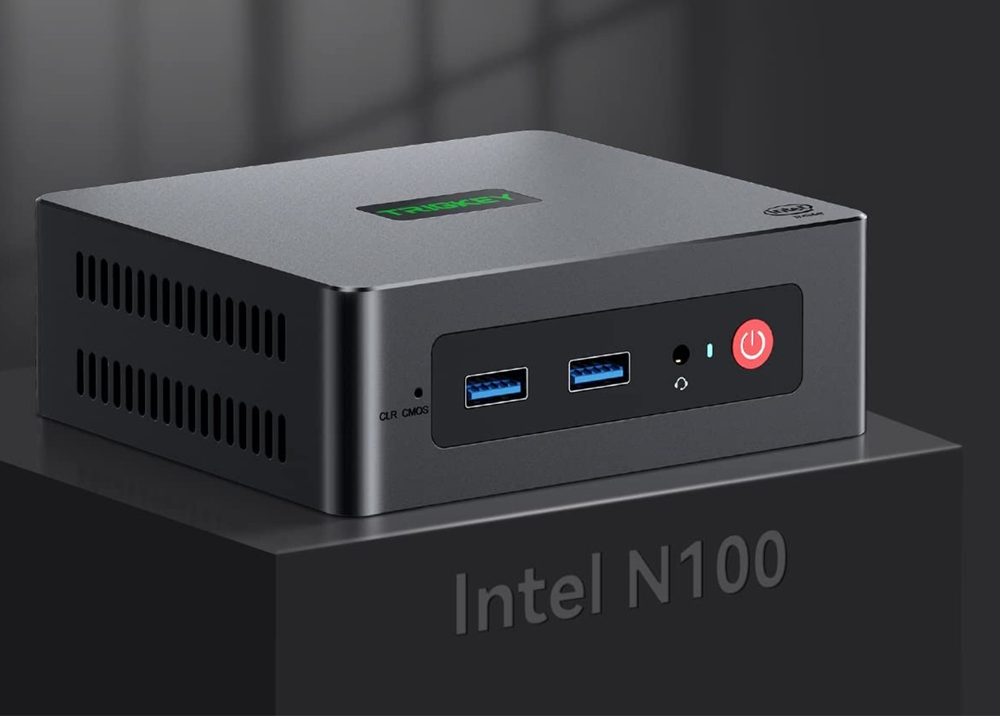
    </td>
    <td>
      <ul>
        <li>Intel Alder Lake N100 12th gen (4Core, up to 3.4 GHz)</li>
        <li>Integrated Intel UHD GPU handling 4K@60Hz</li>
        <li>16GB DDR4 3200MHz</li>
        <li>500GB M.2 NVME SSD</li>
        <li>1 GbE ethernet & Wi-Fi 6</li>
        <li>4 x USB 3.2 Gen2</li>
      </ul>
    </td>
  </tr>
</table>

> [!NOTE]
> This hardware is not designed for high loads, I only have a few users on my public applications, of course if you need
to handle more load you might consider a better machine.

It should also work on many other **x86** based computers.

## Target architecture

Here is a chart representing the global network "architecture" we are going to set up, simplified with only the most
relevant services.
See [Network flow](#network-flow) for more detailed schemas.

This architecture allows exposing applications to the internet while restricting access to some of them only through
**VPN** or from the local network.
It's up to you to choose the accessibility level you need for each service, you may want some to be accessible only from
your local network, some only via VPN, and others to anyone from the internet.


```mermaid
flowchart TB
   style HOSTING_PROVIDER fill: #4d683b
   style DDNS_PROVIDER fill: #69587b
   style INTERNET_SERVICE_PROVIDER fill: #205566
   style SERVER_DEVICE fill: #665151
   style CONTAINER_ENGINE fill: #664343
   style TRAEFIK_CONTAINER fill: #663535
   style PIHOLE_CONTAINER fill: #663535
   style UNBOUND_CONTAINER fill: #663535
   style MYAPP_CONTAINER fill: #663535
   style CROWDSEC_CONTAINER fill: #663535
   style SABLIER_CONTAINER fill: #663535
   style WIREGUARD_HOST fill: #663535
   style TRAEFIK_ROUTER fill: #806030
   style TRAEFIK_MIDDLEWARE fill: #806030
   style VPN_CLIENT fill: #105040
   style PIHOLE_DNS_RECORDS fill: #806030
   style CROWDSEC_COMMUNITY fill: #4d683b
   DOMAIN(example.com)
   SUBDOMAIN_WIREGUARD(wireguard.example.com)
   SUBDOMAIN_MYAPP(myapp.example.com)
   DDNS(myddns.ddns.net)
   ROUTER[public IP]
   ROUTER_PORT80{{80/tcp}}
   ROUTER_PORT443{{443/tcp}}
   ROUTER_PORT51820{{51820/udp}}
   DOCKER_WIREGUARD_PORT51820{{51820/udp}}
   DOCKER_MYAPP_PORT5000{{5000/tcp}}
   DOCKER_PIHOLE_PORT80{{80/tcp}}
   DOCKER_PIHOLE_PORT53{{53/udp}}
   DOCKER_TRAEFIK_PORT443{{443/tcp}}
   DOCKER_TRAEFIK_PORT80{{80/tcp}}
   DOCKER_TRAEFIK_PORT8080{{8080/tcp}}
   DOCKER_UNBOUND_PORT53{{53/udp}}
   TRAEFIK_ROUTER_MYAPP(myapp\n.example.com)
   TRAEFIK_ROUTER_PIHOLE(pihole\n.example.com)
   TRAEFIK_ROUTER_TRAEFIK(traefik\n.example.com)
   ROOT_DNS_SERVERS[Root DNS servers]
   DNS_ISP[DNS 1 & 2]
   DOCKER_PIHOLE_DNS[DNS 1 & 2]
   PIHOLE_DNS_PIHOLE[pihole\n.example.com]
   PIHOLE_DNS_TRAEFIK[traefik\n.example.com]
   PIHOLE_DNS_MYAPP[myapp\n.example.com]
   CROWDSEC_BOUNCER(CrowdSec bouncer)
   CROWDSEC_ENGINE[Security engine\n+ local API]
   ACCESS_LOG[(access log)]
   CROWDSEC_COMMUNITY[CrowdSec\ncommunity blocklist]

   subgraph VPN_CLIENT[VPN CLIENT]
      WIREGUARD_CLIENT_ENDPOINT[Endpoint]
      WIREGUARD_CLIENT_DNS[DNS]
   end

   subgraph HOSTING_PROVIDER[DOMAIN NAME REGISTRAR]
      DOMAIN -->|subdomain| SUBDOMAIN_MYAPP
      DOMAIN -->|subdomain| SUBDOMAIN_WIREGUARD
   end

   subgraph DDNS_PROVIDER[DYNAMIC DNS PROVIDER]
      SUBDOMAIN_MYAPP --->|CNAME| DDNS
      SUBDOMAIN_WIREGUARD --->|CNAME| DDNS
   end

   subgraph INTERNET_SERVICE_PROVIDER[INTERNET SERVICE PROVIDER]
      DDNS --->|DynDNS| ROUTER
      ROUTER --> ROUTER_PORT443
      ROUTER --> ROUTER_PORT80
      ROUTER --> ROUTER_PORT51820
      DNS_ISP
   end

   subgraph SERVER_DEVICE[MINI PC]
   
      subgraph CONTAINER_ENGINE[DOCKER]
      
         subgraph TRAEFIK_CONTAINER[TRAEFIK CONTAINER]
         
            subgraph TRAEFIK_ROUTER[TRAEFIK HTTP ROUTER]
            TRAEFIK_ROUTER_TRAEFIK
            TRAEFIK_ROUTER_MYAPP
            TRAEFIK_ROUTER_PIHOLE
            end
            
            subgraph TRAEFIK_MIDDLEWARE[TRAEFIK MIDDLEWARE]
               REDIRECT(HTTPS redirect)
               IP_WHITELISTING(IP whitelist)
               SABLIER(Sablier dynamic)
               AUTH(PocketID auth)
            end
            
            CROWDSEC_BOUNCER
            ACCESS_LOG
            DOCKER_TRAEFIK_PORT80
            DOCKER_TRAEFIK_PORT443
            DOCKER_TRAEFIK_PORT8080
         end
         
         subgraph SABLIER_CONTAINER[SABLIER CONTAINER]
            DOCKER_SABLIER_PORT10000
            WAITING_PAGE(Waiting page)
         end
         
         subgraph PIHOLE_CONTAINER[PIHOLE CONTAINER]
         
            subgraph PIHOLE_DNS_RECORDS[LOCAL DNS RECORDS]
               PIHOLE_DNS_TRAEFIK ~~~ 
               PIHOLE_DNS_PIHOLE ~~~
               PIHOLE_DNS_MYAPP
            end
         
            DOCKER_PIHOLE_PORT53
            DOCKER_PIHOLE_PORT80
            DOCKER_PIHOLE_DNS
         end
         
         subgraph WIREGUARD_HOST[WIREGUARD CONTAINER]
           DOCKER_WIREGUARD_PORT51820
         end
         
         subgraph MYAPP_CONTAINER[MYAPP CONTAINER]
           DOCKER_MYAPP_PORT5000
         end
         
         subgraph UNBOUND_CONTAINER[UNBOUND CONTAINER]
           DOCKER_UNBOUND_PORT53
         end
         
         subgraph CROWDSEC_CONTAINER[CROWDSEC CONTAINER]
           CROWDSEC_ENGINE
         end
      
      end
   
   end

   CLIENT((User )) -.-> VPN_CLIENT
   BROWSER((Browser)) --> HOSTING_PROVIDER
   CLIENT -.-> BROWSER
   VPN_CLIENT --> BROWSER
   WIREGUARD_CLIENT_ENDPOINT -.->|Server static IP\n192 . 168. 0 . 16|SERVER_DEVICE
   WIREGUARD_CLIENT_DNS -->|Server tunnel address\n10 . 0 . 0 . 1| SERVER_DEVICE
   ROUTER_PORT51820 -->|port forward|DOCKER_WIREGUARD_PORT51820
   ROUTER_PORT443 ------>|port forward|DOCKER_TRAEFIK_PORT443
   ROUTER_PORT80 -->|port forward|DOCKER_TRAEFIK_PORT80
   DNS_ISP ------>|Server static IP|DOCKER_PIHOLE_PORT53
   PIHOLE_DNS_MYAPP --->|Server internal IP|DOCKER_TRAEFIK_PORT443
   PIHOLE_DNS_PIHOLE --->|Server internal IP|DOCKER_TRAEFIK_PORT443
   PIHOLE_DNS_TRAEFIK --->|Server internal IP| DOCKER_TRAEFIK_PORT443
   DOCKER_TRAEFIK_PORT443 --> CROWDSEC_BOUNCER
   CROWDSEC_BOUNCER ----->|IP not banned|TRAEFIK_ROUTER
   DOCKER_TRAEFIK_PORT80 --> TRAEFIK_ROUTER
   CROWDSEC_BOUNCER -.->|every request logged|ACCESS_LOG
   ACCESS_LOG -.........->|reads, detects attacks|CROWDSEC_ENGINE
   CROWDSEC_ENGINE -.->|decisions|CROWDSEC_BOUNCER
   CROWDSEC_ENGINE <-...->|signals / community blocklist|CROWDSEC_COMMUNITY
   TRAEFIK_ROUTER_MYAPP --> REDIRECT
   TRAEFIK_ROUTER_PIHOLE --> REDIRECT
   TRAEFIK_ROUTER_TRAEFIK -->|Dashboard / API|REDIRECT
   IP_WHITELISTING --> AUTH
   IP_WHITELISTING --> DOCKER_PIHOLE_PORT80
   REDIRECT ----> SABLIER
   SABLIER <-..->|return status|DOCKER_SABLIER_PORT10000
   SABLIER --->|not ready|WAITING_PAGE
   SABLIER --->|ready|DOCKER_MYAPP_PORT5000
   REDIRECT --> IP_WHITELISTING
   DOCKER_SABLIER_PORT10000 <-.->|check status|DOCKER_MYAPP_PORT5000
   AUTH --> DOCKER_TRAEFIK_PORT8080
   DOCKER_PIHOLE_DNS ---> DOCKER_UNBOUND_PORT53
   UNBOUND_CONTAINER <----> ROOT_DNS_SERVERS
```

Basically all services will be accessible via dedicated subdomains which will point to our local network, either through
**dynamic DNS** or through **local DNS records**, then a **reverse proxy** will be responsible for routing the requests
to the right application running in **Docker** containers.

We make the **ISP upstream DNS** (from **router** configuration) point to the server **IP address**, so that we reroute
the entire Internet traffic through **Pi-hole** and thus take advantage of its benefits.

In this example **Traefik** (_traefik.example.com_) and **Pi-Hole** (_pihole.example.com_) are only accessible through
VPN and from the local network thanks to local DNS records and IP whitelisting, while **Myapp** (_myapp.example.com_) is
also accessible from the internet publicly. In addition, Traefik dashboard is behind **OIDC authentication** through
**PocketID**, see [PocketID](#pocketid).

On top of that, **CrowdSec** watches the Traefik access log and its bouncer, plugged on the HTTPS entrypoint, rejects
the IP addresses flagged as malicious (by our own scenarios or by the community blocklist) before they reach any
service, see [CrowdSec](#crowdsec).

You will find more details on how all this has been implemented later in this guide.

# Install and prepare system


By default, the Mni PC came with **Windows 11**, I simply installed **Debian 12** instead (then followed version up to
**13.4**, which is the version I use at the time of writing this guide).
Backup the Windows key before, just in case.

- Download latest **Debian** image for amd64 :
    - _debian-12.5.0-amd64-netinst.iso_
- Download **Rufus** or equivalent software to be able to write the image to a USB key
- Simply select the image in **Rufus** and write it to the USB key with the default proposed options
- Insert the USB key into the mini PC and start it, you may need to access the bios to change the boot device priority,
  to boot on the USB key
- Then follow the Debian installation instructions, I personally installed the basic system without GUI (no desktop
  environment)

## System user

When installing **Debian**, you should have been asked to create a **regular user account**.
We will simply use that user for the whole guide.

For security reasons, do not use the `root` user directly.
If you run a program as root and a security flaw is exploited, the attacker has access to the whole system without
restriction.
Using a regular user, even with sudo enabled, will require running `sudo` and will still prompt for the account password
as an additional security step.
It is also safer in case you unintentionally issue a command that could hurt the system (like deleting system files,
etc.).

> [!NOTE]
> We may also create specific users inside **Docker containers** for some applications, specially when creating our own
**Dockerfile**,
> but we'll clarify then whether additional permissions need to be added in case they need access to the local
filesystem through a **bind mount**.

`sudo` is not installed on Debian by default. You have to install it.
So, become root and install sudo :

```shell
su -
apt install sudo
```

Then add user in the sudoers :

```shell
/sbin/adduser username sudo
```

## SSH access

Generally, you'll want to leave your machine in a cool, quiet corner, rather than letting it land around in your feet
and having to connect a keyboard/mouse/screen every time you want to access it.

A solution is simply to access it as a remote computer via **SSH**, from your main computer.

In the normal **Debian** images, SSH is not enabled by default, so you need to install **openssh** server to allow SSH
connections :

```shell
apt update
apt install openssh-server
```

Then simply use the `ssh` command from the client machine to establish a secure and authenticated SSH connection to the
mini PC (here named `n100`) :

```shell
ssh username@n100
```

Enter your password then you are ready to go !

You can also use your preferred **SSH client**.

Unless you want to be able to do some operations from outside your local network, there is no need to open the SSH port
to the internet.
If you do so consider using it behind a VPN (even if SSH itself is very secure).

## Basic tools

We need to install some basic tools which will be useful for the next steps.

Install **curl** (for transferring data through URLs) :

```shell
sudo apt install curl
```

Install **netstat** (to check network connections) :

```shell
sudo apt install net-tools
```

Optionally install **vim** (improved **vi**) :

```shell
sudo apt install vim
```

## Directory structure

We will place every application configuration into the _/opt/apps_ directory, as follows :

 ```
 /
 |- opt
     |- apps
         |- traefik
         |- portainer
         |- phpmyadmin
         |- dashdot
         |- ...
 ```

Usually this directory (_/opt_) is reserved for any software and packages that are not part of the default installation,
but feel free to choose another location.

You can already create the directory :

```shell
sudo mkdir /opt/apps
```

We will create the subdirectories associated with each application when we install them.

## Docker & Docker Compose

<table>
  <tr>
    <td>
      
    </td>
    <td>
      
    </td>
  </tr>
</table>

We will use **Docker** to containerize and run our different applications.

Docker enables to separate applications from the infrastructure, it provides the ability to package and run an
application in an isolated environment called a **container**.
Containers contain everything needed to run the application, so you don't need to rely on what's installed on the host.

We will also install **Docker Compose**, so we can define and run multi-container Docker applications.

Docker provides an installation script, but in Debian 13, we can install the Docker engine through the package manager
and a more modern version of Docker Compose is available as a plugin.

Complete Docker setup on Debian 13 :

```shell
# 1. Remove any conflicting packages
sudo dpkg --remove --force-depends docker-buildx-plugin docker-compose-plugin docker-compose
sudo apt --fix-broken install
sudo apt autoremove

# 2. Install Docker Engine + plugins
sudo apt update
sudo apt install docker.io docker-compose-plugin docker-buildx-plugin

# 3. Enable and start Docker
sudo systemctl enable --now docker
sudo systemctl status docker

# 4. Add user to docker group
sudo usermod -aG docker $USER
newgrp docker  # or log out/in

# 5. Check Docker installation
sudo docker info
```

> [!NOTE]
> In this guide I systematically use latest images (`:latest`tag), but usually you better want to avoid using `:latest`
tags in production.
> Anyway if you use `latest` tags and want to update an image in the future, simply pull it again and rerun your
container / compose file, i.e. :
>
> ```shell
> sudo docker-compose pull
> sudo docker-compose up -d
> ```
>
> Then remove any old images.

# Network configuration

Before installing our services, we need to configure the network, so we can reach our applications from different
locations.

The idea is to have :

- A main **domain** name
- A **subdomain** name for each application that must be reachable from the internet
- A **dynamic DNS** name to avoid having to use a **static** public IP address
- A **Traefik** reverse proxy to handle HTTP request that will be port forwarded to the applications

For services that will not be accessible to the internet, we will use **Pi-Hole**’s ability to manage **local DNS
records** (each record will point to server's internal IP address) so that they are also reachable using a subdomain
name.

Here is an overview of the route for each case, when a client request _myapp.example.com_ :

:small_blue_diamond: Internet access :


```mermaid
flowchart LR
    style HOSTING_PROVIDER fill: #4d683b
    style DDNS_PROVIDER fill: #69587b
    style INTERNET_SERVICE_PROVIDER fill: #205566
    style TRAEFIK_CONTAINER fill: #663535
    style APPLICATION fill: #663535
    style SERVER_DEVICE fill: #665151
    CLIENT((Client))
    SUBDOMAIN_MYAPP(myapp\n.example.com)
    DDNS(myddns\n.ddns.net)
    ROUTER[public IP]
    ROUTER_PORT{{port}}
    DOCKER_TRAEFIK_PORT{{port}}
    APPLICATION_PORT{{port}}

    subgraph HOSTING_PROVIDER[DOMAIN NAME REGISTRAR]
        SUBDOMAIN_MYAPP
    end

    subgraph DDNS_PROVIDER[DYNAMIC DNS PROVIDER]
        DDNS
    end

    subgraph INTERNET_SERVICE_PROVIDER[INTERNET SERVICE PROVIDER]
        ROUTER
        ROUTER_PORT
    end

    subgraph SERVER_DEVICE[MINI PC]
        subgraph TRAEFIK_CONTAINER[TRAEFIK]
            DOCKER_TRAEFIK_PORT
        end

        subgraph APPLICATION[APPLICATION]
            APPLICATION_PORT
        end
    end

    CLIENT --> SUBDOMAIN_MYAPP
    SUBDOMAIN_MYAPP -->|CNAME| DDNS
    DDNS -->|DynDNS| ROUTER
    ROUTER --> ROUTER_PORT
    ROUTER_PORT -->|port forward| DOCKER_TRAEFIK_PORT
    DOCKER_TRAEFIK_PORT -->|HTTP router| APPLICATION_PORT
```

:small_blue_diamond: VPN access :

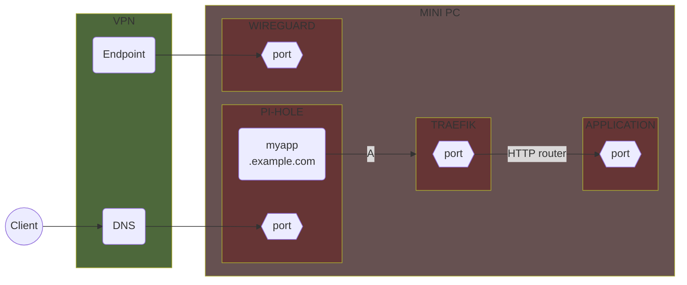
```mermaid
flowchart LR
    style VPN fill: #4d683b
    style TRAEFIK_CONTAINER fill: #663535
    style PI_HOLE fill: #663535
    style APPLICATION fill: #663535
    style WIREGUARD fill: #663535
    style SERVER_DEVICE fill: #665151
    CLIENT((Client))
    VPN_CLIENT(DNS)
    VPN_ENDPOINT(Endpoint)
    PIHOLE_DNS_MYAPP(myapp\n.example.com)
    DOCKER_TRAEFIK_PORT{{port}}
    APPLICATION_PORT{{port}}
    WIREGUARD_PORT{{port}}
    PIHOLE_DNS{{port}}

    subgraph VPN[VPN]
        VPN_CLIENT
        VPN_ENDPOINT
    end

    subgraph SERVER_DEVICE[MINI PC]
        subgraph PI_HOLE[PI-HOLE]
            PIHOLE_DNS
            PIHOLE_DNS_MYAPP
        end

        subgraph TRAEFIK_CONTAINER[TRAEFIK]
            DOCKER_TRAEFIK_PORT
        end

        subgraph APPLICATION[APPLICATION]
            APPLICATION_PORT
        end

        subgraph WIREGUARD[WIREGUARD]
            WIREGUARD_PORT
        end
    end

    VPN_ENDPOINT --> WIREGUARD_PORT
    CLIENT --> VPN_CLIENT
    VPN_CLIENT --> PIHOLE_DNS
    PIHOLE_DNS_MYAPP --->|A| TRAEFIK_CONTAINER
    DOCKER_TRAEFIK_PORT -->|HTTP router| APPLICATION_PORT
```

:small_blue_diamond: Local network access :

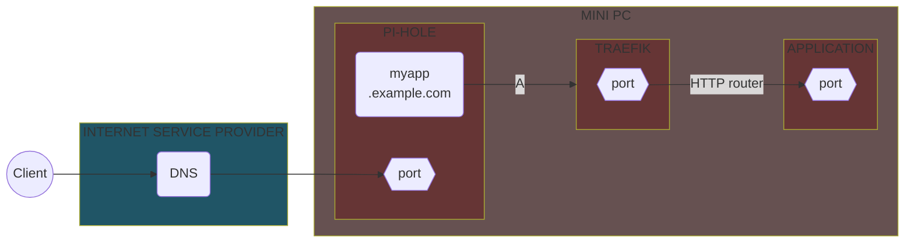
```mermaid
flowchart LR
    style INTERNET_SERVICE_PROVIDER fill: #205566
    style TRAEFIK_CONTAINER fill: #663535
    style PI_HOLE fill: #663535
    style APPLICATION fill: #663535
    style SERVER_DEVICE fill: #665151
    CLIENT((Client))
    ISP_DNS(DNS)
    PIHOLE_DNS_MYAPP(myapp\n.example.com)
    DOCKER_TRAEFIK_PORT{{port}}
    APPLICATION_PORT{{port}}
    PIHOLE_DNS{{port}}

    subgraph INTERNET_SERVICE_PROVIDER[INTERNET SERVICE PROVIDER]
        ISP_DNS
    end

    subgraph SERVER_DEVICE[MINI PC]
        subgraph PI_HOLE[PI-HOLE]
            PIHOLE_DNS
            PIHOLE_DNS_MYAPP
        end

        subgraph TRAEFIK_CONTAINER[TRAEFIK]
            DOCKER_TRAEFIK_PORT
        end

        subgraph APPLICATION[APPLICATION]
            APPLICATION_PORT
        end

    end

    CLIENT ---> ISP_DNS
    ISP_DNS ---> PIHOLE_DNS
    PIHOLE_DNS_MYAPP --->|A| TRAEFIK_CONTAINER
    DOCKER_TRAEFIK_PORT -->|HTTP router| APPLICATION_PORT
```

> [!NOTE]
> My router offers all the required features (DHCP server, DNS server, port forwarding, dynDNS, etc.) for the steps
described below.
> Most of the routers also have those features (they rarely purely route packets), but if this is not your case, you may
have to perform **double NAT** to allow more advanced configurations.
> I obviously cannot go through the configuration specific to each router.

## IP settings

The following changes to the IP settings are required if you want the **DNS requests** of your whole local network to go
through **Pi-Hole** and the custom **DNS resolver** (**Unbound**) (only the DNS requests : the ad blocking is done at
DNS level, the traffic itself does not need to go through the mini PC) :

- Assign a **static IP address** to the mini PC, for example `192.168.0.16` (I have local **DHCP** enabled)
- Make the devices use the mini PC as **DNS server** (`192.168.0.16`), either through the router (the DNS server it
  hands out with DHCP), or manually on each device

Of course Pi-Hole container have to expose port **53** to receive incoming DNS requests. Refer to [Pi-hole](#pi-hole)
setup for more details.

> [!WARNING]
> Setting the mini PC as "DNS server" in the router configuration is **not always enough** : many ISP boxes keep
answering the DNS queries of the LAN devices themselves with the ISP resolvers, and the devices silently bypass
Pi-Hole.
> Always verify from a device which server actually answers :
>
> ```cmd
> nslookup doubleclick.net
> ```
>
> The answering server must be the mini PC (`192.168.0.16`), and a domain from the block lists must resolve to
`0.0.0.0`.
> If the router does not hand out the mini PC address, set the DNS manually on each device
> (on Windows : _Settings -> Network -> Ethernet -> DNS server assignment -> Manual_). In that case :
>
> - leave the **alternate DNS empty** : Windows does not strictly respect the primary/secondary order, a public
    secondary DNS ends up bypassing Pi-Hole
> - leave "**DNS over HTTPS**" **off** : Pi-Hole only speaks plain DNS on port `53`, and this leg never leaves your LAN
    anyway (the privacy part is Unbound resolving directly from the root servers)
> - disable "secure DNS" / DNS-over-HTTPS in the **browsers** too, else they use their own resolver and bypass Pi-Hole

If you don't want the whole network to use Pi-Hole, skip the second point, then only the VPN clients (and the devices
you configure manually) will use it.

## Dynamic DNS

When connecting from outside our network (from the internet), we need to know the **public IP address** of our router to
connect to.
But unless we have a **static** public IP (not necessarily the safest option), we are getting dynamically-assigned
public IP addresses (via **DHCP**), so we would need to update the configuration everytime the IP changes, which is very
uncomfortable.

Fortunately we can register a **dynamic host record** (DynDNS), and configure it in our router configuration so that
when the public IP address changes, a call is made to the DynDNS service provider to update the record. That way our
network will always be reachable from the internet via the **DynDNS** record no matter the IP address.

Well, simply register a **dynamic DNS** hostname from a provider (there are free ones), for example **No-IP**,
**DuckDNS**, etc. :

- hostname : `myddns.ddns.net`
- IP / target : _internet box external IP (public IP)_
- type : `A`

Then activate **DynDNS** on the router :

- Service provider : `No-IP` (adapt to your provider)
- Hostname : `myddns.ddns.net`
- Username : _xxxxxxxx_
- Password : _xxxxxxxx_

The IP will be updated automatically when a change will be detected.

> [!NOTE]
> Your ISP may only support some dynamic DNS provider that can be configured in the router, so you may want to pick one
that is supported natively, else you will have to set up an **update client** that will be responsible to regularly
check for IP change.

## Domain and subdomains

You will need to buy a **domain** from you preferred domain provider, for this guide I will use `example.com`.

> [!IMPORTANT]
> I advise you to also subscribe to a **domain privacy** option in order to hide you personal data.
> Domain Privacy protects the contact information of the owner of a domain name in the **WHOIS directory**.
> Normally, this public database is used to verify the availability of a domain name and who it belongs to,
> but marketing companies and scammers can also exploit it for other purposes, like sending spam or identity theft.

You can check the information that are available publicly about your domain using the `whois` command :

```shell
whois example.com
```

Right, we will then use **subdomains** to locate each service as a separate website to avoid having to buy a new domain
name for each.
A subdomain is simply a prefix added to the original domain name, it functions as a separate website from its domain.

So, let's create **subdomains** from the domain name registrar settings, for every service to be exposed on the
internet :

- `wireguard.example.com` : To access the [WireGuard](#wireguard) server
- `quake.example.com` : To access the [Defrag-life](#defrag-life) website
- `lychee.example.com` : To access the [Lychee](#lychee) website
- `ccteam.example.com` : To access the [CCTeam](#ccteam) APIs
- `goatcounter.example.com` : So that [GoatCounter](#goatcounter) can track the traffic on the exposed websites

Then add corresponding **CNAME records** to point to the dynamic DNS `myddns.ddns.net` :

- `CNAME	wireguard	    myddns.ddns.net`
- `CNAME	quake	        myddns.ddns.net`
- `CNAME	lychee	        myddns.ddns.net`
- `CNAME	ccteam	        myddns.ddns.net`
- `CNAME	goatcounter	    myddns.ddns.net`

A **CNAME record** is just a records which points a name to another name instead of pointing to an IP address (like
**A** records).

> [!NOTE]
> Services that will only be accessible from the local network or through VPN do **not** need to have a subdomain
defined at this level.
> We will use Pi-Hole's **local DNS records** for that. See [Pi-Hole configuration](#pi-hole).
>
> However, while the VPN stuff is fully functional and to be able to do the configuration easily from your client
machine, you may want to temporarily create subdomains and add CNAME records for the following subdomains (also remove
the IP whitelisting middleware in the corresponding service configuration), else you will be blocked by IP
whitelisting :
>
> - `portainer.example.com` : To manage Docker containers (start/stop, check logs, etc.)
> - `pihole.example.com` : To configure the local DNS records

## Port forwarding

For our services to be reachable from the internet, we need to **forward incoming requests** to our mini PC so that they
will be handled by our **Traefik** reverse proxy.
This can be done through **port forwarding**.

Port forwarding directs the **router** to send any incoming data from the internet to a specified device on the network.
It is safe to forward ports on your router as long as you have a **reverse proxy** or a **firewall** running in between.

### Allow access without VPN

If you decide that at least one of the applications must be reachable from the outside directly through **HTTP** or
**HTTPS** without requiring a **VPN**, then simply port forward the related **TCP** ports to the mini PC.

Go to your router configuration and add a **port forward rule** for the **TCP** port `80` :

- Name : `Traefik`
- Input port : `80`
- Target port : `80`
- Device : `n100`
- Protocol : `TCP`

and `443` :

- Name : `Traefik SSL`
- Input port : `443`
- Target port : `443`
- Device : `n100`
- Protocol : `TCP`

We will configure **Traefik** later to **redirect** HTTP requests to HTTPS.
But if you prefer you can only open the HTTPS port (if you are going to use Let's encrypt' **HTTP challenge**,
it's enough for the TLS certificates to be generated, see the warning box a little further below though).

### Allow access through VPN

If you want some applications to be available from the outside **through VPN**, then open the **VPN** port :

Go to your router configuration and add a **port forward rule** for the **UDP** port `51820` :

- Name : `VPN`
- Input port : `51820`
- Target port : `51820`
- Device : `n100`
- Protocol : `UDP`

Of course if you want the applications to be available **only through VPN**, then only open the VPN port, remove any
opened HTTP/HTTPS port.

> [!WARNING]
> Note that if you use Let's Encrypt' **HTTP challenge** to issue and renew **SSL/TLS certificates**, target websites
must be reachable from the internet.
> That mean you will have to open the HTTP (S) port at least when issuing/renewing certificates, you could also keep
them open and restrict access to the necessary IP ranges, if your router supports that.
> If you really don't want to open HTTP (S) ports (better for security), then you will have to configure **DNS
challenge** instead of HTTP challenge, if your DNS provider support it.
> See [HTTP challenge](#http-challenge) and [DNS challenge](#dns-challenge) below when configuring **Traefik**.

# Reverse proxy


**Traefik** is an open source **HTTP reverse proxy** and **load balancer** that can integrate easily with our Docker
infrastructure.
We will use it to intercept and route every incoming request to the corresponding backend services.

It will listen to our services and instantly generates the **routes**, so that they are connected to the outside world.
We will also use it to automatically generate and renew **SSL/TLS certificates** through **Let's Encrypt**.

Here is an overview of the network flow on our setup :

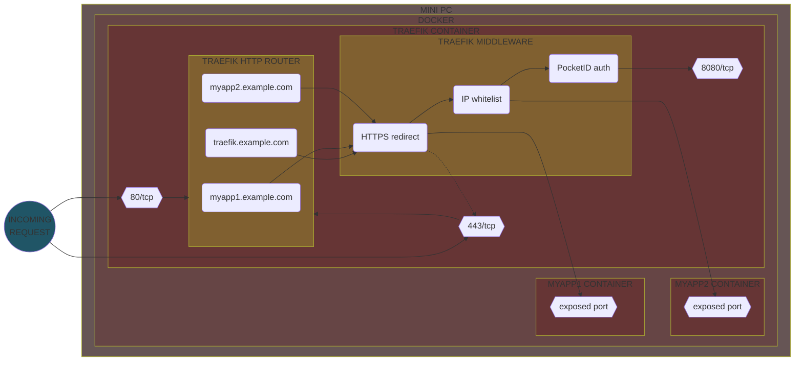
```mermaid
flowchart LR
    style INCOMING_REQUEST fill: #205566
    style TRAEFIK_CONTAINER fill: #663535
    style MYAPP1_CONTAINER fill: #663535
    style MYAPP2_CONTAINER fill: #663535
    style TRAEFIK_ROUTER fill: #806030
    style TRAEFIK_MIDDLEWARE fill: #806030
    style SERVER_DEVICE fill: #665555
    style CONTAINER_ENGINE fill: #664545
    INCOMING_REQUEST((INCOMING\nREQUEST))
    DOCKER_TRAEFIK_PORT443{{443/tcp}}
    DOCKER_TRAEFIK_PORT80{{80/tcp}}
    DOCKER_TRAEFIK_PORT8080{{8080/tcp}}
    DOCKER_MYAPP1_PORT{{exposed port}}
    DOCKER_MYAPP2_PORT{{exposed port}}
    TRAEFIK_ROUTER_MYAPP1(myapp1.example.com)
    TRAEFIK_ROUTER_MYAPP2(myapp2.example.com)
    TRAEFIK_ROUTER_TRAEFIK(traefik.example.com)

    subgraph SERVER_DEVICE[MINI PC]
        subgraph CONTAINER_ENGINE[DOCKER]
            subgraph MYAPP1_CONTAINER[MYAPP1 CONTAINER]
                DOCKER_MYAPP1_PORT
            end
            subgraph MYAPP2_CONTAINER[MYAPP2 CONTAINER]
                DOCKER_MYAPP2_PORT
            end

            subgraph TRAEFIK_CONTAINER[TRAEFIK CONTAINER]
                subgraph TRAEFIK_ROUTER[TRAEFIK HTTP ROUTER]
                    TRAEFIK_ROUTER_TRAEFIK
                    TRAEFIK_ROUTER_MYAPP1
                    TRAEFIK_ROUTER_MYAPP2
                end
                subgraph TRAEFIK_MIDDLEWARE[TRAEFIK MIDDLEWARE]
                    REDIRECT(HTTPS redirect)
                    IP_WHITELISTING(IP whitelist)
                    AUTH(PocketID auth)
                end
                DOCKER_TRAEFIK_PORT80
                DOCKER_TRAEFIK_PORT443
                DOCKER_TRAEFIK_PORT8080
            end

        end
    end

    INCOMING_REQUEST --> DOCKER_TRAEFIK_PORT80
    INCOMING_REQUEST --> DOCKER_TRAEFIK_PORT443
    DOCKER_TRAEFIK_PORT80 --> TRAEFIK_ROUTER
    DOCKER_TRAEFIK_PORT443 --> TRAEFIK_ROUTER
    TRAEFIK_ROUTER_TRAEFIK --> REDIRECT
    TRAEFIK_ROUTER_MYAPP1 --> REDIRECT
    TRAEFIK_ROUTER_MYAPP2 --> REDIRECT
    REDIRECT -.-> DOCKER_TRAEFIK_PORT443
    IP_WHITELISTING --> AUTH
    IP_WHITELISTING ---> DOCKER_MYAPP2_PORT
    REDIRECT --> IP_WHITELISTING
    REDIRECT ---> DOCKER_MYAPP1_PORT
    AUTH --> DOCKER_TRAEFIK_PORT8080
```

It handles HTTP to HTTPS redirection, IP whitelisting and authentication (through PocketID, or basic authentication)
through custom **middlewares**.
In this example `myapp1` is accessible from the internet, `myapp2` is accessible only through VPN,
and Traefik (dashboard and APIs) is accessible only through VPN after OIDC authentication.

I've deliberately left out **Sablier** for the moment, to keep things simple, but basically this would simply add a
middleware that checks the state of the application, in order to temporarily display a waiting page while not ready,
refer to [Scale to zero with Sablier](#scale-to-zero-with-sablier) for more information.

### Installation

First, create a folder to hold data and configuration :

```bash
sudo mkdir /opt/apps/traefik
```

Then copy the files from this project's _traefik_ directory into the _/opt/apps/traefik_ directory :

- _docker-compose.yml_ : The Traefik service definition
- _traefik.yml_ : The Traefik static configuration
- _.env_ : The secrets read by the service (DNS provider token, CrowdSec bouncer key), to fill in
- _credentials.txt_ : A file that will hold users credentials to access the Traefik dashboard (if you want it restricted
  with **basic authentication**),
  see [Generate basic authentication credentials](#generate-basic-authentication-credentials)

Files should be ready to use, simply replace the e-mail address (`admin@example.com`) in the _traefik.yaml_ file with
your e-mail address.

You will also need to create the **JSON** file to hold the certificates, see [TLS certificates](#tls-certificates).

Anyway you will find below more details about each file
(see [Configuration files details](#configuration-files-details)) and some further configuration.

### Generate basic authentication credentials

If you want the Traefik dashboard to be protected with **basic authentication** rather than via PocketID, allowed users
have to be added to the _credentials.txt_ file.

You can generate a user/password using **htpasswd** :

1. Install the needed package if not present :

    ```bash
    sudo apt install apache2-util
    ```

2. Generate the credentials (we use **bcrypt** with a computing time of 10) :

    ```bash
    htpasswd -nbBC 10 admin xxxxxxxx
    ```

Then copy the output to the _credentials.txt_ file.

> [!NOTE]
> Actually as Traefik will be accessible only from local network and through VPN, we don't really need to set up
authentication, but it's more for demonstration, and it's always better to have 2 layers of security than one.

### TLS certificates


To enable **HTTPS** on our websites, we need to get **TLS certificates** from a **certificate authority**.
A TLS certificate certifies, in a way, the authenticity of a website (actually it proves that we have the ownership of
the public key used for TLS encryption), preventing hackers from intercepting any data transmitted between a device and
the site.

We will use **Let's Encrypt**, a nonprofit certificate authority which provide free TLS certificates.

**Let's Encrypt** can automatically generate certificates via Traefik, for that we need to create a `acme.json` file
that will hold the generated certificates (file is mapped to a volume in the **Compose** file), so that the certificates
are persisted between container restarts (not generated each time which could raise Let's Encrypt rate limits), we also
need to change the permissions so that Traefik can access and edit this file :

```bash
cd /opt/apps/traefik
touch /opt/apps/traefik/acme.json
chmod 600 /opt/apps/traefik/acme.json
```

#### HTTP challenge

If you use **HTTP challenge**, Let's Encrypt will validate that you control the domain names by trying to reach the web
server through HTTP or HTTPS.
So you must open and port forward ports `80` or `443` for the TLS certificate to be issued correctly.

The corresponding certificate resolver configuration would be :

```yaml
tlsChallenge: { }
```

> [!WARNING]
> Note that Let’s Encrypt will not let you use this challenge to issue wildcard certificates.

#### DNS challenge

When using **DNS challenge**, Let's Encrypt will validate that you control the domain names by querying the DNS system
for a TXT record under the target domain name.
So you **don't** need to open HTTP or HTTPS port on your router.

First, check that your DNS provider is supported by Traefik to automate the DNS verification, a list can be found
here : https://doc.traefik.io/traefik/https/acme/.

Then :

1. Create an **access token** / **API key** from your provider interface
2. Add the necessary **environment variables** required by your provider to the _.env_ file next to the Compose file
   (loaded with `env_file`), i.e. :
   ```shell
   MYPROVIDER_ACCESS_TOKEN=<access_token_here>
   ```

The corresponding certificate resolver configuration would be :

```yaml
dnsChallenge:
  provider: <your_provider_here>
```

### IP whitelisting

We will set up **IP whitelisting** so that we can allow only traffic from the local network or from the VPN for some of
our services.
Indeed, even if we do not have defined public subdomains for these services, they can still be reached via the IP
address (actually in that case Traefik will not route the request, but it is still better to have this additional
security).

Basically it involves creating a **Traefik middleware** for defining the IP whitelist and apply it to the needed
services.
It is declared once, in the dynamic configuration directory :

:page_facing_up: _traefik/dynamic/vpn-whitelist.yml_ :

```yaml
http:
  middlewares:
    vpn-whitelist:
      ipAllowList:
        sourceRange:
          - "192.168.0.0/24" # your LAN
          - "10.0.0.0/24" # Wireguard subnet
```

So we allow exactly 2 **IP ranges** :

- the **local IP range** : IPs assigned to the devices on your local network (computers, mobile devices, ...)
- the **WireGuard subnet** : the VPN peers keep their tunnel address when they reach Traefik, as WireGuard runs on the
  host and the peers' traffic is not NATed towards the containers

That way :

- Requests coming from the local network come with a local address assigned by the router DHCP, and are **accepted**.
- Requests coming from the internet through VPN come with a `10.0.0.x` address, and are **accepted**.
- Requests coming from the internet without VPN come with a public IP address and are **rejected**, as it does not match
  any whitelisted address.

> [!NOTE]
> A request from your own network to a name that resolves to your **public IP** goes through the NAT loopback of the
router and reaches Traefik with the **public IP** as source : rejected as well.
> So the private services must resolve to the LAN address of the mini PC for the devices that use them (Pi-Hole's local
DNS records, see [Pi-hole](#pi-hole)), and a container that has to call another one (Portainer or the Traefik plugin
fetching a token from PocketID) must use the **internal** name (i.e.`http://pocketid:1411`), never the public URL.

> [!WARNING]
> Never whitelist a **Docker network range**.
> A container is not a trusted client, and with the [network segmentation](#network-segmentation) below, a whitelisted
Docker range would let a compromised public container walk straight into the private services.

Then it just needs to be referenced in the `middlewares` list of every router that must stay private
(`vpn-whitelist@file`), as you will see in the services definitions.
Keep in mind that it only protects the requests that go **through Traefik** : what a container can reach directly on the
Docker networks is the job of the network segmentation.

### Network segmentation

Every service behind the reverse proxy must share a Docker network with Traefik to be reachable by name, but containers
on the same network can also talk **to each other** directly, without going through Traefik and its middlewares. With a
single shared network, a vulnerability in one of the applications exposed to the internet (an old PHP website, a photo
gallery, an API) gives an attacker a foothold from which every other container is one HTTP request away :
Pi-Hole's admin interface, Portainer (and through it the Docker socket, i.e. root on the host), the Traefik
dashboard, ...
The IP whitelist does not help there, it never sees this traffic.

So Traefik sits on two networks, and nothing else is allowed to be on both :

| Network               | Who                                                                                                           | Reachable from                               |
|-----------------------|---------------------------------------------------------------------------------------------------------------|----------------------------------------------|
| `traefik-private-net` | Traefik and the **private** services : Pi-Hole, Portainer, Dashdot, Homer, PhpMyAdmin, PocketID, Sablier, ... | local network and VPN only (`vpn-whitelist`) |
| `traefik-public-net`  | Traefik and the services **exposed to the internet** : Lychee, Defrag-life, ...                               | anyone                                       |

A compromised public container can then only see Traefik and the other public applications, never the private ones. A
few rules go with it :

- a public application never joins `traefik-private-net`, a private one never joins `traefik-public-net`, and no
  application joins both
- the databases stay on the private network of their own stack (`lychee-net`, `defrag-life-net`, ...), never on a
  Traefik network
- containers holding the **Docker socket** (Portainer, Sablier) are private by construction
- PocketID stays private : a public application that would authenticate through it does so with the browser, through the
  public URL and Traefik, it does not need a shared network
- a public application monitored by Prometheus shares a **dedicated** network with Prometheus only
  (`prometheus-<app>-net`), never `prometheus-net` nor its own database network, see [Prometheus](#prometheus)

### Configuration files details

#### Static configuration file :

:page_facing_up: _traefik.yaml_ :

```yaml
api:
  dashboard: true

entryPoints:
  web:
    address: ':80'

  websecure:
    address: ':443'
    http:
      middlewares:
        # Every request on 443 is checked against the CrowdSec decisions first (see the CrowdSec section)
        - crowdsec@file

providers:
  docker:
    watch: true
    exposedByDefault: false
  file:
    directory: /etc/traefik/dynamic
    watch: true

certificatesResolvers:
  default:
    acme:
      email: admin@example.com
      storage: acme.json
      caServer: 'https://acme-v02.api.letsencrypt.org/directory'
      dnsChallenge:
        provider: <your_provider_here>

experimental:
  plugins:
    sablier:
      moduleName: "github.com/sablierapp/sablier-traefik-plugin"
      version: "v1.1.0"
    traefik-oidc-auth:
      moduleName: "github.com/sevensolutions/traefik-oidc-auth"
      version: "v0.18.0"
    crowdsec-bouncer-traefik-plugin:
      moduleName: "github.com/maxlerebourg/crowdsec-bouncer-traefik-plugin"
      version: "v1.7.1"
log:
  level: info

accessLog:
  # One JSON line per request, written to a file shared (read-only) with the CrowdSec container
  filePath: /var/log/traefik/access.log
  format: json
  fields:
    headers:
      names:
        # Request headers are dropped from the log by default, the User-Agent is needed by the CrowdSec scenarios
        User-Agent: keep
```

This config file :

- enables the Traefik **dashboard** (UI that provides a detailed overview of the current configuration)
- defines 2 **entrypoints**, named `web` (for port `80`) and `websecure` (for port `443`) so that we can receive
  requests on these ports
- defines a `docker` provider so that we can use **container labels** for retrieving routing configuration. We have
  configured it to **not** expose containers by default, so that containers that do not have a `traefik.enable=true`
  label are ignored from the resulting routing configuration
- defines a `default` **certificate resolver** for Let's Encrypt to automatically generate certificates
- set log level to `info` (you can set it to `debug` when you need more information on what's going on)
- writes the **access log** as JSON lines in _/var/log/traefik/access.log_ (a folder bound in the Compose file), one
  line per request with the client IP, the router and the status code :
  the fastest way to understand why a request is rejected, and the input of [CrowdSec](#crowdsec). Request headers are
  dropped from the log by default, the `User-Agent` is kept for the CrowdSec scenarios
- declares the Traefik **plugins** used by the middlewares (Sablier, OIDC authentication, CrowdSec bouncer), downloaded
  when Traefik starts
- sets the `crowdsec` middleware on the `websecure` **entrypoint**, so that every HTTPS request is checked against the
  CrowdSec decisions before reaching any router

#### Service definition :

:page_facing_up: _docker-compose.yml_ :

```yaml
services:

  traefik:
    image: traefik:latest
    container_name: traefik
    restart: unless-stopped
    ports:
      - "80:80"
      - "443:443"
    volumes:
      - /var/run/docker.sock:/var/run/docker.sock:ro    # So that Traefik can listen to the Docker events
      - ./traefik.yml:/etc/traefik/traefik.yml:ro       # Traefik static configuration
      - ./dynamic:/etc/traefik/dynamic:ro               # Traefik dynamic configuration
      - ./acme.json:/acme.json                          # For Let's Encrypt certificate storage
      - ./credentials.txt:/credentials.txt:ro           # For Traefik dashboard credentials
      - ./logs:/var/log/traefik                         # Access log, shared (read-only) with CrowdSec
    networks:
      - traefik-private-net # private : services reachable from the local network and the VPN only
      - traefik-public-net  # public : services exposed to the internet
    env_file: .env    # DNS provider token for the DNS challenge, CrowdSec bouncer key
    labels:
      - "traefik.enable=true"

      # Redirect all HTTP requests to HTTPS
      - "traefik.http.middlewares.httpsonly.redirectscheme.scheme=https"
      - "traefik.http.middlewares.httpsonly.redirectscheme.permanent=true"
      - "traefik.http.routers.httpsonly.rule=HostRegexp(`{any:.*}`)"
      - "traefik.http.routers.httpsonly.middlewares=httpsonly"

      # Configure dashboard with HTTPS
      - "traefik.http.routers.dashboard.rule=Host(`traefik.example.com`)"
      - "traefik.http.routers.dashboard.entrypoints=websecure"
      - "traefik.http.routers.dashboard.service=dashboard@internal"
      - "traefik.http.routers.dashboard.tls=true"
      - "traefik.http.routers.dashboard.tls.certresolver=default"

      # Configure API with HTTPS
      - "traefik.http.routers.api.rule=Host(`traefik.example.com`) && PathPrefix(`/api`)"
      - "traefik.http.routers.api.entrypoints=websecure"
      - "traefik.http.routers.api.service=api@internal"
      - "traefik.http.routers.api.tls=true"
      - "traefik.http.routers.api.tls.certresolver=default"

      # Secure dashboard/API behind VPN and PocketID authentication (or basic authentication)
      - "traefik.http.routers.dashboard.middlewares=vpn-whitelist@file,traefik-auth@file"
      - "traefik.http.routers.api.middlewares=vpn-whitelist@file,traefik-auth@file"
      # - "traefik.http.middlewares.auth.basicauth.usersfile=/credentials.txt" # only if you use basic auth

networks:

  traefik-private-net:
    name: traefik-private-net

  traefik-public-net:
    name: traefik-public-net
```

This **Compose** file mainly :

- exposes ports `80` and `443` to receive incoming HTTP/HTTPS requests
- binds the _logs_ folder where the access log is written, shared read-only with the [CrowdSec](#crowdsec) container
- defines two **networks** : `traefik-private-net` for the services that must stay private (reachable from the local
  network and the VPN only) and `traefik-public-net` for the services exposed to the internet,
  see [Network segmentation](#network-segmentation)
- loads its secrets from the _.env_ file (see [Environment variables](#environment-variables-)) : the DNS provider
  access token used to issue Let's Encrypt certificates through **DNS challenge**, and the CrowdSec bouncer key
- defines an HTTP **router** that will match `traefik.example.com` URL on our `websecure` **entrypoint** to point to our
  service
- defines `httpsonly` **router** and **middleware** responsible for automatically redirecting HTTP requests to HTTPS
- configures `dashboard` and `api` routers to use secure HTTPS endpoint with our certificate resolver to generate
  related Let's Encrypt certificates
- secures dashboard and API endpoints with the `vpn-whitelist` middleware (requests from the local network and the VPN
  only) and the `traefik-auth` middleware (authentication through [PocketID](#pocketid), basic authentication being the
  alternative)

> [!CAUTION]
> The order in which the middlewares are defined in relation to a router is important, they will be applied in the same
order as their declaration.

#### Environment variables :

:page_facing_up: _.env_ :

```shell
# Access token / API key of your DNS provider, used by the Let's Encrypt DNS challenge (variable name depends on the provider, see Traefik documentation)
MYPROVIDER_ACCESS_TOKEN=<access_token_here>
# Key of the CrowdSec bouncer (same value as BOUNCER_KEY_traefik in crowdsec/.env), read by traefik/dynamic/crowdsec.yml
CROWDSEC_BOUNCER_KEY=<bouncer_key>
```

- `MYPROVIDER_ACCESS_TOKEN` is the token of your DNS provider, its name depends on the provider
  (see [DNS challenge](#dns-challenge))
- `CROWDSEC_BOUNCER_KEY` is read by the `crowdsec` middleware in _dynamic/crowdsec.yml_ through a template (dynamic
  configuration files are Go templates, `{{ env "..." }}` reads a variable of the Traefik container),
  so that no secret sits in a configuration file. Same value as `BOUNCER_KEY_traefik` in _crowdsec/.env_
  (see [CrowdSec](#crowdsec))

### Run

Finally, run the Compose file :

```bash
sudo docker-compose -f /opt/apps/traefik/docker-compose.yml up -d
# You may need to force recreate if you changed a config from an already running configuration
sudo docker-compose -f /opt/apps/traefik/docker-compose.yml up -d --force-recreate
```

You should end-up with a running `traefik` container.

It should also have generated the needed Let's Encrypt certificates in the _acme.json_ file.

So you can reach the dashboard at https://traefik.example.com.

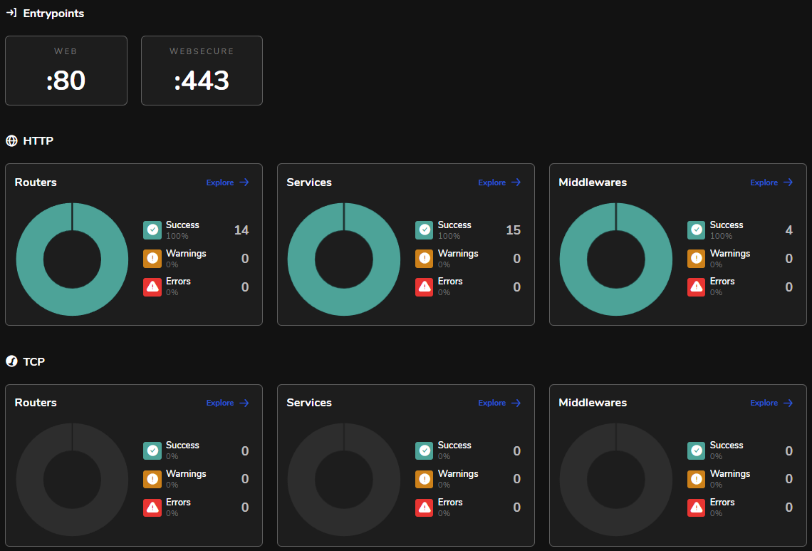

# VPN and ad-blocking

<table>
  <tr>
    <td>
      
    </td>
    <td>
      
    </td>
    <td>
      
    </td>
  </tr>
</table>

We will install **WireGuard**, **Pi-hole** and **Unbound** to create a virtual private network (VPN) with ad-blocking
and DNS privacy/caching capabilities.

**WireGuard** is a free and open-source modern VPN that utilizes state-of-the-art cryptography to securely encapsulates
**IP packets** over **UDP**, in order to lower the environment attack surface. As a VPN it establishes a secure
connection between a computer and the internet by making all the traffic going through an encrypted **tunnel**. The
point of self-hosting our own VPN server is to ensure a **private** and **secure** connection to our services from the
internet, without having to trust third-party VPN providers, and to keep complete freedom and control over the browsing
data.

**Pi-hole** is a network-level ad blocking and internet tracker blocking application.
It has the ability to block traditional website advertisements as well as advertisements in unconventional places such
as mobile apps ads.
It can also be used as a **DNS** server and has a built-in **DHCP** server.

**Unbound** is a validating, recursive, caching **DNS resolver**, that has the ability to contact **DNS authority**
servers directly in order to validate and cache the queries on your network and serve them to you directly, so you don’t
have to rely on your ISP or third-party DNS resolvers (like Cloudflare or Google).

So the idea is that every client in any network can use the VPN to reach our applications while taking advantage of
Pi-Hole and Unbound :


```mermaid
flowchart TB
    style WINDOWS11 fill: #205566
    style LAPTOP fill: #205566
    style MOBILE fill: #205566
    style MACOS fill: #205566
    style WIREGUARD_SERVER fill: #764545
    style PIHOLE fill: #663535
    style UNBOUND fill: #562525
    style INTERNET fill: #4d683b
    style HOME_NETWORK fill: #263555
    style 5G_NETWORK fill: #263555
    style WORK_NETWORK fill: #263555
    style MINI_PC fill: #504255
    WINDOWS11(Peer 1 \n Home PC - Windows 11)
    LAPTOP(Peer 2 \n Home laptop - Ubuntu 22)
    MOBILE(Peer 3 \n Phone - Android 14)
    MACOS(Peer 4 \n Work PC - MacOS 13)
    WIREGUARD_SERVER(WireGuard server - Secure VPN)
    PIHOLE(Pi-Hole - Firewall & ad-blocking)
    UNBOUND(Unbound - Custom DNS resolver)
    INTERNET((Internet))

    subgraph HOME_NETWORK[Home network]
        WINDOWS11
        LAPTOP
    end

    subgraph 5G_NETWORK[Mobile network]
        MOBILE
    end

    subgraph WORK_NETWORK[Work network]
        MACOS
    end

    subgraph MINI_PC[Mini PC]
        WIREGUARD_SERVER
        PIHOLE
        UNBOUND
    end

    WINDOWS11 -- WireGuard tunnel --> WIREGUARD_SERVER
    LAPTOP -- WireGuard tunnel --> WIREGUARD_SERVER
    MOBILE -- WireGuard tunnel --> WIREGUARD_SERVER
    MACOS -- WireGuard tunnel --> WIREGUARD_SERVER
    WIREGUARD_SERVER -- DNS queries --> PIHOLE
    PIHOLE -- Filtered DNS queries --> UNBOUND
    UNBOUND -- DNS resolution --> INTERNET
```

**WireGuard** runs directly on the host (kernel module, managed by `wg-quick`), **Pi-Hole** and **Unbound** run as two
small **Compose** stacks.
Everything about performance is in [VPN connection speed](#vpn-connection-speed).

### Installation

First, create the folders that will hold data and configuration :

```bash
sudo mkdir -p /opt/apps/pihole /opt/apps/unbound /opt/apps/wgdashboard/data
```

Then from this project's _pihole_, _unbound_ and _wgdashboard_ directories, copy the _docker-compose.yml_ files into the
matching _/opt/apps_ folders.
For more details about these files, see [Configuration files details](#configuration-files-details-1).

WireGuard itself is a Debian package :

```bash
sudo apt install wireguard
```

Now let's take a look at the configuration for each service.

### Configuration

#### WireGuard


WireGuard runs **directly on the host** : the kernel module is part of Debian, `wg-quick` manages the interface, and the
peers are managed in the configuration file (or with the `wg` command). Compared to running it in a container, this
removes a few hops for every packet (Docker bridge, `veth` pair, a second NAT layer and the userland proxy)
and makes the network stack much easier to observe and tune.

Generate the keys (`wg genkey | tee private.key | wg pubkey > public.key`, on the server and on each peer) and create
the configuration :

```bash
sudo nano /etc/wireguard/wg0.conf
```

:page_facing_up: _/etc/wireguard/wg0.conf_ (`enp1s0` is the LAN interface of the mini PC, `%i` is replaced by the
interface name) :

```ini
[Interface]
Address = 10.0.0.1/24
ListenPort = 51820
MTU = 1420
PrivateKey = <server private key>
PostUp = iptables -N DOCKER-USER 2>/dev/null || true; iptables -C DOCKER-USER -i %i -j ACCEPT 2>/dev/null || iptables -I DOCKER-USER 1 -i %i -j ACCEPT; iptables -C DOCKER-USER -o %i -j ACCEPT 2>/dev/null || iptables -I DOCKER-USER 2 -o %i -j ACCEPT; iptables -A FORWARD -i %i -j ACCEPT; iptables -A FORWARD -o %i -j ACCEPT; iptables -t nat -C POSTROUTING -s 10.0.0.0/24 -o enp1s0 -j MASQUERADE 2>/dev/null || iptables -t nat -A POSTROUTING -s 10.0.0.0/24 -o enp1s0 -j MASQUERADE; iptables -t mangle -C FORWARD -p tcp --tcp-flags SYN,RST SYN -j TCPMSS --clamp-mss-to-pmtu 2>/dev/null || iptables -t mangle -A FORWARD -p tcp --tcp-flags SYN,RST SYN -j TCPMSS --clamp-mss-to-pmtu; iptables -t raw -C PREROUTING -i enp1s0 -p udp --dport 51820 -j NOTRACK 2>/dev/null || iptables -t raw -A PREROUTING -i enp1s0 -p udp --dport 51820 -j NOTRACK; iptables -t raw -C OUTPUT -o enp1s0 -p udp --sport 51820 -j NOTRACK 2>/dev/null || iptables -t raw -A OUTPUT -o enp1s0 -p udp --sport 51820 -j NOTRACK; tc qdisc replace dev %i root cake bandwidth 860mbit besteffort || true
PostDown = iptables -D DOCKER-USER -i %i -j ACCEPT || true; iptables -D DOCKER-USER -o %i -j ACCEPT || true; iptables -D FORWARD -i %i -j ACCEPT || true; iptables -D FORWARD -o %i -j ACCEPT || true; iptables -t nat -D POSTROUTING -s 10.0.0.0/24 -o enp1s0 -j MASQUERADE || true; iptables -t mangle -D FORWARD -p tcp --tcp-flags SYN,RST SYN -j TCPMSS --clamp-mss-to-pmtu || true; iptables -t raw -D PREROUTING -i enp1s0 -p udp --dport 51820 -j NOTRACK || true; iptables -t raw -D OUTPUT -o enp1s0 -p udp --sport 51820 -j NOTRACK || true

[Peer]
# desktop-home
PublicKey = <peer public key>
AllowedIPs = 10.0.0.2/32

[Peer]
# phone
PublicKey = <peer public key>
AllowedIPs = 10.0.0.3/32
```

Then protect and enable it :

```bash
sudo chmod 600 /etc/wireguard/wg0.conf
sudo systemctl enable --now wg-quick@wg0
```

The `PostUp` line looks scary, but each piece has a reason (and `wg-quick` runs the hooks with `set -e`, so anything
that may legitimately fail has to be guarded with `|| true` or a `-C` check, else the interface is torn down) :

- `DOCKER-USER` **fast path** : Docker sets the `FORWARD` policy to `DROP` and inserts about a hundred rules (four per
  bridge network) that **every relayed packet** walks through.
  The `DOCKER-USER` chain is evaluated first and is never flushed by Docker, so accepting the tunnel traffic there
  short-circuits the whole chain.
  The plain `FORWARD` rules are a fallback in case `wg0` comes up before Docker at boot.
- **NAT** : the peers' traffic leaves with the mini PC address (on my machine the rule was already set globally, keeping
  it here makes the file self-contained).
- **TCPMSS clamp** : TCP inside the tunnel can carry `1380` bytes per segment at most, clamping the MSS on the SYN
  packets prevents fragmentation and black holes for the relayed connections.
- `NOTRACK` : connection tracking is useless for the encrypted UDP flow (WireGuard authenticates every packet itself),
  this saves a lookup per packet.
- `cake` : gives every flow inside the tunnel its own queue and keeps the latency low. Without it, the `fq_codel` queue
  of the physical interface sees the whole tunnel as a **single flow**, so a big download can starve a video stream or a
  call. `860mbit` is what a gigabit link carries once the tunnel overhead is added, it costs nothing measurable.

The **DNS** pushed to the peers is the tunnel address of the server, `10.0.0.1` : Docker publishes Pi-Hole's port `53`
on **every** address of the host, including this one, so the peers reach Pi-Hole (then Unbound) without any extra route,
and it also works in split tunnel mode since the address is inside the tunnel subnet.

##### Peers configuration

On each device, the client configuration looks like this :

```ini
[Interface]
PrivateKey = <peer private key>
Address = 10.0.0.2/32
DNS = 10.0.0.1
MTU = 1420

[Peer]
PublicKey = <server public key>
Endpoint = 192.168.0.16:51820
# full tunnel : 0.0.0.0/1, 128.0.0.0/1 — split tunnel : 10.0.0.0/24
AllowedIPs = 0.0.0.0/1, 128.0.0.0/1
PersistentKeepalive = 25
```

> [!TIP]
> A few things I learned the hard way about the peers configuration :
>
> - At home, use the **LAN IP address** of the server as endpoint (`192.168.0.16:51820`), not the public hostname :
    going through the public IP from inside the LAN makes the router do **NAT loopback** (hairpin) in software, which
    cost me about half of the throughput (350/440 Mbit/s instead of 570/860).
    Easiest is to keep two tunnels on the device : a "home" one with the LAN endpoint and an "away" one with the
    public hostname.
> - At home, a **full tunnel** brings nothing : the traffic leaves through the same router anyway, it only adds
    encryption and relaying work for the server (and costs about 40 % of the download speed,
    see [VPN connection speed](#vpn-connection-speed)).
    Use a **split tunnel** (`AllowedIPs` limited to the VPN subnet, here `10.0.0.0/24`, which contains the DNS address
    so that the DNS still goes through the tunnel), or simply no tunnel at all with the device DNS pointing to the mini
    PC : the ad blocking is done at DNS level, it is identical in all cases.
> - `0.0.0.0/1, 128.0.0.0/1` also disables the **kill switch** and the **DNS leak protection** of the Windows client
    (only a `0.0.0.0/0` route enables them), so Windows silently falls back to the router DNS if Pi-Hole does not answer
    within about a second.
> - Never point a client to an address the server holds on a **secondary interface** (Wi-Fi, USB adapter), see the
    warning below.

> [!WARNING]
> Connect the server to the LAN through **one interface only**. I had the Wi-Fi of the mini PC connected to the same
network "just in case", plus a USB Ethernet adapter left over from a test.
> Linux answers ARP requests for **all** its addresses on **all** its interfaces, so the router could deliver traffic
for the main address through the Wi-Fi or the USB adapter, NetworkManager detected its own Wi-Fi as an address conflict
and dropped the USB adapter address for hours at each DHCP renewal, and the client I had pointed to that address lost
its tunnel at random and got a fraction of the throughput when it worked. Disable the Wi-Fi
(`sudo nmcli radio wifi off`) and unplug what you don't use.

#### WGDashboard


Managing the peers in _wg0.conf_ with an editor works, but a web interface is more comfortable : **WGDashboard** shows
the interfaces, the peers, their last handshake and their traffic, creates a peer with its keys and its QR code, and
serves the configuration file to download. It is the replacement for WireGuard UI, which is no longer maintained and
which could not be used with WireGuard running on the host.

> [!IMPORTANT]
> The container **must share the host's network namespace** (`network_mode: host`). WireGuard runs on the host, so the
`wg0` interface lives in the host's namespace :
> a container with its own namespace can read _wg0.conf_ through the bind mount, and will happily list your peers, but
it cannot query the interface itself.
> The symptom is unmistakable : the peers are displayed but always as **disconnected**, with no handshake and no
traffic, whatever their real state.

Two consequences follow from the host namespace, and they are the whole difficulty of this service :

- Traefik can no longer reach it by container name, since the container is on no Docker network. The service points at
  the mini PC address instead, `http://192.168.0.16:10086`
- the dashboard is reachable **directly** at that same address, hence bypassing Traefik, the IP whitelist and any
  authentication middleware. Its own login therefore remains the barrier that covers every path, and it is the reason we
  do not put PocketID in front of it : that would only protect the nice URL while leaving the direct one open

To close that direct path, `app_ip` in the `[Server]` section of _wg-dashboard.ini_ can bind the dashboard to the
gateway address of the private Traefik network
(`docker network inspect traefik-private-net --format '{{range .IPAM.Config}}{{.Gateway}}{{end}}'`) so that only Traefik
and the containers of that network can reach it.
Keep in mind that this address depends on the subnet Docker assigns, and would change if the network were recreated.

> [!NOTE]
> **OIDC is not available for the admin dashboard**, only for the client side app. The `[OIDC] admin_enable` setting and
the `/api/oidc/toggle` endpoint exist,
> and the `Admin` section of _wg-dashboard-oidc-providers.json_ can be filled, but nothing consumes them :
`dashboard.py` never instantiates the `DashboardOIDC` module,
> so no provider is registered, no request is made to the provider, nothing is logged, and no button appears. Don't
spend an evening looking for a configuration mistake.
>
> The single sign-on documented by the project applies to the **client side app** (`/client`), a self-service portal
where people sign in to download the peers assigned to them : fill the `Client` section instead, set
`client_enable = true`, and register the portal URL itself as the callback. The (empty) **Clients** tab of the admin
dashboard lists those portal accounts, not your peers, an empty tab is normal when you are the only user.
>
> The `extra_hosts` entry of the Compose file is there for that case : in the host namespace the container resolves
names through the **host** resolver, which knows nothing of the private names, so the provider would not even be
resolved. See [PocketID](#pocketid) for the general problem and its other solutions.

##### Setting up

Create the folder, then copy the _docker-compose.yml_ file from this project's _wgdashboard_ directory into
_/opt/apps/wgdashboard_,
and the _wgdashboard.yml_ file from _traefik/dynamic_ into _/opt/apps/traefik/dynamic_ :

```bash
sudo mkdir -p /opt/apps/wgdashboard/data
```

Then add a **local DNS record** `wgdashboard.example.com` pointing to the mini PC (see [Pi-hole](#pi-hole)), start the
container (see [Run](#run-1)) and open https://wgdashboard.example.com. The default credentials are `admin` / `admin`,
change them immediately in the settings, where TOTP can also be enabled.

Your existing peers appear on their own : the dashboard reads the very _wg0.conf_ the interface uses, so nothing has to
be imported and nothing is duplicated.

> [!WARNING]
> The dashboard can start and stop the interface, but `wg0` is managed by `wg-quick@wg0` through systemd. Avoid
switching it from both sides, otherwise systemd and the dashboard end up with diverging views of what is running.
>
> Peers created from the dashboard are written directly into _wg0.conf_. Keep a copy of that file with your backups : it
holds the **server's private key**, and losing it means every client has to be reconfigured.

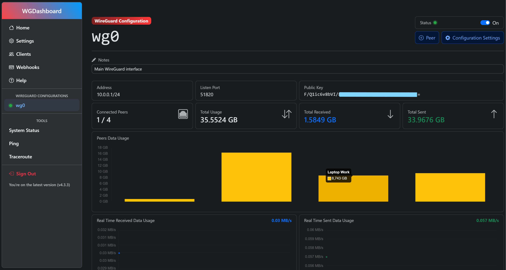

#### Pi-hole


The Compose file will run a **Pi-Hole** instance which need to be configured.

First, Pi-Hole must accept the queries coming from other interfaces than its own Docker network (the VPN peers, the
LAN) : by default it only answers "local" requests, and "local" for Pi-Hole is the Docker bridge network. The Compose
file sets this once and for all with the`FTLCONF_dns_listeningMode: 'all'` environment variable (the equivalent of
_Settings -> DNS -> Interface settings -> "Permit all origins"_ in the web UI).

The web UI is reachable at https://pihole.example.com through **Traefik** : the Compose file does not carry Traefik
labels anymore, the router is declared in a file of Traefik's **dynamic configuration** directory instead
(see [Traefik routing](#traefik-routing) below), restricted to the local network and the VPN peers.

> [!IMPORTANT]
> Chicken and egg : the private services have **no public DNS record**
(see [Domain and subdomains](#domain-and-subdomains)), so `pihole.example.com` can only be resolved by Pi-Hole itself
through a **local DNS record**... which is created in the web UI you cannot reach yet. Until it exists the browser gets
`NXDOMAIN` (or, if a public record for the name still exists, reaches Traefik through the NAT loopback of the router
with the public IP as source and gets a `403`, see [IP whitelisting](#ip-whitelisting)).
> Create the first record from the command line, it is applied immediately :
>
> ```bash
> sudo docker exec pihole pihole-FTL --config dns.hosts '[ "192.168.0.16 pihole.example.com" ]'
> sudo docker exec pihole nslookup pihole.example.com 127.0.0.1
> ```
>
> Then make sure the device you use has Pi-Hole as DNS server (`192.168.0.16`, see [IP settings](#ip-settings)), flush
its cache (`ipconfig /flushdns` on Windows) and restart the browser. `--config dns.hosts` **replaces** the whole list :
to add entries later from the command line, repeat the complete list, or simply use the web UI once it is reachable.

I don't set a Pi-Hole **password** : authentication is handled in front of it by the reverse proxy, with an OIDC
middleware backed by **PocketID** (see [PocketID](#pocketid)),
and the [network segmentation](#network-segmentation) keeps the container out of reach of the applications exposed to
the internet. The image generates a random password at first start, remove it (or set yours) with :

```bash
sudo docker exec -it pihole pihole setpassword
```

In _Settings -> DNS_, untick every public upstream and add **Unbound** as custom upstream DNS server : `10.2.0.200#53`
(its static address in the `pihole-net` Docker network, see [Services definition](#services-definition)).

Then we need to add **local DNS records** so that the domain names can be resolved from VPN or local network (remember
the DNS requests of the VPN peers and of the configured devices go through Pi-Hole).
We simply need to associate domain names with the internal IP address of the mini PC, so they can be handled by the
reverse proxy.

Go to _Settings -> Local DNS Records_ (or repeat the `pihole-FTL --config dns.hosts` command above with the complete
list) and add a **DNS record entry** for every subdomain that must only be reachable from the local network or through
VPN :

```
ccteam.example.com                  192.168.0.16
crowdsec.example.com                192.168.0.16
dashboard.example.com               192.168.0.16
dashdot.example.com                 192.168.0.16
goatcounter.example.com             192.168.0.16
homebox.example.com                 192.168.0.16
lychee.example.com                  192.168.0.16
omnitools.example.com               192.168.0.16
phpmyadmin.example.com              192.168.0.16
pihole.example.com                  192.168.0.16
pocketid.example.com                192.168.0.16
portainer.example.com               192.168.0.16
quake.example.com                   192.168.0.16
traefik.example.com                 192.168.0.16
wgdashboard.example.com             192.168.0.16
```

Add the **public** services as well (Lychee, Defrag-life, ...), even though they have a public DNS record. Without a
local record, a device at home resolves them to the **public IP** and the traffic loops through the **NAT loopback** of
the router : it costs about half of the throughput (measured in [VPN connection speed](#vpn-connection-speed)),
and Traefik sees the requests coming from your public IP address instead of the device's one, so they are treated like
internet traffic by the IP whitelist and by [CrowdSec](#crowdsec) (a misbehaving device at home could get your whole
household banned from your own sites). With a local record, everything stays on the LAN.

> [!NOTE]
> Consequence for the VPN peers away from home : they use Pi-Hole through the tunnel, so these names resolve to
`192.168.0.16` for them too, which is only reachable with a **full tunnel** or with `192.168.0.0/24` added to
`AllowedIPs`. Do that on the *away* profile only : on the *home* profile, routing the LAN subnet through the tunnel
would send the traffic to your printer or TV through the mini PC.

You can also configure rate limiting (default to **1000 queries per minute**), domain whitelisting, DNS settings, etc.
but I will not go through all Pi-Hole configuration, the default should work just fine.

If it is working you should be able to see activity in the dashboard.

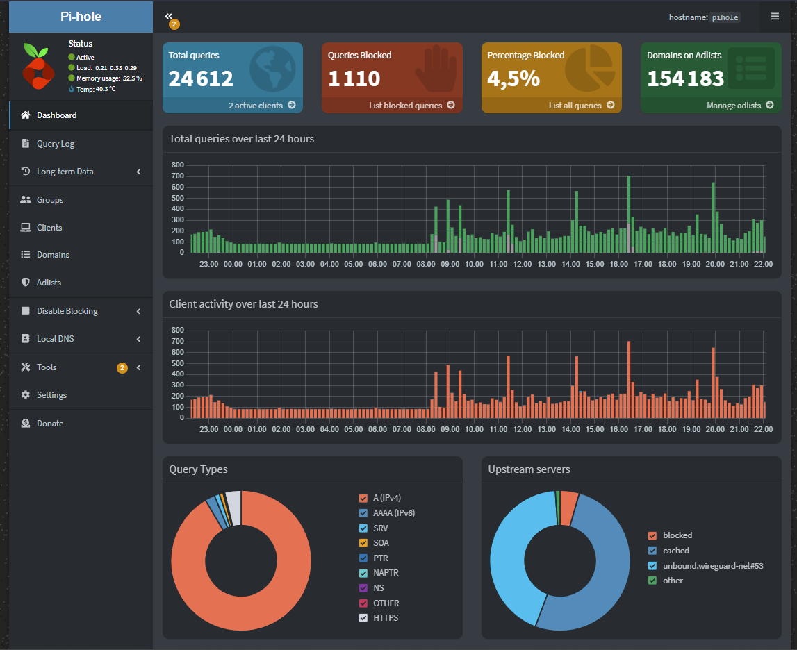

#### Unbound


The first time you will run **Unbound**, it may fail because a few files included in the default configuration will be
missing (at least in the image version I'm using), indeed the following files are included in the default _unbound.conf_
file (which should have been created correctly in _/etc/unbound/unbound.conf_) :

- _/opt/unbound/etc/unbound/a-records.conf_
- _/opt/unbound/etc/unbound/srv-records.conf_
- _/opt/unbound/etc/unbound/forward-records.conf_

You could manually create these files (you can find default ones from the Unbound **GitHub** repository),
and then mount them into the Unbound container, before running again the Compose file.

But that way it would run Unbound in **forwarder** mode, meaning that the DNS server will forward all the queries to
**Cloudflare**.
This was my first try and a **DNS leak test** confirmed that it uses Cloudflare, indeed the default
_forward-records.conf_ file includes the following forwarding rules :

```
forward-addr: 1.1.1.1@853#cloudflare-dns.com
forward-addr: 1.0.0.1@853#cloudflare-dns.com
```

So, if you want to run Unbound **without forwarding**, just remove or comment the lines that includes the above files
from the _unbound.conf_ file.
Do not create any of these files at all and do not bind them in the container, just remove the includes from the
_unbound.conf_ file.

A DNS leak test should now show your IP address as DNS server.

> [!IMPORTANT]
> If you use the default _forward-records.conf_ file, Unbound will run in **forwarder** mode, meaning that it will
forward all queries to **Cloudflare**.
> To remove the default forwarding to Cloudflare and make your unbound container a recursive-only server, edit the
_unbound.conf_ file and remove include of the _forward-records.conf_ file.

Then there are a few settings in _unbound.conf_ that are **essential** when Unbound runs in a container. I ran for
months with a resolver that returned `SERVFAIL` for most names that were not already in cache (`login.live.com`,
`www.apple.com`, the Twitch video servers, ...), cached names being served fine, which made streams randomly fail to
start and Windows painfully slow at boot when the tunnel was up :

```
server:
    # the container has no IPv6 connectivity : without this, Unbound keeps trying the IPv6 addresses of the authoritative
    # servers, burns its retry budget and ends up with SERVFAIL ("exceeded the maximum number of sends")
    do-ip6: no
    # 0x20 case randomization breaks with load balanced domains (Microsoft, Akamai, Twitch, ...) that answer differently
    # on each query, Unbound then cannot validate its fallback ("0x20 failed, then got different replies in fallback")
    use-caps-for-id: no
    # 1 is plenty, 5 (debug) formats a huge amount of text for every single query, even when it ends up in /dev/null
    verbosity: 1
    # log the reason of each SERVFAIL to the container output (sudo docker logs unbound)
    log-servfail: yes
    logfile: ""
    use-syslog: no
```

A quick way to validate such changes without touching the running resolver is to start a **throwaway** Unbound with the
modified file on the same Docker network, and to compare both on names that are not cached :

```bash
sudo docker run -d --name unbound-test --network wireguard_net -v /tmp/unbound-test.conf:/opt/unbound/etc/unbound/unbound.conf:ro mvance/unbound:latest
dig @$(sudo docker inspect unbound-test --format '{{range .NetworkSettings.Networks}}{{.IPAddress}}{{end}}') login.live.com
sudo docker logs unbound-test | grep SERVFAIL
sudo docker rm -f unbound-test
```

With my original file 9 names out of 16 failed, with `do-ip6: no` alone all 16 succeeded, and `use-caps-for-id: no` on
top made them faster.

Do not enable `log-queries` for daily use, Unbound logs a lot.

### Configuration files details

#### Services definition

:page_facing_up: _pihole/docker-compose.yml_ :

```yaml
services:

  pihole:
    container_name: pihole
    image: pihole/pihole:latest
    restart: unless-stopped
    ports:
      - "53:53/tcp"
      - "53:53/udp"
    environment:
      TZ: "Europe/Zurich"
      FTLCONF_dns_listeningMode: 'all'
    networks:
      pihole-net:
        ipv4_address: 10.2.0.100
      traefik-private-net:
    volumes:
      - "./etc-pihole/:/etc/pihole/"
    cap_add:
      - NET_ADMIN
      - SYS_TIME
      - SYS_NICE

networks:

  pihole-net:
    name: pihole-net
    ipam:
      driver: default
      config:
        - subnet: 10.2.0.0/24

  traefik-private-net:
    name: traefik-private-net
    external: true
```

:page_facing_up: _traefik/dynamic/pihole.yml_ :

```yaml
http:
  services:
    pihole:
      loadBalancer:
        servers:
          - url: http://pihole:80

  routers:
    pihole:
      rule: 'Host(`pihole.example.com`)'
      entryPoints:
        - websecure
      tls:
        certResolver: default
      service: pihole
      middlewares:
        - vpn-whitelist@file
        - pihole-auth@file
```

This **Compose** file :

- defines the `pihole-net` **network** with the subnet `10.2.0.0/24` (shared with Unbound)
- references the `traefik-private-net` Traefik network so that the web UI can be reached through the reverse proxy (the
  router itself is declared on the Traefik side, see below)
- defines the `pihole` service :
    - publishes port `53` (TCP and UDP) on **every address of the host**, which is what makes Pi-Hole reachable from the
      LAN (`192.168.0.16`) and from the VPN peers (`10.0.0.1`) without any extra rule
    - sets the timezone and `FTLCONF_dns_listeningMode: 'all'` (see [Pi-hole](#pi-hole))
    - assigns the **static IP address** `10.2.0.100`
    - binds the _/etc/pihole_ folder to keep the configuration and the databases
    - adds the `NET_ADMIN`, `SYS_TIME` and `SYS_NICE` capabilities recommended by the Pi-Hole image (DHCP server, time
      synchronisation, scheduling priority)
- it uses Traefik dynamic config file to :
    - define the `pihole` **service** pointing to the container on port `80` (reachable by name thanks to the shared
      `traefik-private-net` network)
    - define the **router** matching `pihole.example.com` on the `websecure` entrypoint with a Let's Encrypt certificate
    - restrict the web UI to the local network and the VPN peers with the `vpn-whitelist` middleware
    - add a forward-auth middleware `pihole-auth` in front of it (I use PocketID) to require authentication
      (see [PocketID](#pocketid))

> [!NOTE]
> Do not lower the MTU of the Docker networks "to fit the tunnel" (I had `com.docker.network.driver.mtu: "1280"` on all
of them for a long time) : the containers don't need it, MSS clamping and PMTU discovery take care of TCP through the
tunnel and DNS answers fit anyway. A small bridge MTU only means more packets for the same data and a dependency on ICMP
for the inbound traffic, and back when WireGuard itself ran in a container it forced the kernel to fragment every single
encrypted packet.

:page_facing_up: _unbound/docker-compose.yml_ :

```yaml
services:

  unbound:
    image: "mvance/unbound:latest"
    container_name: unbound
    restart: unless-stopped
    hostname: "unbound"
    volumes:
      - "./unbound:/opt/unbound/etc/unbound/"
    networks:
      pihole-net:
        ipv4_address: 10.2.0.200

networks:

  pihole-net:
    name: pihole-net
    external: true
```

This **Compose** file only defines the `unbound` service, on the same (external) `pihole-net` network with the **static
IP address** `10.2.0.200`, and binds the configuration folder so that _unbound.conf_ can be edited
(see [Unbound](#unbound)). Unbound is not exposed at all, only Pi-Hole talks to it.

:page_facing_up: _wgdashboard/docker-compose.yml_ :

```yaml
services:

  wgdashboard:
    image: ghcr.io/wgdashboard/wgdashboard:latest
    restart: unless-stopped
    container_name: wgdashboard
    volumes:
      - /etc/wireguard:/etc/wireguard
      - ./data:/data
    network_mode: host
    cap_add:
      - NET_ADMIN
    extra_hosts:
      - "pocketid.example.com:192.168.0.16"
```

This one is the odd one out : no network and no published port, because `network_mode: host` puts it in the **host's**
network namespace, the only way for it to see the live state of `wg0` (see [WGDashboard](#wgdashboard)). `NET_ADMIN`
lets it act on the interface, _/etc/wireguard_ is shared with the host so that it edits the very file `wg-quick` uses,
and _data_ holds its own database and settings. `extra_hosts` is only useful if you enable the single sign-on of the
client side app.

#### Traefik routing

:page_facing_up: _traefik/dynamic/pihole.yml_ (to copy into _/opt/apps/traefik/dynamic/_, the directory watched by the
`file` provider of _traefik.yml_) :

```yaml
http:
  services:
    pihole:
      loadBalancer:
        servers:
          - url: http://pihole:80

  routers:
    pihole:
      rule: 'Host(`pihole.example.com`)'
      entryPoints:
        - websecure
      tls:
        certResolver: default
      service: pihole
      middlewares:
        - vpn-whitelist@docker
        - pihole-auth@file
```

It declares the `pihole` **service** pointing to the container on port `80` (reachable by name thanks to the shared
`traefik-private-net` network) and the **router** matching `pihole.example.com` on the `websecure` entrypoint with a
Let's Encrypt certificate, exactly what the Traefik labels used to do, but Traefik picks up the file without restarting
anything. The `vpn-whitelist` middleware keeps the web UI private (local network and VPN peers only).
The `pihole-auth` middleware is a forward-auth middleware (I use PocketID) to require authentication
(see [PocketID](#pocketid)).

:page_facing_up: _traefik/dynamic/wgdashboard.yml_ :

```yaml
http:
  services:
    wgdashboard:
      loadBalancer:
        servers:
          - url: http://192.168.0.16:10086

  routers:
    wgdashboard:
      rule: 'Host(`wgdashboard.example.com`)'
      entryPoints:
        - websecure
      tls:
        certResolver: default
      service: wgdashboard
      middlewares:
        - vpn-whitelist@file
```

The WGDashboard router is the same, with one difference : its service points at the **mini PC address** rather than at a
container name, since the container has no Docker network of its own. Only the IP whitelist is applied, for the reason
explained in [WGDashboard](#wgdashboard).

### Run

Once the tunnel is up (see [WireGuard](#wireguard)), run the three Compose files :

```bash
sudo docker-compose -f /opt/apps/pihole/docker-compose.yml up -d
sudo docker-compose -f /opt/apps/unbound/docker-compose.yml up -d
sudo docker-compose -f /opt/apps/wgdashboard/docker-compose.yml up -d
```

You should end up with the `wg0` interface (`sudo wg show`) and **3** running containers, `pihole`, `unbound` and
`wgdashboard`.
Unbound is not exposed, Pi-Hole is reachable at https://pihole.example.com and WGDashboard
at https://wgdashboard.example.com.

# Test the network

## DNS resolution

Each service should be resolvable through its **subdomain name**.

When a user enters the URL in the browser, the browser need to know the IP address corresponding to the domain name, so
it can send the queries to. For that it :

1. Checks the **browser cache** (most browsers cache DNS data by default), and use the address corresponding to the
   provided name if found
2. Checks the **OS cache** and return the address to the browser if found
3. Checks the **local host table file** (usually _/etc/hosts_ on Linux/Mac systems and _C:
   \Windows\System32\Drivers\etc\hosts_ on Windows) to see if an entry matches the specified name, if so, it will
   directly return it to the browser
4. Invokes the **local resolver**, on Windows, it is defined at the network adapter level, usually _Control Panel >
   Network and Internet > Network Connections_ then in the advanced properties of the desired connection (Higher
   Priority Connection).
   On Linux/Mac it is usually _/etc/resovl.conf_. In my Windows system it is automatically configured to point to my
   router local IP Address.
   The resolver checks its cache to see if it already has the address for this name. If it does, it returns it
   immediately to the browser
5. Checks the **router cache** and return the address to the browser if found
6. Checks the **ISP cache** and return the address to the browser if found
7. Checks the **ISP resolving name server** which will call the **root DNS servers** (root server <--> TLD server <-->
   Authoritative Name Server) to find the IP address from the DNS server responsible for the domain name

In our case the requests from the **local network** should reach **Pi-hole** (directly, or through the router if it
really forwards them, see [IP settings](#ip-settings)), so the IP resolving goes through **Pi-Hole** and **Unbound**.
See [Network flow](#network-flow) later below for a more graphical representation of the network flow.

You can first test that each service is resolvable using `nslookup` command, i.e. :

```cmd
C:\Users\Yann39>nslookup myapp.example.com
Server :   pi.hole
Address:  10.2.0.100

Name :     myapp.example.com
Address:  192.168.0.16
```

If the answering server is the router instead of Pi-Hole, the router does not forward the queries
(see [IP settings](#ip-settings)).
If names resolve fine once cached but fail (`SERVFAIL`) or take a second the first time, the problem is on Unbound's
side, see the settings in [Unbound](#unbound).

Then you can look for DNS leak using any online checker, to determine which DNS servers the browser is using to resolve
domain names, it should end up showing your **public IP address**, not Cloudflare or Google, etc. as we use **Unbound**
(see [Unbound](#unbound) for configuration).

You could also use tools like **Wireshark** to look closely at DNS resolution or to confirm that the traffic is
effectively going through the VPN when connected (in that case the "Protocol" column should be `WireGuard` for all
queries). I will not go through a Wireshark tutorial, but it is a very useful and interesting tool for viewing what
going on in your network.

## Reachability

To verify that the network is set up correctly, we can simply try to access some services and see if we can reach them
or not, from different device and connection type.

> [!NOTE]
> I simply temporarily added a `CNAME` record in my domain name registrar for the services to be checked, to point to my
DDNS for testing the IP whitelisting,
> Traefik will not route request if you try to access a service via the public IP address.

For example if we try to access a service that must be accessible only through VPN (and local network), here are the
results :

| Device | Connection | VPN status        | Public IP     | Remote address (request header) | Traefik       | Response                  |
|--------|------------|-------------------|---------------|---------------------------------|---------------|---------------------------|
| PC     | cable      | :red_circle: off  | 144.12.117.3  | 192.168.0.16                    | 192.168.0.11  | :heavy_check_mark: 200 OK |
| PC     | cable      | :green_circle: on | 144.12.117.3  | 192.168.0.16                    | 192.168.0.11  | :heavy_check_mark: 200 OK |
| Mobile | wifi       | :red_circle: off  | 144.12.117.3  | 192.168.0.16                    | 192.168.0.12  | :heavy_check_mark: 200 OK |
| Mobile | wifi       | :green_circle: on | 144.12.117.3  | 192.168.0.16                    | 172.22.0.1    | :heavy_check_mark: 200 OK |
| Mobile | 4G         | :red_circle: off  | 81.165.84.189 | 144.12.117.3                    | 81.165.84.189 | :x: 403 Forbidden         |
| Mobile | 4G         | :green_circle: on | 144.12.117.3  | 192.168.0.16                    | 172.22.0.1    | :heavy_check_mark: 200 OK |

- `192.168.0.16` is the mini PC's private IP address
- `144.12.117.3` is the router's public IP address
- `192.168.0.11` is the desktop PC's local IP address
- `192.168.0.12` is the mobile phone's local IP address
- `172.22.0.1` is the Traefik Bridge network IP address
- `81.165.84.189` is the public IP address on the mobile 4G network

These are expected results, we can see that the service is reachable from the local network and from anywhere when using
the VPN, and it is not accessible outside the local network if we don't use the VPN.

We can also confirm this by looking at the **Traefik logs** (you have to set `level` to `debug` in _traefik.yml_ file to
see the debug logs) which shows that the `vpn-whitelist` **middleware** blocks any IP address that is not whitelisted :

> ```
> level=debug msg="Authentication succeeded" middlewareType=BasicAuth middlewareName=auth@docker
> level=debug msg="Accepting IP 192.168.0.16" middlewareName=vpn-whitelist@docker middlewareType=IPWhiteLister
> level=debug msg="Accepting IP 172.22.0.1" middlewareName=vpn-whitelist@docker middlewareType=IPWhiteLister
> level=debug msg="Rejecting IP 81.165.84.189: \"81.165.84.189\" matched none of the trusted IPs" middlewareName=vpn-whitelist@docker middlewareType=IPWhiteLister
> ```

## VPN connection speed

To verify that the VPN is not killing the connection speed, first run an online **speed test** with and without the
tunnel, from a **wired** device (Wi-Fi adds its own variability). These are my results with a symmetric gigabit fiber
line, from the home PC :

| Test (home PC, Ethernet)                                 | Download / upload (Mbit/s) |
|----------------------------------------------------------|----------------------------|
| No VPN                                                   | 920 / 920                  |
| Split tunnel (only the VPN subnet routed)                | 910 / 920                  |
| Full tunnel, endpoint = LAN IP of the server             | 570 / 860                  |
| Full tunnel, endpoint = public hostname (router hairpin) | 350 / 440                  |

The upload is fine, the hairpin case is explained in [Peers configuration](#peers-configuration), and the download
ceiling took me an evening of measurements to understand.
Here is what I learned, so you don't have to.

### Configure MTU

Most **Ethernet** connections have an MTU of `1500`. You can confirm this on your network by running the `ping` command
with the right parameters :

```console
ping www.google.com -f -l 1472
ping www.google.com -f -l 1473
```

`1472` will work and `1473` will warn that the packet needs to be fragmented, because the **IPv4 header** is `20` bytes
and the **ICMP header** is `8` bytes (`1472 + 20 + 8 = 1500`).

WireGuard adds its own headers, `60` bytes on IPv4 and `80` bytes on IPv6, so the tunnel MTU must be `1500 - 80 = 1420`
(the `wg-quick` default).
Beware of tools defaulting to `1450` (WireGuard UI did) : that produces `1510` bytes packets that get fragmented, and a
**fragmented tunnel is dramatically slow** (a few percent of the line rate).
Set `1420` on the server and on every peer, and don't go lower : a smaller MTU only means more packets for the same
data.

### Measure where the limit is

Speed tests only give the end result. To know **which part** of the path limits, use **iPerf 3** between the peer and
the server, in both directions, in **UDP** and in **TCP**.
Install `iperf3` on the server (`sudo apt install iperf3`) and on the client (Windows builds are available on iperf.fr),
run `iperf3 -s` on the client (allow it in the Windows firewall), then from the server, with the tunnel up (`10.0.0.2`
being the tunnel address of the peer and `192.168.0.12` its LAN address) :

```bash
# reference : LAN, no tunnel, both directions
iperf3 -c 192.168.0.12 -t 10 -P 4
iperf3 -c 192.168.0.12 -t 10 -P 4 -R
# through the tunnel, UDP at a fixed rate : does the path carry the packets at all ?
iperf3 -c 10.0.0.2 -u -b 900M -l 1350 -t 10
# through the tunnel, TCP : what does a real transfer get ?
iperf3 -c 10.0.0.2 -t 10 -P 4
iperf3 -c 10.0.0.2 -t 10 -P 4 -R
```

And while a test runs, watch the receive drops of the network card and the state of the TCP connections on the server :

```bash
ethtool -S enp1s0 | grep rx_missed      # before / after : frames the card dropped because its receive ring was full
ss -ti dst 10.0.0.2                     # rtt, cwnd and retrans of the running connections
```

My results on the N100 :

- LAN without tunnel : **940 Mbit/s** both ways, zero retransmission. Card, cable, router and PC are fine.
- Tunnel, UDP : **900+ Mbit/s** both ways with **0.00 % loss** at line rate. The whole path, encryption on the N100 and
  decryption on the PC included, carries the full gigabit.
- Tunnel, TCP, upload (peer to internet) : 860 to 930 Mbit/s.
- Tunnel, TCP, download (internet to peer) : **550 to 600 Mbit/s**, whatever I tried, with `rx_missed` climbing on the
  server (50 to 1000 per second) while the CPU never went above 70 % on the busiest core.

So the limit is neither the CPU nor WireGuard, it is the **network card**. The Realtek RTL8168H of this mini PC (`r8169`
driver) has a **single queue**, a single interrupt handled by a single core, and a **receive ring of 256 descriptors**
(hardware maximum), which holds about 3 ms of gigabit traffic.
When the card receives *and* transmits at ~600 Mbit/s at the same time, which is exactly what relaying a download
through the tunnel does, the ring overflows during the small scheduling gaps of the receive path, and the dropped frames
make the TCP senders on the internet back off. "Polite" senders (speed test servers) settle around 560 Mbit/s,
aggressive ones (public iPerf servers with 10 Gbit/s uplinks) push ~850 Mbit/s through at the price of tens of thousands
of retransmissions.
The upload is not affected because the plaintext sent out benefits from segmentation offload (far fewer packets to
handle), and UDP is not affected because it does not react to drops.

For the record, here is what does **not** move that ceiling (I measured each one) : pinning the card interrupt to a
dedicated core and steering the rest with RPS, interrupt coalescing (receive coalescing even multiplied the drops by
30), threaded NAPI with real-time priority, real-time `ksoftirqd`, a bigger NAPI budget, disabling Ethernet flow
control, TSO/GSO, `cake` on the tunnel interface, an ingress shaper, a fast path in iptables. Some of them lower the CPU
usage, none of them changes the size of the receive ring.

What does help :

- **Don't use a full tunnel at home**, see [Peers configuration](#peers-configuration) : a split tunnel, or no tunnel at
  all with the DNS pointing to Pi-Hole, gives the same ad blocking at 920 Mbit/s.
  Away from home, the remote connection is the limit anyway.
- If you really want line rate through the tunnel, the fix is hardware : a **multi-queue** network card (for example an
  Intel i226 on an M.2 A+E adapter, in place of the unused Wi-Fi card, brings 4 queues and receive rings up to 4096
  descriptors).

### Network card settings

Two settings of the `r8169` driver are worth changing anyway, they lower the CPU cost of the upload and of the LAN
traffic. Put them as `post-up` commands of the interface in _/etc/network/interfaces_ so that they survive a reboot :

```
iface enp1s0 inet dhcp
    # the driver keeps scatter-gather and TCP segmentation offload off by default because of old reports of transmit timeouts, they work fine on the RTL8168H
    post-up ethtool -K enp1s0 sg on tso on gso on || true
    # one interrupt per transmitted packet by default : coalesce them (but do NOT coalesce the receive side, it makes the receive drops worse)
    post-up ethtool -C enp1s0 tx-usecs 120 tx-frames 16 || true
```

If `dmesg` ever shows `NETDEV WATCHDOG` for the interface, remove the first line.

## Network flow

For the following examples, we will consider that the **user** enters http://myapp.example.com in the **browser** for
the first time (no **DNS record** found in cache).

### Without VPN

Here is what happen when you try to reach a service which is **open to the internet**, without using any VPN,
from your local network holding your homelab (on the left), or from any other location (on the right) :

<table width="100%">
<tr>
  <th>From local network</th>
  <th>From outside local network</th>
</tr>
<tr>
<td width="50%" valign="top">


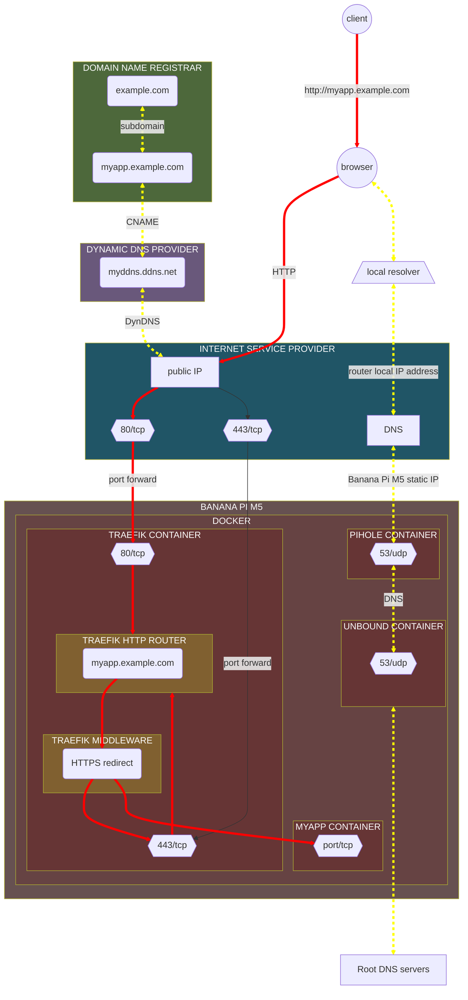
```mermaid
flowchart TB
    style HOSTING_PROVIDER fill: #4d683b, color: #fff
    style DDNS_PROVIDER fill: #69587b, color: #fff
    style INTERNET_SERVICE_PROVIDER fill: #205566, color: #fff
    style SINGLE_BOARD_COMPUTER fill: #665151, color: #fff
    style CONTAINER_ENGINE fill: #664343, color: #fff
    style TRAEFIK_CONTAINER fill: #663535, color: #fff
    style PIHOLE_CONTAINER fill: #663535, color: #fff
    style UNBOUND_CONTAINER fill: #663535, color: #fff
    style MYAPP_CONTAINER fill: #663535, color: #fff
    style TRAEFIK_ROUTER fill: #806030, color: #fff
    style TRAEFIK_MIDDLEWARE fill: #806030, color: #fff
    DOMAIN(example.com)
    SUBDOMAIN_MYAPP(myapp.example.com)
    DDNS(myddns.ddns.net)
    ROUTER_PUBLIC_IP[public IP]
    ROUTER_PORT80{{80/tcp}}
    ROUTER_PORT443{{443/tcp}}
    ROUTER_DNS[DNS]
    DOCKER_PIHOLE_PORT53{{53/udp}}
    DOCKER_TRAEFIK_PORT443{{443/tcp}}
    DOCKER_TRAEFIK_PORT80{{80/tcp}}
    DOCKER_MYAPP_PORT{{port/tcp}}
    DOCKER_UNBOUND_PORT53{{53/udp}}
    TRAEFIK_ROUTER_MYAPP(myapp.example.com)
    TRAEFIK_MIDDLEWARE_REDIRECT(HTTPS redirect)
    ROOT_DNS_SERVERS[Root DNS servers]

    subgraph HOSTING_PROVIDER[DOMAIN NAME REGISTRAR]
        DOMAIN
        SUBDOMAIN_MYAPP
    end

    subgraph DDNS_PROVIDER[DYNAMIC DNS PROVIDER]
        DDNS
    end

    subgraph INTERNET_SERVICE_PROVIDER[INTERNET SERVICE PROVIDER]
        ROUTER_PUBLIC_IP
        ROUTER_PORT80
        ROUTER_PORT443
        ROUTER_DNS
    end

    subgraph SINGLE_BOARD_COMPUTER[BANANA PI M5]
        subgraph CONTAINER_ENGINE[DOCKER]
            subgraph MYAPP_CONTAINER[MYAPP CONTAINER]
                DOCKER_MYAPP_PORT
            end

            subgraph UNBOUND_CONTAINER[UNBOUND CONTAINER]
                DOCKER_UNBOUND_PORT53
            end

            subgraph PIHOLE_CONTAINER[PIHOLE CONTAINER]
                DOCKER_PIHOLE_PORT53
            end

            subgraph TRAEFIK_CONTAINER[TRAEFIK CONTAINER]
                DOCKER_TRAEFIK_PORT443
                DOCKER_TRAEFIK_PORT80

                subgraph TRAEFIK_ROUTER[TRAEFIK HTTP ROUTER]
                    TRAEFIK_ROUTER_MYAPP
                end

                subgraph TRAEFIK_MIDDLEWARE[TRAEFIK MIDDLEWARE]
                    TRAEFIK_MIDDLEWARE_REDIRECT
                end
            end

        end

    end

    CLIENT((client)) --->|" http‎://myapp.example.com "| BROWSER
    BROWSER((browser)) -->|HTTP| ROUTER_PUBLIC_IP
    DOMAIN <-->|subdomain| SUBDOMAIN_MYAPP
    SUBDOMAIN_MYAPP <-->|CNAME| DDNS
    DDNS <-->|DynDNS| ROUTER_PUBLIC_IP
    ROUTER_PUBLIC_IP --> ROUTER_PORT80
    ROUTER_PUBLIC_IP --> ROUTER_PORT443
    ROUTER_PORT443 -->|port forward| DOCKER_TRAEFIK_PORT443
    ROUTER_PORT80 -->|port forward| DOCKER_TRAEFIK_PORT80
    DOCKER_TRAEFIK_PORT443 --> TRAEFIK_ROUTER
    DOCKER_TRAEFIK_PORT80 --> TRAEFIK_ROUTER
    TRAEFIK_ROUTER_MYAPP --> TRAEFIK_MIDDLEWARE_REDIRECT
    TRAEFIK_MIDDLEWARE_REDIRECT --> DOCKER_TRAEFIK_PORT443
    TRAEFIK_MIDDLEWARE_REDIRECT --> DOCKER_MYAPP_PORT
    BROWSER((browser)) <--> LOCAL_DNS_RESOLVER[/local resolver\]
    LOCAL_DNS_RESOLVER <--->|router local IP address| ROUTER_DNS
    ROUTER_DNS <-->|Banana Pi M5 static IP| DOCKER_PIHOLE_PORT53
    DOCKER_PIHOLE_PORT53 <-->|DNS| DOCKER_UNBOUND_PORT53
    UNBOUND_CONTAINER <-----> ROOT_DNS_SERVERS
    linkStyle 0 stroke-width: 4px, stroke: red
    linkStyle 1 stroke-width: 4px, stroke: red
    linkStyle 2 stroke-width: 4px, stroke: yellow, stroke-dasharray: 5
    linkStyle 3 stroke-width: 4px, stroke: yellow, stroke-dasharray: 5
    linkStyle 4 stroke-width: 4px, stroke: yellow, stroke-dasharray: 5
    linkStyle 5 stroke-width: 4px, stroke: red
    linkStyle 8 stroke-width: 4px, stroke: red
    linkStyle 9 stroke-width: 4px, stroke: red
    linkStyle 10 stroke-width: 4px, stroke: red
    linkStyle 11 stroke-width: 4px, stroke: red
    linkStyle 12 stroke-width: 4px, stroke: red
    linkStyle 13 stroke-width: 4px, stroke: red
    linkStyle 14 stroke-width: 4px, stroke: yellow, stroke-dasharray: 5
    linkStyle 15 stroke-width: 4px, stroke: yellow, stroke-dasharray: 5
    linkStyle 16 stroke-width: 4px, stroke: yellow, stroke-dasharray: 5
    linkStyle 17 stroke-width: 4px, stroke: yellow, stroke-dasharray: 5
    linkStyle 18 stroke-width: 4px, stroke: yellow, stroke-dasharray: 5
```

</td>
<td width="50%" valign="top">


```mermaid
flowchart TB
    style HOSTING_PROVIDER fill: #4d683b
    style DDNS_PROVIDER fill: #69587b
    style INTERNET_SERVICE_PROVIDER fill: #205566
    style INTERNET_SERVICE_PROVIDER2 fill: #205566
    style SERVER_DEVICE fill: #665151
    style CONTAINER_ENGINE fill: #664343
    style TRAEFIK_CONTAINER fill: #663535
    style MYAPP_CONTAINER fill: #663535
    style TRAEFIK_ROUTER fill: #806030
    style TRAEFIK_MIDDLEWARE fill: #806030
    style DNS_RESOLVER fill: #805060
    DOMAIN(example.com)
    SUBDOMAIN_MYAPP(myapp.example.com)
    DDNS(myddns.ddns.net)
    ROUTER_PUBLIC_IP[public IP]
    ROUTER_PORT80{{80/tcp}}
    ROUTER_PORT443{{443/tcp}}
    ROUTER2_DNS[DNS]
    DOCKER_TRAEFIK_PORT443{{443/tcp}}
    DOCKER_TRAEFIK_PORT80{{80/tcp}}
    DOCKER_MYAPP_PORT{{port/tcp}}
    TRAEFIK_ROUTER_MYAPP(myapp.example.com)
    TRAEFIK_MIDDLEWARE_REDIRECT(HTTPS redirect)
    ROOT_DNS_SERVERS[Root DNS servers]
    CLOUDFLARE(Cloudflare, etc.)

    subgraph HOSTING_PROVIDER[DOMAIN NAME REGISTRAR]
        DOMAIN
        SUBDOMAIN_MYAPP
    end

    subgraph DDNS_PROVIDER[DYNAMIC DNS PROVIDER]
        DDNS
    end

    subgraph INTERNET_SERVICE_PROVIDER[ISP ROUTER]
        ROUTER_PUBLIC_IP
        ROUTER_PORT80
        ROUTER_PORT443
    end

    subgraph INTERNET_SERVICE_PROVIDER2[CLIENT ISP ROUTER]
        ROUTER2_DNS
    end

    subgraph DNS_RESOLVER[DNS RESOLVER]
        CLOUDFLARE
    end

    subgraph SERVER_DEVICE[MINI PC]
        subgraph CONTAINER_ENGINE[DOCKER]
            subgraph MYAPP_CONTAINER[MYAPP CONTAINER]
                DOCKER_MYAPP_PORT
            end

            subgraph TRAEFIK_CONTAINER[TRAEFIK CONTAINER]
                DOCKER_TRAEFIK_PORT443
                DOCKER_TRAEFIK_PORT80

                subgraph TRAEFIK_ROUTER[TRAEFIK HTTP ROUTER]
                    TRAEFIK_ROUTER_MYAPP
                end

                subgraph TRAEFIK_MIDDLEWARE[TRAEFIK MIDDLEWARE]
                    TRAEFIK_MIDDLEWARE_REDIRECT
                end
            end

        end

    end

    CLIENT((client)) ---->|" http://myapp.example.com "| BROWSER
    BROWSER((browser)) ---> ROUTER_PUBLIC_IP
    DOMAIN <-->|subdomain| SUBDOMAIN_MYAPP
    SUBDOMAIN_MYAPP <-->|CNAME| DDNS
    DDNS <--->|DynDNS| ROUTER_PUBLIC_IP
    ROUTER_PUBLIC_IP --> ROUTER_PORT80
    ROUTER_PUBLIC_IP --> ROUTER_PORT443
    ROUTER_PORT443 -->|port forward| DOCKER_TRAEFIK_PORT443
    ROUTER_PORT80 -->|port forward| DOCKER_TRAEFIK_PORT80
    DOCKER_TRAEFIK_PORT443 --> TRAEFIK_ROUTER
    DOCKER_TRAEFIK_PORT80 --> TRAEFIK_ROUTER
    TRAEFIK_ROUTER_MYAPP --> TRAEFIK_MIDDLEWARE_REDIRECT
    TRAEFIK_MIDDLEWARE_REDIRECT --> DOCKER_TRAEFIK_PORT443
    TRAEFIK_MIDDLEWARE_REDIRECT --> DOCKER_MYAPP_PORT
    BROWSER((browser)) <--> LOCAL_DNS_RESOLVER[/local resolver\]
    LOCAL_DNS_RESOLVER <--->|router local IP address| ROUTER2_DNS
    ROUTER2_DNS <--> CLOUDFLARE
    CLOUDFLARE <---> ROOT_DNS_SERVERS
    linkStyle 0 stroke-width: 4px, stroke: red
    linkStyle 1 stroke-width: 4px, stroke: red
    linkStyle 2 stroke-width: 4px, stroke: yellow, stroke-dasharray: 5
    linkStyle 3 stroke-width: 4px, stroke: yellow, stroke-dasharray: 5
    linkStyle 4 stroke-width: 4px, stroke: yellow, stroke-dasharray: 5
    linkStyle 5 stroke-width: 4px, stroke: red
    linkStyle 8 stroke-width: 4px, stroke: red
    linkStyle 9 stroke-width: 4px, stroke: red
    linkStyle 10 stroke-width: 4px, stroke: red
    linkStyle 11 stroke-width: 4px, stroke: red
    linkStyle 12 stroke-width: 4px, stroke: red
    linkStyle 13 stroke-width: 4px, stroke: red
    linkStyle 14 stroke-width: 4px, stroke: yellow, stroke-dasharray: 5
    linkStyle 15 stroke-width: 4px, stroke: yellow, stroke-dasharray: 5
    linkStyle 16 stroke-width: 4px, stroke: yellow, stroke-dasharray: 5
    linkStyle 17 stroke-width: 4px, stroke: yellow, stroke-dasharray: 5
```

</td>
</tr>
</table>

From the **local network** (left), Pi-Hole answers with its **local DNS record** (yellow dotted line), so the browser
gets the mini PC's **internal IP** and reaches the **reverse proxy** directly on the LAN, without going through the
public IP (no port forwarding, no NAT loopback).
From **any other location** (right), the name is resolved publicly through the client's **DNS resolver** and the request
reaches the mini PC on port **80** (HTTP) after being **port forwarded** by the **ISP router**.
In both cases the reverse proxy redirects the request to port **443** (HTTPS) thanks to the **HTTPS redirect
middleware**, which finally routes it to the target application (red line).

### With VPN

If you try to reach the service through the **WireGuard** VPN, the flow will look like the following :

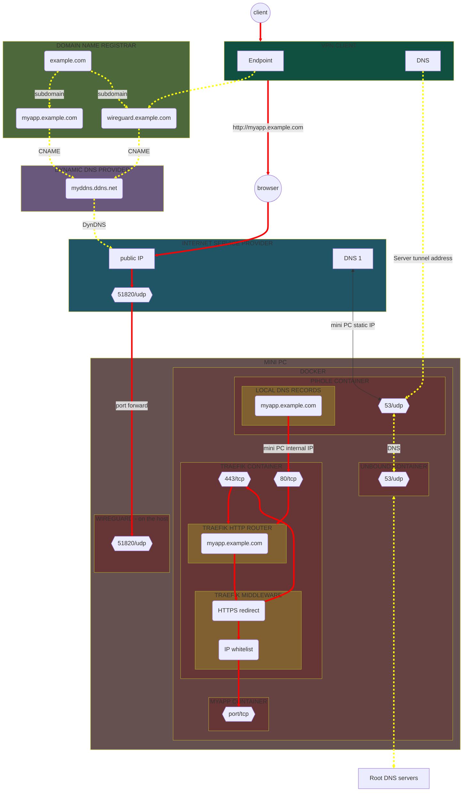
```mermaid
flowchart TB
    style HOSTING_PROVIDER fill: #4d683b
    style DDNS_PROVIDER fill: #69587b
    style INTERNET_SERVICE_PROVIDER fill: #205566
    style SERVER_DEVICE fill: #665151
    style CONTAINER_ENGINE fill: #664343
    style TRAEFIK_CONTAINER fill: #663535
    style PIHOLE_CONTAINER fill: #663535
    style UNBOUND_CONTAINER fill: #663535
    style WIREGUARD_HOST fill: #663535
    style MYAPP_CONTAINER fill: #663535
    style PIHOLE_DNS_RECORDS fill: #806030
    style TRAEFIK_ROUTER fill: #806030
    style TRAEFIK_MIDDLEWARE fill: #806030
    style VPN_CLIENT fill: #105040
    DOMAIN(example.com)
    SUBDOMAIN_MYAPP(myapp.example.com)
    SUBDOMAIN_WIREGUARD(wireguard.example.com)
    DDNS(myddns.ddns.net)
    ROUTER_PUBLIC_IP[public IP]
    ROUTER_PORT51820{{51820/udp}}
    WIREGUARD_PORT{{51820/udp}}
    ROUTER_DNS[DNS 1]
    DOCKER_PIHOLE_PORT53{{53/udp}}
    DOCKER_TRAEFIK_PORT443{{443/tcp}}
    DOCKER_TRAEFIK_PORT80{{80/tcp}}
    DOCKER_MYAPP_PORT{{port/tcp}}
    DOCKER_UNBOUND_PORT53{{53/udp}}
    TRAEFIK_ROUTER_MYAPP(myapp.example.com)
    TRAEFIK_MIDDLEWARE_REDIRECT(HTTPS redirect)
    TRAEFIK_MIDDLEWARE_WHITELIST(IP whitelist)
    ROOT_DNS_SERVERS[Root DNS servers]
    PIHOLE_DNS_MYAPP(myapp.example.com)

    subgraph VPN_CLIENT[VPN CLIENT]
        WIREGUARD_CLIENT_ENDPOINT[Endpoint]
        WIREGUARD_CLIENT_DNS[DNS]
    end

    subgraph HOSTING_PROVIDER[DOMAIN NAME REGISTRAR]
        DOMAIN
        SUBDOMAIN_MYAPP
        SUBDOMAIN_WIREGUARD
    end

    subgraph DDNS_PROVIDER[DYNAMIC DNS PROVIDER]
        DDNS
    end

    subgraph INTERNET_SERVICE_PROVIDER[INTERNET SERVICE PROVIDER]
        ROUTER_PUBLIC_IP
        ROUTER_PORT51820
        ROUTER_DNS
    end

    subgraph SERVER_DEVICE[MINI PC]
        subgraph CONTAINER_ENGINE[DOCKER]
            subgraph MYAPP_CONTAINER[MYAPP CONTAINER]
                DOCKER_MYAPP_PORT
            end

            subgraph UNBOUND_CONTAINER[UNBOUND CONTAINER]
                DOCKER_UNBOUND_PORT53
            end

            subgraph PIHOLE_CONTAINER[PIHOLE CONTAINER]
                DOCKER_PIHOLE_PORT53
                subgraph PIHOLE_DNS_RECORDS[LOCAL DNS RECORDS]
                    PIHOLE_DNS_MYAPP
                end
            end

            subgraph TRAEFIK_CONTAINER[TRAEFIK CONTAINER]
                DOCKER_TRAEFIK_PORT443
                DOCKER_TRAEFIK_PORT80

                subgraph TRAEFIK_ROUTER[TRAEFIK HTTP ROUTER]
                    TRAEFIK_ROUTER_MYAPP
                end

                subgraph TRAEFIK_MIDDLEWARE[TRAEFIK MIDDLEWARE]
                    TRAEFIK_MIDDLEWARE_REDIRECT
                    TRAEFIK_MIDDLEWARE_WHITELIST
                end
            end

        end

        subgraph WIREGUARD_HOST[WIREGUARD - on the host]
            WIREGUARD_PORT
        end

    end

    CLIENT((client)) --> VPN_CLIENT
    WIREGUARD_CLIENT_ENDPOINT --> SUBDOMAIN_WIREGUARD
    WIREGUARD_CLIENT_DNS -->|Server tunnel address| DOCKER_PIHOLE_PORT53
    VPN_CLIENT -->|" http://myapp.example.com "| BROWSER
    BROWSER((browser)) --> ROUTER_PUBLIC_IP
    DOMAIN -->|subdomain| SUBDOMAIN_MYAPP
    DOMAIN -->|subdomain| SUBDOMAIN_WIREGUARD
    SUBDOMAIN_MYAPP -->|CNAME| DDNS
    SUBDOMAIN_WIREGUARD -->|CNAME| DDNS
    DDNS -->|DynDNS| ROUTER_PUBLIC_IP
    ROUTER_PUBLIC_IP --> ROUTER_PORT51820
    ROUTER_PORT51820 ----->|port forward| WIREGUARD_PORT
    PIHOLE_DNS_MYAPP -->|mini PC internal IP| DOCKER_TRAEFIK_PORT80
    DOCKER_TRAEFIK_PORT443 --> TRAEFIK_ROUTER
    DOCKER_TRAEFIK_PORT80 --> TRAEFIK_ROUTER
    TRAEFIK_ROUTER_MYAPP --> TRAEFIK_MIDDLEWARE_REDIRECT
    TRAEFIK_MIDDLEWARE_REDIRECT --> DOCKER_TRAEFIK_PORT443
    TRAEFIK_MIDDLEWARE_REDIRECT --> TRAEFIK_MIDDLEWARE_WHITELIST
    TRAEFIK_MIDDLEWARE_WHITELIST --> DOCKER_MYAPP_PORT
    ROUTER_DNS <---->|mini PC static IP| DOCKER_PIHOLE_PORT53
    DOCKER_PIHOLE_PORT53 <-->|DNS| DOCKER_UNBOUND_PORT53
    UNBOUND_CONTAINER <------> ROOT_DNS_SERVERS
    linkStyle 0 stroke-width: 4px, stroke: red
    linkStyle 1 stroke-width: 4px, stroke: yellow, stroke-dasharray: 5
    linkStyle 2 stroke-width: 4px, stroke: yellow, stroke-dasharray: 5
    linkStyle 3 stroke-width: 4px, stroke: red
    linkStyle 4 stroke-width: 4px, stroke: red
    linkStyle 5 stroke-width: 4px, stroke: yellow, stroke-dasharray: 5
    linkStyle 6 stroke-width: 4px, stroke: yellow, stroke-dasharray: 5
    linkStyle 7 stroke-width: 4px, stroke: yellow, stroke-dasharray: 5
    linkStyle 8 stroke-width: 4px, stroke: yellow, stroke-dasharray: 5
    linkStyle 9 stroke-width: 4px, stroke: yellow, stroke-dasharray: 5
    linkStyle 10 stroke-width: 4px, stroke: red
    linkStyle 11 stroke-width: 4px, stroke: red
    linkStyle 12 stroke-width: 4px, stroke: red
    linkStyle 13 stroke-width: 4px, stroke: red
    linkStyle 14 stroke-width: 4px, stroke: red
    linkStyle 15 stroke-width: 4px, stroke: red
    linkStyle 16 stroke-width: 4px, stroke: red
    linkStyle 17 stroke-width: 4px, stroke: red
    linkStyle 18 stroke-width: 4px, stroke: red
    linkStyle 20 stroke-width: 4px, stroke: yellow, stroke-dasharray: 5
    linkStyle 21 stroke-width: 4px, stroke: yellow, stroke-dasharray: 5
```

Here, first the client needs to connect to the **VPN server** through his preferred **VPN client**.
The request for VPN connection reaches the mini PC on UDP port **51820** (VPN port) after being routed by the **CNAME
record** to our **dynamic DNS** and then **port forwarded** by our **router**.

The **DNS resolving** always go through **Pi-Hole** and **Unbound** (yellow dotted line), to resolve the VPN server and
the application.

The request for the application is handled by Pi-Hole DNS local record which route it to the mini PC IP address,
to be handled by the **reverse proxy**, and is then redirected to port **443** (HTTPS) thanks to the **HTTPS redirect
middleware**, which finally route it to the target application (red line).

If in any way the request arrives to Traefik with an unauthorized IP address, it will be rejected thanks to the **IP
whitelist** middleware.

# Install services

## PocketID


We will use **PocketID** to add a single sign-on in front of the services that don't have a proper authentication of
their own (Pi-Hole, the Traefik dashboard), and as identity provider for the services that support OpenID Connect
natively (Portainer).

PocketID is a small self-hosted **OpenID Connect** (OIDC) provider with a twist : users don't have passwords, they
authenticate with **passkeys** only (a hardware key, or the passkey manager of the phone, the browser or a password
manager). Nothing to remember, nothing to phish, and one login for every service.

There are two ways to plug a service on it :

- services that speak OIDC natively (Portainer, ...) get their own **OIDC client** in PocketID and show a "login with
  PocketID" button
- services that don't (Pi-Hole, the Traefik dashboard) are put behind
  the [traefik-oidc-auth](https://github.com/sevensolutions/traefik-oidc-auth) **Traefik plugin** :
  a middleware that redirects the browser to PocketID, checks the token it comes back with and keeps a session cookie,
  so that the service behind never sees an unauthenticated request

Here is an overview of the network flow when a service is protected by the middleware :

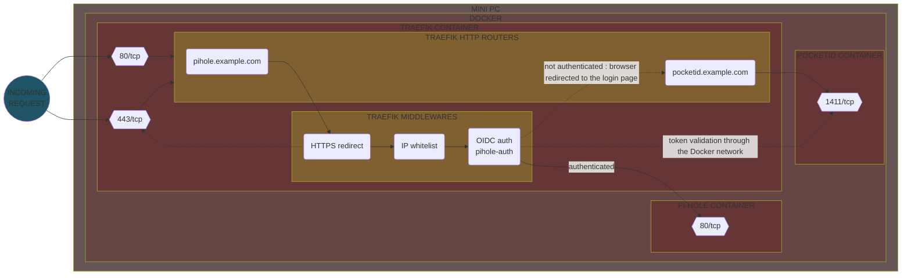
```mermaid
flowchart LR
    style INCOMING_REQUEST fill: #205566
    style TRAEFIK_CONTAINER fill: #663535
    style APP_CONTAINER fill: #663535
    style POCKETID_CONTAINER fill: #663535
    style TRAEFIK_ROUTER fill: #806030
    style TRAEFIK_MIDDLEWARE fill: #806030
    style SERVER_DEVICE fill: #665555
    style CONTAINER_ENGINE fill: #664545
    DOCKER_TRAEFIK_PORT443{{443/tcp}}
    DOCKER_TRAEFIK_PORT80{{80/tcp}}
    DOCKER_APP_PORT{{80/tcp}}
    DOCKER_POCKETID_PORT{{1411/tcp}}
    TRAEFIK_ROUTER_APP(pihole.example.com)
    TRAEFIK_ROUTER_POCKETID(pocketid.example.com)
    TRAEFIK_MIDDLEWARE_REDIRECT(HTTPS redirect)
    TRAEFIK_MIDDLEWARE_IP_WHITELIST(IP whitelist)
    TRAEFIK_MIDDLEWARE_OIDC(OIDC auth\npihole-auth)
    INCOMING_REQUEST((INCOMING\nREQUEST))
    INCOMING_REQUEST --> DOCKER_TRAEFIK_PORT443
    INCOMING_REQUEST --> DOCKER_TRAEFIK_PORT80

    subgraph SERVER_DEVICE[MINI PC]
        subgraph CONTAINER_ENGINE[DOCKER]
            subgraph APP_CONTAINER[PI-HOLE CONTAINER]
                DOCKER_APP_PORT
            end

            subgraph POCKETID_CONTAINER[POCKETID CONTAINER]
                DOCKER_POCKETID_PORT
            end

            subgraph TRAEFIK_CONTAINER[TRAEFIK CONTAINER]
                DOCKER_TRAEFIK_PORT443 --> TRAEFIK_ROUTER
                DOCKER_TRAEFIK_PORT80 --> TRAEFIK_ROUTER

                subgraph TRAEFIK_ROUTER[TRAEFIK HTTP ROUTERS]
                    TRAEFIK_ROUTER_APP
                    TRAEFIK_ROUTER_POCKETID
                end

                subgraph TRAEFIK_MIDDLEWARE[TRAEFIK MIDDLEWARES]
                    TRAEFIK_MIDDLEWARE_REDIRECT
                    TRAEFIK_MIDDLEWARE_IP_WHITELIST
                    TRAEFIK_MIDDLEWARE_OIDC
                end

                TRAEFIK_ROUTER_APP --> TRAEFIK_MIDDLEWARE_REDIRECT
                TRAEFIK_MIDDLEWARE_REDIRECT --> TRAEFIK_MIDDLEWARE_IP_WHITELIST
                TRAEFIK_MIDDLEWARE_REDIRECT -.-> DOCKER_TRAEFIK_PORT443
                TRAEFIK_MIDDLEWARE_IP_WHITELIST --> TRAEFIK_MIDDLEWARE_OIDC
                TRAEFIK_MIDDLEWARE_OIDC -->|authenticated| DOCKER_APP_PORT
                TRAEFIK_MIDDLEWARE_OIDC -.->|not authenticated : browser redirected to the login page| TRAEFIK_ROUTER_POCKETID
                TRAEFIK_MIDDLEWARE_OIDC -.->|token validation through the Docker network| DOCKER_POCKETID_PORT
                TRAEFIK_ROUTER_POCKETID --> DOCKER_POCKETID_PORT
            end

        end
    end
```

### Setting up

Create the folders and the **encryption key** (PocketID encrypts its secrets at rest with it : keep that file with your
backups, without it the database is unusable).
The container runs as user `1000:1001` (see the _.env_ file), so give it the ownership of the data folder and of the
key :

```bash
sudo mkdir -p /opt/apps/pocketid/data
openssl rand -base64 32 | sudo tee /opt/apps/pocketid/encryption_key > /dev/null
sudo chown -R 1000:1001 /opt/apps/pocketid/data /opt/apps/pocketid/encryption_key
sudo chmod 600 /opt/apps/pocketid/encryption_key
```

Then :

- copy the _.env_ and _docker-compose.yml_ files from this project's _pocketid_ directory into the _/opt/apps/pocketid_
  directory, and adapt the _.env_ file to your domain
- copy the _pocketid.yml_ file from this project's _traefik/dynamic_ directory into the _/opt/apps/traefik/dynamic_
  directory
- declare the `traefik-oidc-auth` **plugin** in the _traefik.yml_ static configuration (see below) and restart Traefik,
  plugins are downloaded when it starts

Run the Compose file (see [Run](#run-2)), then open https://pocketid.example.com : on first start the setup page
(`/setup`) creates the **administrator** account and registers its first **passkey**.

Now create one **OIDC client** per service to protect (_OIDC Clients -> Add_) :

- for a service put behind the Traefik middleware, the callback URL is the service URL followed by `/oidc/callback` (the
  default `CallbackUri` of the plugin), for example `https://pihole.example.com/oidc/callback`,
  and **PKCE** enabled. Copy the generated client ID and secret into the `ClientId` / `ClientSecret` fields of the
  corresponding middleware in _pocketid.yml_, and give the middleware a random 32 characters `Secret`
  (`openssl rand -base64 48 | tr -dc 'A-Za-z0-9' | head -c 32; echo`) : this one is not a PocketID secret,
  it is the key the plugin uses to encrypt its own session cookie. The plugin expects exactly **32 characters**, and
  each middleware must have its own.
  Traefik picks up the change without restart
- for a service with native OIDC support, use the callback URL it documents and its own settings page. **Portainer**
  (_Settings -> Authentication -> OAuth -> Custom_) needs the client ID and secret,
  `openid profile email` as scopes, **PKCE disabled** on the PocketID side as Portainer does not support it, and three
  endpoints : the **authorization URL** is the public one (`https://pocketid.example.com/authorize`, the browser follows
  it), but the **access token URL** and the **resource URL** must be the **internal** ones
  (`http://pocketid:1411/api/oidc/token` and `http://pocketid:1411/api/oidc/userinfo`). These two calls are made by the
  Portainer container itself : through the public URL these two calls are made by the Portainer container itself, and
  reaching PocketID directly on the Docker network is the shortest path. Since the alias and the `pocketid-whitelist`
  middleware described below, the public URLs would work just as well here
- most OIDC libraries, however, **verify that the issuer announced by the provider matches the URL they queried**
  (Homebox and its `go-oidc` for instance), so they cannot use the internal URL at all :
  querying `http://pocketid:1411` returns `https://pocketid.example.com` as issuer and they refuse. Those applications
  must use the **public** issuer URL, which means their container has to reach it.
  Two small additions make that work, and they serve every future application :
    - Traefik carries a **network alias** with the provider's public name on the private network
      (see [Service definition](#service-definition-)), so that the containers resolve it to Traefik itself,
      without any hard coded IP address and without depending on Pi-Hole for the container DNS
    - the PocketID router uses the `pocketid-whitelist` middleware instead of `vpn-whitelist` : same ranges plus the
      **private** Docker network, so that a container is allowed to fetch the discovery document and to exchange the
      token. The **public** Docker network is deliberately left out, an application exposed to the internet must not
      reach the provider this way
  ```mermaid
  flowchart LR
      APP[application container] -->|1 . resolves pocketid.example.com| DNS[[Docker DNS : alias on Traefik]]
      APP -->|2 . HTTPS, source 172.21.x.x| TRAEFIK[Traefik]
      TRAEFIK -->|3 . pocketid-whitelist accepts the private network| POCKETID[PocketID]
  ```

Finally, to protect a service with the middleware, add it to the `middlewares` list of its router, after the IP
whitelist, as done for Pi-Hole :

```yaml
      middlewares:
        - vpn-whitelist@file
        - pihole-auth@file
```

> [!NOTE]
> The `pocketid` router is itself behind the `vpn-whitelist` middleware because every service I protect with it is only
reachable from the local network or the VPN.
> If one day a **public** service is put behind the middleware, the login page must be reachable from the internet too :
remove the whitelist from the `pocketid` router only, the login page is designed to be public (passkeys cannot be
brute-forced or phished). PocketID itself stays on the private network
(see [Network segmentation](#network-segmentation)).

### Details

#### Service definition

:page_facing_up: _docker-compose.yml_ :

```yaml
services:

  pocketid:
    image: ghcr.io/pocket-id/pocket-id:v2
    container_name: pocketid
    restart: unless-stopped
    env_file: .env
    volumes:
      - ./data:/app/data
      - /opt/apps/pocketid/encryption_key:/opt/pocket-id/encryption_key:ro
    networks:
      - pocketid-net
      - traefik-private-net

networks:

  pocketid-net:
    name: pocketid-net

  traefik-private-net:
    name: traefik-private-net
    external: true
```

:page_facing_up: _pocketid.yml_ :

```yaml
http:
  services:
    pocketid:
      loadBalancer:
        servers:
          - url: http://pocketid:1411

  routers:
    pocketid:
      rule: 'Host(`pocketid.example.com`)'
      entryPoints:
        - websecure
      tls:
        certResolver: default
      service: pocketid
      middlewares:
        - vpn-whitelist@file

  middlewares:
    traefik-auth:
      plugin:
        traefik-oidc-auth:
          Secret: "<secret>"
          Provider:
            Url: "http://pocketid:1411/"
            ClientId: "<oidc_client_id>"
            ClientSecret: "<oidc_client_secret>"
            UsePkce: true
          Scopes: [ "openid", "profile", "email" ]
    pihole-auth:
      plugin:
        traefik-oidc-auth:
          Secret: "<secret>"
          Provider:
            Url: "http://pocketid:1411/"
            ClientId: "<oidc_client_id>"
            ClientSecret: "<oidc_client_secret>"
            UsePkce: true
          Scopes: [ "openid", "profile", "email" ]
```

:page_facing_up: _traefik.yml_ (plugin declaration, in the static configuration) :

```yaml
experimental:
  plugins:
    traefik-oidc-auth:
      moduleName: "github.com/sevensolutions/traefik-oidc-auth"
      version: "v0.18.0"
```

Things to notice :

- PocketID's data (SQLite database, uploaded logos) lives in the _data_ folder, and the **encryption key** is mounted
  read-only from the host
- the settings come from the _.env_ file (see [Environment variables](#environment-variables))
- it runs in its own **network** (`pocketid-net`) but must also share the same network as Traefik
  (`traefik-private-net`), both to be reachable by the reverse proxy and so that the plugin can talk to it directly by
  container name
- the Traefik dynamic config file :
    - creates a **service** which will point to our container application running on port `1411`
    - creates an HTTP **router** that will match `pocketid.example.com` URL on our `websecure` **entrypoint** to point
      to our service
    - assigns the `vpn-whitelist` **middleware** so that the traffic will be restricted to allowed IPs only (application
      reachable only from local network or through VPN)
    - adds a **TLS** configuration that will use our `default` **certificates resolver**, so it can generate Let's
      encrypt certificates
    - defines one **middleware per protected service** (`traefik-auth` for the Traefik dashboard, `pihole-auth` for
      Pi-Hole), each with its own OIDC client and session, all pointing to PocketID through the **internal** URL
      `http://pocketid:1411/` : the token exchange stays inside the Docker network instead of looping through the
      reverse proxy
- the plugin itself is declared once in the static configuration, Traefik downloads it from its plugin catalog at start

#### Environment variables

:page_facing_up: _.env_ :

```shell
APP_URL=https://pocketid.example.com
ENCRYPTION_KEY_FILE=/opt/pocket-id/encryption_key
# These variables are optional but recommended to review:
TRUST_PROXY=true
MAXMIND_LICENSE_KEY=
PUID=1000
PGID=1001
```

- `APP_URL` is the public URL, it is also the OIDC **issuer** written in every token, so it must match the router's host
  exactly
- there is no `INTERNAL_APP_URL` here on purpose : it makes the discovery document advertise the **token** and
  **userinfo** endpoints as `http://pocketid:1411/...`, for every client and whatever URL the document was fetched from.
  Clients whose library refuses plain HTTP (CrowdSec Web UI) then break on the token exchange.
  With the network alias and `pocketid-whitelist`, the containers reach the public HTTPS endpoints directly, so it is no
  longer needed
- `ENCRYPTION_KEY_FILE` points to the key mounted read-only in the container
- `TRUST_PROXY` makes PocketID take the client IP addresses from the headers set by Traefik (audit log, rate limiting),
  which is required behind a reverse proxy
- `MAXMIND_LICENSE_KEY` is optional, with a free MaxMind license key the audit log shows where the logins come from
- `PUID` / `PGID` are the user and group the application runs as, hence the ownership of the data folder and of the key

### Run

Finally, simply run the Compose file :

```bash
sudo docker-compose -f /opt/apps/pocketid/docker-compose.yml up -d
```

You should end-up with a running `pocketid` container.

It should also have generated the needed Let's Encrypt certificates in the _acme.json_ file in the Traefik folder.

The application is available at https://pocketid.example.com, where the first visit creates the administrator account
and its passkey (see [Setting up](#setting-up)).

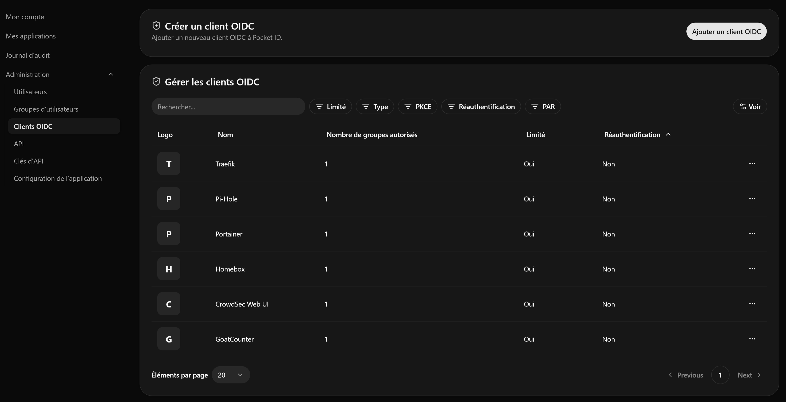

## CrowdSec


We will use **CrowdSec** to detect and block the attackers knocking on the reverse proxy : scanners looking for `/.env`
or `/wp-login.php`, brute force attempts, known exploits, bad bots.

CrowdSec is an open source, collaborative **intrusion prevention system** : a **security engine** reads logs, matches
them against **scenarios** from a community hub and takes **decisions** (ban an IP address for a few hours), and a
**bouncer** enforces them where the traffic enters.
In return for the signals it shares, the engine also receives the **community blocklist** : IP addresses currently
attacking other CrowdSec users are blocked before they even try anything here.

In our setup the only door open to the internet is Traefik, so everything happens there :

- the **security engine** runs in a container on the private Traefik network and reads the Traefik **access log**
  through a shared folder (no Docker socket involved)
- the **bouncer** is a Traefik **plugin**, declared as a middleware on the `websecure` entrypoint : every HTTPS request
  is checked against the current decisions before reaching any router,
  private services included (harmless : the local network and the VPN peers are trusted and never blocked)

Here is an overview of the network flow :

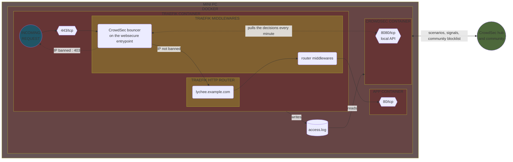
```mermaid
flowchart LR
    style INCOMING_REQUEST fill: #205566
    style TRAEFIK_CONTAINER fill: #663535
    style APP_CONTAINER fill: #663535
    style CROWDSEC_CONTAINER fill: #663535
    style TRAEFIK_ROUTER fill: #806030
    style TRAEFIK_MIDDLEWARE fill: #806030
    style SERVER_DEVICE fill: #665555
    style CONTAINER_ENGINE fill: #664545
    style HUB fill: #4d683b
    DOCKER_TRAEFIK_PORT443{{443/tcp}}
    DOCKER_APP_PORT{{80/tcp}}
    DOCKER_CROWDSEC_PORT{{8080/tcp\nlocal API}}
    TRAEFIK_ROUTER_APP(lychee.example.com)
    TRAEFIK_MIDDLEWARE_CROWDSEC(CrowdSec bouncer\non the websecure entrypoint)
    TRAEFIK_MIDDLEWARE_OTHERS(router middlewares)
    INCOMING_REQUEST((INCOMING\nREQUEST))
    HUB((CrowdSec hub\nand community))
    INCOMING_REQUEST --> DOCKER_TRAEFIK_PORT443

    subgraph SERVER_DEVICE[MINI PC]
        subgraph CONTAINER_ENGINE[DOCKER]
            subgraph TRAEFIK_CONTAINER[TRAEFIK CONTAINER]
                DOCKER_TRAEFIK_PORT443 --> TRAEFIK_MIDDLEWARE_CROWDSEC

                subgraph TRAEFIK_MIDDLEWARE[TRAEFIK MIDDLEWARES]
                    TRAEFIK_MIDDLEWARE_CROWDSEC
                    TRAEFIK_MIDDLEWARE_OTHERS
                end

                subgraph TRAEFIK_ROUTER[TRAEFIK HTTP ROUTER]
                    TRAEFIK_ROUTER_APP
                end

                TRAEFIK_MIDDLEWARE_CROWDSEC -->|IP not banned| TRAEFIK_ROUTER_APP
                TRAEFIK_MIDDLEWARE_CROWDSEC -.->|IP banned : 403| INCOMING_REQUEST
                TRAEFIK_ROUTER_APP --> TRAEFIK_MIDDLEWARE_OTHERS
            end

            subgraph APP_CONTAINER[APP CONTAINER]
                DOCKER_APP_PORT
            end

            subgraph CROWDSEC_CONTAINER[CROWDSEC CONTAINER]
                DOCKER_CROWDSEC_PORT
            end

            ACCESS_LOG[(access.log)]
            TRAEFIK_MIDDLEWARE_OTHERS --> DOCKER_APP_PORT
            TRAEFIK_CONTAINER -->|writes| ACCESS_LOG
            ACCESS_LOG -->|reads| CROWDSEC_CONTAINER
            TRAEFIK_MIDDLEWARE_CROWDSEC <-.->|pulls the decisions every minute| DOCKER_CROWDSEC_PORT
        end
    end

    CROWDSEC_CONTAINER <-->|scenarios, signals, community blocklist| HUB
```

### Setting up

Create the folders, and a random key that will be shared between the security engine and the bouncer :

```bash
sudo mkdir -p /opt/apps/crowdsec /opt/apps/traefik/logs
openssl rand -base64 48
```

Then :

- copy the _.env_, _docker-compose.yml_ and _acquis.yml_ files from this project's _crowdsec_ directory into the
  _/opt/apps/crowdsec_ directory, and put the key in `BOUNCER_KEY_traefik` of the _.env_ file
- put the **same** key in `CROWDSEC_BOUNCER_KEY` of Traefik's _.env_ file, and copy the _crowdsec.yml_ file from this
  project's _traefik/dynamic_ directory into the _/opt/apps/traefik/dynamic_ directory
- update Traefik : the access log now goes to a file with the `User-Agent` header kept, the plugin is declared and the
  `crowdsec@file` middleware is set on the `websecure` entrypoint
  in _traefik.yml_ (see [Static configuration file](#static-configuration-file-)), and the _logs_ folder is bound in
  Traefik's _docker-compose.yml_ (see [Service definition](#service-definition-))
- copy the _logrotate_ file from this project's _traefik_ directory to _/etc/logrotate.d/traefik_ : the access log is
  rotated daily and kept 7 days, Traefik reopens it on the `USR1` signal

### Details

#### Service definition

:page_facing_up: _crowdsec/docker-compose.yml_ :

```yaml
services:

  crowdsec:
    image: crowdsecurity/crowdsec:latest
    container_name: crowdsec
    restart: unless-stopped
    # Holds BOUNCER_KEY_traefik : registers the Traefik bouncer with this key at start (same value in traefik/.env)
    env_file: .env
    environment:
      TZ: "Europe/Zurich"
      # Hub items installed at start : Traefik log parser + HTTP scenarios, known CVE exploits, private IP ranges whitelist
      COLLECTIONS: "crowdsecurity/traefik crowdsecurity/http-cve"
      PARSERS: "crowdsecurity/whitelists"
    volumes:
      - ./acquis.yml:/etc/crowdsec/acquis.yaml:ro   # acquis.yaml is the path expected by CrowdSec's config.yaml
      - ./config:/etc/crowdsec
      - ./data:/var/lib/crowdsec/data
      - /opt/apps/traefik/logs:/var/log/traefik:ro
    networks:
      - traefik-private-net

networks:

  traefik-private-net:
    name: traefik-private-net
    external: true
```

:page_facing_up: _crowdsec/.env_ :

```shell
# Key shared with the Traefik bouncer (same value as CROWDSEC_BOUNCER_KEY in traefik/.env), generate it with : openssl rand -base64 48
BOUNCER_KEY_traefik=<bouncer_key>
```

:page_facing_up: _crowdsec/acquis.yml_ :

```yaml
# Log sources read by the CrowdSec agent : the Traefik access log (bind mount shared with the Traefik container).
# A glob pattern, so that the file is picked up when it appears (Traefik may start after CrowdSec) or is recreated by logrotate.
filenames:
  - /var/log/traefik/*.log
labels:
  type: traefik
```

:page_facing_up: _traefik/dynamic/crowdsec.yml_ :

```yaml
http:
  middlewares:
    crowdsec:
      plugin:
        crowdsec-bouncer-traefik-plugin:
          enabled: true
          logLevel: INFO
          # stream mode : the plugin pulls the decisions from the CrowdSec local API every updateIntervalSeconds
          # and answers from its cache, nothing is called on the request path
          crowdsecMode: stream
          updateIntervalSeconds: 60
          crowdsecLapiScheme: http
          crowdsecLapiHost: crowdsec:8080
          # Dynamic files are Go templates : the key is read from the CROWDSEC_BOUNCER_KEY variable of the Traefik container (traefik/.env),
          # same value as BOUNCER_KEY_traefik in crowdsec/.env
          crowdsecLapiKey: '{{ env "CROWDSEC_BOUNCER_KEY" }}'
          # never block the local network and the VPN peers, whatever the decisions say
          clientTrustedIPs:
            - 192.168.0.0/24
            - 10.0.0.0/24
```

:page_facing_up: _traefik/logrotate_ (to copy to _/etc/logrotate.d/traefik_) :

```
# Rotation of the Traefik access log (copy this file to /etc/logrotate.d/traefik on the host).
# Traefik reopens its log files when it receives the USR1 signal, no restart needed.
/opt/apps/traefik/logs/access.log {
    daily
    rotate 7
    compress
    delaycompress
    missingok
    notifempty
    create 0644 root root
    postrotate
        /usr/bin/docker kill --signal=USR1 traefik >/dev/null 2>&1 || true
    endscript
}
```

Things to notice :

- the security engine only joins `traefik-private-net` : the bouncer reaches its **local API** at `crowdsec:8080` by
  name, nothing is published on the host
- `COLLECTIONS` and `PARSERS` are installed from the hub at the first start : `crowdsecurity/traefik` (the access log
  parser and the base HTTP scenarios), `crowdsecurity/http-cve` (known exploits) and `crowdsecurity/whitelists` (private
  IP ranges are never banned, so a misbehaving device at home cannot lock you out)
- `BOUNCER_KEY_traefik` (from the _.env_ file) registers the `traefik` bouncer with the given key at start, no manual
  `cscli bouncers add` needed, the middleware reads the same key from Traefik's own _.env_ file through a template, so
  that the key never appears in a configuration file
- the **volumes** hold the acquisition file (which log to read, and which parser applies to it — mounted as
  _/etc/crowdsec/acquis.yaml_, the path CrowdSec expects), the configuration (hub items, local API and community API
  credentials, all created automatically) and the data (SQLite database of alerts and decisions, downloaded blocklists),
  the Traefik _logs_ folder is mounted **read-only**
- the middleware runs in **stream** mode : it pulls the decisions from the local API every `updateIntervalSeconds` and
  answers from its cache, nothing is called on the request path.
  If the local API becomes unreachable, the plugin keeps serving with the decisions it already has and logs errors
- `clientTrustedIPs` makes the bouncer skip the local network and the VPN peers entirely, in addition to the CrowdSec
  side whitelist
- as the middleware sits on the **entrypoint**, it runs before the routers and their own middlewares (IP whitelist,
  authentication) for every request on `443`, present and future services alike

> [!NOTE]
> Your own **public IP** is not a private range. If some of your traffic reached Traefik through the NAT loopback of the
router (a name resolving to the public IP, see [IP whitelisting](#ip-whitelisting)), a noisy test could ban you from
your own services : `cscli decisions delete --ip <your_public_ip>` lifts it. With local DNS records for the private
**and** the public services (see [Pi-hole](#pi-hole)), the devices at home never take that path.
>
> The engine shares the alerts it raises (attacking IP address and scenario) with CrowdSec's central API, that is what
feeds the community blocklist everybody benefits from.
> If you don't want that, remove the `api.server.online_client` section from _config.yaml_.

### Run

Start the security engine first, so that the bouncer finds its local API, then recreate Traefik (the static
configuration changed, and the plugin is downloaded at that moment) :

```bash
sudo docker-compose -f /opt/apps/crowdsec/docker-compose.yml up -d
sudo docker-compose -f /opt/apps/traefik/docker-compose.yml up -d --force-recreate
```

You should end-up with a running `crowdsec` container. Check that everything talks to everything :

```bash
sudo docker exec crowdsec cscli bouncers list          # the "traefik" bouncer, with a recent "last pull"
sudo docker exec crowdsec cscli collections list       # crowdsecurity/traefik and http-cve installed
sudo docker exec crowdsec cscli metrics                # "Acquisition Metrics" : lines read and parsed from access.log (browse a site first)
sudo docker logs traefik 2>&1 | grep -i crowdsec       # plugin loaded, no error
```

To test the bouncer independently of the scenarios, ban an outside address (your phone on 4G for example) for a few
minutes and try to reach a public service from it :

```bash
sudo docker exec crowdsec cscli decisions add --ip <phone_public_ip> --duration 5m --reason "bouncer test"
sudo docker exec crowdsec cscli decisions list
sudo docker exec crowdsec cscli decisions delete --ip <phone_public_ip>
```

The phone must get a `403` from Traefik while the decision is active. To test the scenarios, from the same phone request
a dozen pages a scanner would try (`/.env`, `/wp-login.php`, `/phpmyadmin/`, `/.git/config`, ...) on a public service :
after a few of them `cscli alerts list` shows a `http-probing` or `http-sensitive-files` alert and the phone is banned
for four hours (the default duration), lift it with `cscli decisions delete`.

## CrowdSec Web UI


[CrowdSec](#crowdsec) is driven from the command line with `cscli`, which is fine for a check now and then but tedious
to browse. **CrowdSec Web UI** is a small third-party dashboard that reads the same **local API** and shows the alerts,
the active decisions, the bouncers and the metrics, with the country and the AS of every attacker, filters, and the
ability to ban or unban an address in two clicks.

It is a plain HTTP application, it holds no Docker socket and no privilege : it only needs a **machine account** on the
CrowdSec local API, so it sits on the private network like the other administration tools. It authenticates its users
against [PocketID](#pocketid) with its own OIDC support.

Here is an overview of the network flow :

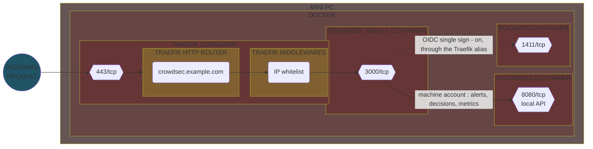
```mermaid
flowchart LR
    style INCOMING_REQUEST fill: #205566
    style TRAEFIK_CONTAINER fill: #663535
    style APP_CONTAINER fill: #663535
    style CROWDSEC_CONTAINER fill: #663535
    style POCKETID_CONTAINER fill: #663535
    style TRAEFIK_ROUTER fill: #806030
    style TRAEFIK_MIDDLEWARE fill: #806030
    style SERVER_DEVICE fill: #665555
    style CONTAINER_ENGINE fill: #664545
    DOCKER_TRAEFIK_PORT443{{443/tcp}}
    DOCKER_APP_PORT{{3000/tcp}}
    DOCKER_CROWDSEC_PORT{{8080/tcp\nlocal API}}
    DOCKER_POCKETID_PORT{{1411/tcp}}
    TRAEFIK_ROUTER_APP(crowdsec.example.com)
    TRAEFIK_MIDDLEWARE_IP_WHITELIST(IP whitelist)
    INCOMING_REQUEST((INCOMING\nREQUEST))
    INCOMING_REQUEST --> DOCKER_TRAEFIK_PORT443

    subgraph SERVER_DEVICE[MINI PC]
        subgraph CONTAINER_ENGINE[DOCKER]
            subgraph TRAEFIK_CONTAINER[TRAEFIK CONTAINER]
                DOCKER_TRAEFIK_PORT443 --> TRAEFIK_ROUTER

                subgraph TRAEFIK_ROUTER[TRAEFIK HTTP ROUTER]
                    TRAEFIK_ROUTER_APP
                end

                subgraph TRAEFIK_MIDDLEWARE[TRAEFIK MIDDLEWARES]
                    TRAEFIK_MIDDLEWARE_IP_WHITELIST
                end

                TRAEFIK_ROUTER_APP --> TRAEFIK_MIDDLEWARE_IP_WHITELIST
            end

            subgraph APP_CONTAINER[CROWDSEC WEB UI CONTAINER]
                DOCKER_APP_PORT
            end

            subgraph CROWDSEC_CONTAINER[CROWDSEC CONTAINER]
                DOCKER_CROWDSEC_PORT
            end

            subgraph POCKETID_CONTAINER[POCKETID CONTAINER]
                DOCKER_POCKETID_PORT
            end

            TRAEFIK_MIDDLEWARE_IP_WHITELIST --> DOCKER_APP_PORT
            DOCKER_APP_PORT -->|machine account : alerts, decisions, metrics| DOCKER_CROWDSEC_PORT
            DOCKER_APP_PORT -.->|OIDC single sign - on, through the Traefik alias| DOCKER_POCKETID_PORT
        end
    end
```

### Setting up

Create the folders, then register the **machine account** the UI will use to read the local API :

```bash
sudo mkdir -p /opt/apps/crowdsec-web-ui/data
PW=$(openssl rand -base64 32); echo "machine password : $PW"
sudo docker exec crowdsec cscli machines add crowdsec-web-ui --password "$PW" -f /dev/null
```

Then :

- copy the _.env_ and _docker-compose.yml_ files from this project's _crowdsec-web-ui_ directory into the
  _/opt/apps/crowdsec-web-ui_ directory, and put the generated password in `CONFIG_INSTANCE_LAPI_AUTH_PASSWORD`
- copy the _crowdsec-web-ui.yml_ file from this project's _traefik/dynamic_ directory into the
  _/opt/apps/traefik/dynamic_ directory
- create an OIDC client in [PocketID](#pocketid) with the callback URL of the **application** :
  `https://crowdsec.example.com/api/auth/oidc/callback`,
  and **PKCE disabled**, as the application does not send a `code_challenge` (like Portainer, and for the same reason :
  it is a confidential client, the client secret is what protects the code exchange). Then put its client ID in
  `CONFIG_AUTH_OIDC_CLIENT_ID` and its secret in `CONFIG_AUTH_OIDC_CLIENT_SECRET`.
  No middleware on the router : the application talks to PocketID itself
- add a **local DNS record** `crowdsec.example.com` pointing to the mini PC (see [Pi-hole](#pi-hole)), the service is
  not published on the internet

> [!TIP]
> If PocketID answers **`access_denied`, "you are not allowed to access this service"** right after the login, the
problem is not in the middleware :
> the OIDC client restricts access to some **user groups** and your account is not in them. Remove the restriction on
the client, or add your group.
> The error comes from PocketID (look at the domain in the address bar), the application is not even reached.

> [!NOTE]
> This service uses the **native OIDC** support of the application rather than the Traefik plugin used by Pi-Hole, so
that the UI knows who is connected and can apply its **admin / read-only** roles. Its OIDC library only accepts
**HTTPS** issuers (`only requests to HTTPS are allowed`), so the internal `http://pocketid:1411` URL cannot be used : it
goes through the public issuer, reachable from the container thanks to the Traefik network alias and the
`pocketid-whitelist` middleware described in [PocketID](#pocketid).
>
> `CONFIG_AUTH_ENABLED` stays on `auto` : the built-in account (password, TOTP, passkeys) created on the first visit
remains available and is your way back in if the OIDC login ever breaks.
>
> Roles are decided by **group mapping**, and `CONFIG_AUTH_OIDC_UNMATCHED_ROLE` defaults to `deny` : without any group
configured, a user who authenticates perfectly is still rejected with *OIDC user is not authorized*, and nothing is
written in the logs since it is a decision, not an error.
> Either declare the groups as above, or set `CONFIG_AUTH_OIDC_UNMATCHED_ROLE` to `admin` and let PocketID alone decide
who may use the client.

### Details

#### Service definition

:page_facing_up: _docker-compose.yml_ :

```yaml
services:

  crowdsec-web-ui:
    image: ghcr.io/theduffman85/crowdsec-web-ui:latest
    container_name: crowdsec-web-ui
    restart: unless-stopped
    # Holds the password of the CrowdSec machine account (see .env)
    env_file: .env
    environment:
      TZ: "Europe/Zurich"
      # Built-in authentication stays enabled : the local account (password, TOTP, passkeys) is the fallback
      # if the OIDC login ever fails, and it is what gives the UI a real identity and admin / read-only roles
      CONFIG_AUTH_ENABLED: "auto"
      # Single sign-on against PocketID, handled by the application itself (no middleware on the router).
      # The issuer is the PUBLIC URL, no trailing slash : the container reaches it through the Traefik network
      # alias and the pocketid-whitelist middleware, see the PocketID section
      CONFIG_AUTH_OIDC_ISSUER_URL: https://pocketid.example.com
      CONFIG_AUTH_OIDC_CLIENT_ID: <oidc_client_id>
      # CONFIG_AUTH_OIDC_CLIENT_SECRET comes from the .env file
      # Role given to a user matching no group. It defaults to "deny", which rejects every OIDC user with
      # "OIDC user is not authorized" as long as no group is mapped. With a single administrator, "admin" is
      # enough : PocketID already decides who may use the client, through the allowed groups of the client itself.
      # For real admin / read-only roles, set it back to "deny" and map the groups :
      #   CONFIG_AUTH_OIDC_SCOPE: "openid profile email groups"
      #   CONFIG_AUTH_OIDC_GROUPS_CLAIM: groups
      #   CONFIG_AUTH_OIDC_ADMIN_GROUPS_0: <admin_group>
      #   CONFIG_AUTH_OIDC_READ_ONLY_GROUPS_0: <read_only_group>
      CONFIG_AUTH_OIDC_UNMATCHED_ROLE: admin
      # CrowdSec local API, reached by container name on the private Traefik network
      CONFIG_INSTANCE_LAPI_URL: http://crowdsec:8080
      CONFIG_INSTANCE_LAPI_AUTH_TYPE: password
      CONFIG_INSTANCE_LAPI_AUTH_USERNAME: crowdsec-web-ui
      # CONFIG_INSTANCE_LAPI_AUTH_PASSWORD comes from the .env file
    volumes:
      # SQLite database of the UI (its own users, notification rules, GeoNames data)
      - ./data:/app/data
    networks:
      - traefik-private-net

networks:

  traefik-private-net:
    name: traefik-private-net
    external: true
```

:page_facing_up: _.env_ :

```shell
# Password of the CrowdSec machine account the UI uses to read the local API.
# Generate it with `openssl rand -base64 32`, then register the machine in the CrowdSec container :
#   sudo docker exec crowdsec cscli machines add crowdsec-web-ui --password '<password>' -f /dev/null
CONFIG_INSTANCE_LAPI_AUTH_PASSWORD=<lapi_machine_password>

# Secret of the PocketID OIDC client used for the single sign-on
CONFIG_AUTH_OIDC_CLIENT_SECRET=<oidc_client_secret>
```

:page_facing_up: _crowdsec-web-ui.yml_ :

```yaml
http:
  services:
    crowdsec-web-ui:
      loadBalancer:
        servers:
          - url: http://crowdsec-web-ui:3000

  routers:
    crowdsec-web-ui:
      rule: 'Host(`crowdsec.example.com`)'
      entryPoints:
        - websecure
      tls:
        certResolver: default
      service: crowdsec-web-ui
      # Only the IP whitelist : the application handles the PocketID single sign-on itself (native OIDC),
      # so no authentication middleware here, otherwise you would log in twice
      middlewares:
        - vpn-whitelist@file
```

Things to notice :

- it only joins `traefik-private-net` : it reaches the CrowdSec local API at `crowdsec:8080` by container name, and
  nothing is published on the host
- `CONFIG_INSTANCE_LAPI_AUTH_*` are the credentials of the machine account registered with `cscli machines add`. A
  **machine** account is required :
  a bouncer API key like the one used by the Traefik plugin can only read the decisions, not the alerts
- the _data_ volume holds the UI's own SQLite database (its accounts, its notification rules, the GeoNames data used to
  locate the attackers), not CrowdSec data
- the router only carries the IP whitelist : the single sign-on is done by the application itself, adding an
  authentication middleware would mean logging in twice
- deleting alerts from the UI additionally requires its source IP to be trusted by CrowdSec, see the note below

> [!WARNING]
> To allow **alert deletion**, the UI's IP must be listed in `api.server.trusted_ips` of CrowdSec's _config.yaml_ (in
_/opt/apps/crowdsec/config/_), then restart the container.
> Use the **private** network range only, never the `172.16.0.0/12` the project suggests : that range also covers
`traefik-public-net`, so the applications exposed to the internet would be trusted too, which is exactly
what [Network segmentation](#network-segmentation) avoids.
>
> ```yaml
> api:
>   server:
>     trusted_ips:
>       - 127.0.0.1
>       - ::1
>       - 172.21.0.0/16 # traefik-private-net, check it with : docker network inspect traefik-private-net
> ```
>
> Everything else (reading the alerts, adding or lifting a ban) works without it.

### Run

Simply run the Compose file :

```bash
sudo docker-compose -f /opt/apps/crowdsec-web-ui/docker-compose.yml up -d
```

You should end-up with a running `crowdsec-web-ui` container, and Traefik picks up the dynamic configuration file
without restarting.

The application is available at https://crowdsec.example.com. On the first visit it asks you to create the local
administrator account, then the PocketID button appears on the login page.

> [!NOTE]
> This is a third-party project, unrelated to the CrowdSec company, and it only publishes a `latest` tag : keep an eye
on it when you pull the images.

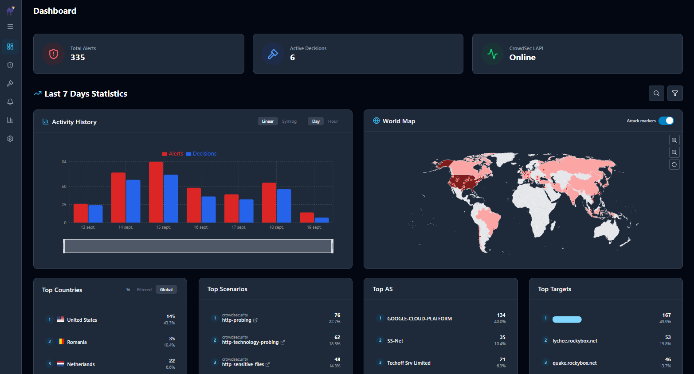

## Portainer


We will use **Portainer** to easily manage our Docker containers.

Portainer is an open source web interface that allows to create, modify, restart, monitor... Docker containers, images,
volumes, networks and more.

Here is an overview of the network flow :


```mermaid
flowchart LR
    style INCOMING_REQUEST fill: #205566
    style TRAEFIK_CONTAINER fill: #663535
    style APP_CONTAINER fill: #663535
    style TRAEFIK_ROUTER fill: #806030
    style TRAEFIK_MIDDLEWARE fill: #806030
    style SERVER_DEVICE fill: #665555
    style CONTAINER_ENGINE fill: #664545
    DOCKER_TRAEFIK_PORT443{{443/tcp}}
    DOCKER_TRAEFIK_PORT80{{80/tcp}}
    DOCKER_APP_PORT{{9000/tcp}}
    TRAEFIK_ROUTER_APP(portainer.example.com)
    TRAEFIK_MIDDLEWARE_REDIRECT(HTTPS redirect)
    TRAEFIK_MIDDLEWARE_IP_WHITELIST(IP whitelist)
    INCOMING_REQUEST((INCOMING\nREQUEST))
    INCOMING_REQUEST --> DOCKER_TRAEFIK_PORT443
    INCOMING_REQUEST --> DOCKER_TRAEFIK_PORT80

    subgraph SERVER_DEVICE[MINI PC]
        subgraph CONTAINER_ENGINE[DOCKER]
            subgraph APP_CONTAINER[PORTAINER CONTAINER]
                DOCKER_APP_PORT
            end

            subgraph TRAEFIK_CONTAINER[TRAEFIK CONTAINER]
                DOCKER_TRAEFIK_PORT443 --> TRAEFIK_ROUTER
                DOCKER_TRAEFIK_PORT80 --> TRAEFIK_ROUTER

                subgraph TRAEFIK_ROUTER[TRAEFIK HTTP ROUTER]
                    TRAEFIK_ROUTER_APP
                end

                subgraph TRAEFIK_MIDDLEWARE[TRAEFIK MIDDLEWARES]
                    TRAEFIK_MIDDLEWARE_REDIRECT
                    TRAEFIK_MIDDLEWARE_IP_WHITELIST
                end

                TRAEFIK_MIDDLEWARE_REDIRECT --> TRAEFIK_MIDDLEWARE_IP_WHITELIST
                TRAEFIK_MIDDLEWARE_REDIRECT -.-> DOCKER_TRAEFIK_PORT443
                TRAEFIK_MIDDLEWARE_IP_WHITELIST --> DOCKER_APP_PORT
                TRAEFIK_ROUTER_APP --> TRAEFIK_MIDDLEWARE_REDIRECT
            end

        end
    end
```

### Setting up

Create a folder to hold the configuration :

```bash
sudo mkdir /opt/apps/portainer
```

Then simply copy the _docker-compose.yml_ file from this project's _portainer_ directory into the _/opt/apps/portainer_
directory.

### Details

#### Service definition

:page_facing_up: _docker-compose.yml_ :

```yaml
services:

  portainer:
    image: portainer/portainer-ce:latest
    container_name: portainer
    volumes:
      - portainer-vol:/data
      - /var/run/docker.sock:/var/run/docker.sock
    restart: unless-stopped
    networks:
      - portainer-net
      - traefik-private-net

volumes:
  portainer-vol:
    name: portainer-vol

networks:

  portainer-net:
    name: portainer-net

  traefik-private-net:
    name: traefik-private-net
    external: true
```

:page_facing_up: _portainer.yml_ :

```yaml
http:
  services:
    portainer:
      loadBalancer:
        servers:
          - url: http://portainer:9000

  routers:
    portainer:
      rule: 'Host(`portainer.example.com`)'
      entryPoints:
        - websecure
      tls:
        certResolver: default
      service: portainer
      middlewares:
        - vpn-whitelist@file
```

Things to notice :

- Portainer's data is bound to a **Docker volume** named `portainer-vol`
- It uses Traefik dynamic config file to :
    - create a **service** which will point to our container application running on port `9000`
    - create an HTTP **router** that will match `portainer.example.com` URL on our `websecure` **entrypoint** to point
      to our service
    - assign the `vpn-whitelist` **middleware** so that the traffic will be restricted to allowed IPs only (application
      reachable only from local network or through VPN)
    - add a **TLS** configuration that will use our `default` **certificates resolver**, so it can generate Let's
      encrypt certificates
- It runs in its own **network** (`portainer-net`) but must also share the same network as Traefik
  (`traefik-private-net`) so it can be auto discovered

### Run

Finally, simply run the Compose file :

```bash
sudo docker-compose -f /opt/apps/portainer/docker-compose.yml up -d
```

You should end-up with a running `portainer` container.

It should also have generated the needed Let's Encrypt certificates in the _acme.json_ file in the Traefik folder.

The application is available at https://portainer.example.com.

On first start, you will be asked to create the **initial administrator user**.

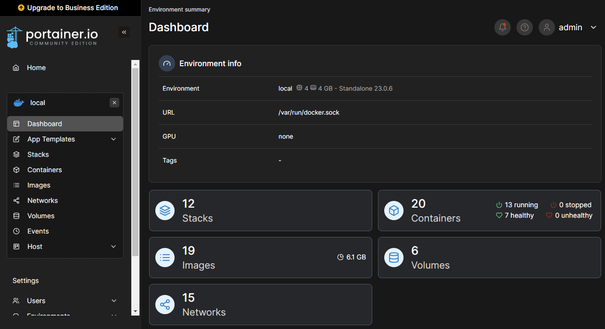

## PhpMyAdmin


As our services will use some MySQL/MariaDB databases, we will use **PhpMyAdmin** to easily manage our databases.

**PhpMyAdmin** is a free software tool intended to handle the administration of MySQL over the Web, it supports a wide
range of operations on **MySQL** and **MariaDB** (managing databases, tables, columns, relations, indexes, users,
permissions, etc.).

Here is an overview of the network flow :


```mermaid
flowchart LR
    style INCOMING_REQUEST fill: #205566
    style TRAEFIK_CONTAINER fill: #663535
    style APP_CONTAINER fill: #663535
    style TRAEFIK_ROUTER fill: #806030
    style TRAEFIK_MIDDLEWARE fill: #806030
    style SERVER_DEVICE fill: #665555
    style CONTAINER_ENGINE fill: #664545
    DOCKER_TRAEFIK_PORT443{{443/tcp}}
    DOCKER_TRAEFIK_PORT80{{80/tcp}}
    DOCKER_APP_PORT{{80/tcp}}
    TRAEFIK_ROUTER_APP(phpmyadmin.example.com)
    TRAEFIK_MIDDLEWARE_REDIRECT(HTTPS redirect)
    TRAEFIK_MIDDLEWARE_IP_WHITELIST(IP whitelist)
    INCOMING_REQUEST((INCOMING\nREQUEST))
    INCOMING_REQUEST --> DOCKER_TRAEFIK_PORT443
    INCOMING_REQUEST --> DOCKER_TRAEFIK_PORT80

    subgraph SERVER_DEVICE[MINI PC]
        subgraph CONTAINER_ENGINE[DOCKER]
            subgraph APP_CONTAINER[PHPMYADMIN CONTAINER]
                DOCKER_APP_PORT
            end

            subgraph TRAEFIK_CONTAINER[TRAEFIK CONTAINER]
                DOCKER_TRAEFIK_PORT443 --> TRAEFIK_ROUTER
                DOCKER_TRAEFIK_PORT80 --> TRAEFIK_ROUTER

                subgraph TRAEFIK_ROUTER[TRAEFIK HTTP ROUTER]
                    TRAEFIK_ROUTER_APP
                end

                subgraph TRAEFIK_MIDDLEWARE[TRAEFIK MIDDLEWARES]
                    TRAEFIK_MIDDLEWARE_REDIRECT
                    TRAEFIK_MIDDLEWARE_IP_WHITELIST
                end

                TRAEFIK_MIDDLEWARE_REDIRECT --> TRAEFIK_MIDDLEWARE_IP_WHITELIST
                TRAEFIK_MIDDLEWARE_REDIRECT -.-> DOCKER_TRAEFIK_PORT443
                TRAEFIK_MIDDLEWARE_IP_WHITELIST --> DOCKER_APP_PORT
                TRAEFIK_ROUTER_APP --> TRAEFIK_MIDDLEWARE_REDIRECT
            end

        end
    end
```

### Setting up

Create a folder to hold the configuration :

```bash
sudo mkdir /opt/apps/phpmyadmin
```

Then simply copy the _docker-compose.yml_ file from this project's _phpmyadmin_ directory into the
_/opt/apps/phpmyadmin_ directory.

### Details

#### Service definition

:page_facing_up: _docker-compose.yml_ :

```yaml
services:

  phpmyadmin:
    image: phpmyadmin:latest
    container_name: phpmyadmin
    environment:
      - PMA_ARBITRARY=1
    restart: unless-stopped
    volumes:
      - ./darkwolf/:/var/www/html/themes/darkwolf/
    networks:
      - phpmyadmin-net
      - traefik-private-net

networks:

  phpmyadmin-net:
    name: phpmyadmin-net

  traefik-private-net:
    name: traefik-private-net
    external: true
```

:page_facing_up: _phpmyadmin.yml_ :

```yaml
http:
  services:
    phpmyadmin:
      loadBalancer:
        servers:
          - url: http://phpmyadmin:80

  routers:
    phpmyadmin:
      rule: 'Host(`phpmyadmin.example.com`)'
      entryPoints:
        - websecure
      tls:
        certResolver: default
      service: phpmyadmin
      middlewares:
        - vpn-whitelist@file
```

Things to notice :

- We mount a _theme_ directory to use a custom theme (dark theme named `darkwolf`), so just copy the theme data from
  official repository https://www.phpmyadmin.net/themes/
- It uses Traefik dynamic config file to :
    - create a **service** which will point to our container application running on port `80`
    - create an HTTP **router** that will match `phpmyadmin.example.com` URL on our `websecure` **entrypoint** to point
      to our service
    - assign the `vpn-whitelist` **middleware** so that the traffic will be restricted to allowed IPs only (application
      reachable only from local network or through VPN)
    - add a **TLS** configuration that will use our `default` **certificates resolver**, so it can generate Let's
      encrypt certificates
- It runs in its own **network** (`phpmyadmin-net`) but must also share the same network as Traefik
  (`traefik-private-net`) so it can be auto discovered
- The `phpmyadmin` network will have to be added to any MySQL/MariaDB database container that we want to make reachable
  from PhpMyAdmin
- We set the environment variable `PMA_ARBITRARY` to `1` to tell PhpMyAdmin to allow connection to any arbitrary
  database server (we will be able to specify the server on login screen)

### Run

Finally, simply run the Compose file :

```bash
sudo docker-compose -f /opt/apps/phpmyadmin/docker-compose.yml up -d
```

You should end-up with a running `phpmyadmin` container.

It should also have generated the needed Let's Encrypt certificates in the _acme.json_ file in the Traefik folder.

The application is available at https://phpmyadmin.example.com.

> [!IMPORTANT]
> You will have to use the database **service name** as host to connect to a database

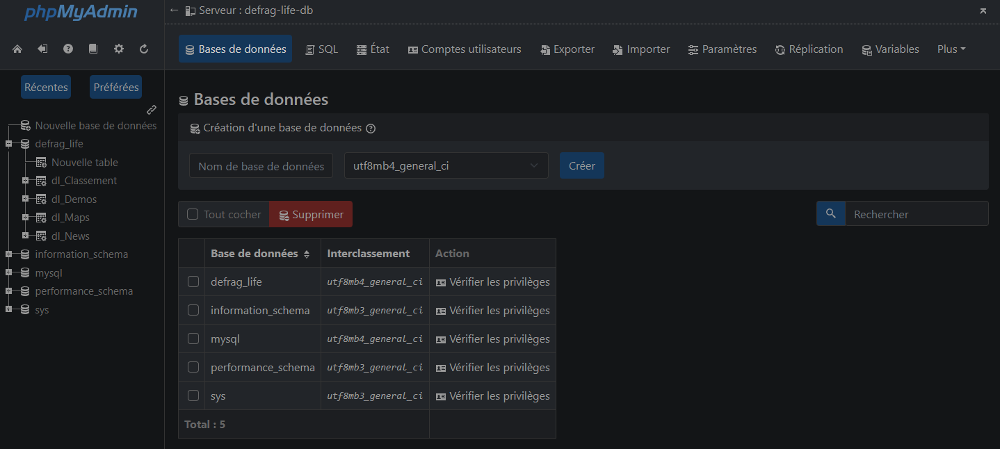

## Homer


**Homer** is a simple application that allows to generate a static homepage from a simple `yaml` configuration file.

We will use it as a dashboard to list our services.


```mermaid
flowchart LR
    style INCOMING_REQUEST fill: #205566
    style TRAEFIK_CONTAINER fill: #663535
    style APP_CONTAINER fill: #663535
    style TRAEFIK_ROUTER fill: #806030
    style TRAEFIK_MIDDLEWARE fill: #806030
    style SERVER_DEVICE fill: #665555
    style CONTAINER_ENGINE fill: #664545
    DOCKER_TRAEFIK_PORT443{{443/tcp}}
    DOCKER_TRAEFIK_PORT80{{80/tcp}}
    DOCKER_APP_PORT{{8080/tcp}}
    TRAEFIK_ROUTER_APP(dashboard.example.com)
    TRAEFIK_MIDDLEWARE_REDIRECT(HTTPS redirect)
    TRAEFIK_MIDDLEWARE_IP_WHITELIST(IP whitelist)
    INCOMING_REQUEST((INCOMING\nREQUEST))
    INCOMING_REQUEST --> DOCKER_TRAEFIK_PORT443
    INCOMING_REQUEST --> DOCKER_TRAEFIK_PORT80

    subgraph SERVER_DEVICE[MINI_PC]
        subgraph CONTAINER_ENGINE[DOCKER]
            subgraph APP_CONTAINER[HOMER CONTAINER]
                DOCKER_APP_PORT
            end

            subgraph TRAEFIK_CONTAINER[TRAEFIK CONTAINER]
                DOCKER_TRAEFIK_PORT443 --> TRAEFIK_ROUTER
                DOCKER_TRAEFIK_PORT80 --> TRAEFIK_ROUTER

                subgraph TRAEFIK_ROUTER[TRAEFIK HTTP ROUTER]
                    TRAEFIK_ROUTER_APP
                end

                subgraph TRAEFIK_MIDDLEWARE[TRAEFIK MIDDLEWARES]
                    TRAEFIK_MIDDLEWARE_REDIRECT
                    TRAEFIK_MIDDLEWARE_IP_WHITELIST
                end

                TRAEFIK_MIDDLEWARE_REDIRECT --> TRAEFIK_MIDDLEWARE_IP_WHITELIST
                TRAEFIK_MIDDLEWARE_REDIRECT -.-> DOCKER_TRAEFIK_PORT443
                TRAEFIK_MIDDLEWARE_IP_WHITELIST --> DOCKER_APP_PORT
                TRAEFIK_ROUTER_APP --> TRAEFIK_MIDDLEWARE_REDIRECT
            end

        end
    end
```

### Setting up

First, create a folder to hold the configuration :

```bash
sudo mkdir /opt/apps/homer
```

Also create an _assets_ directory to hold the application assets and the main configuration file, it will be mounted in
the container.

```bash
mkdir /opt/apps/homer/assets
```

By default, on first run, it installs in this directory some example configuration files and assets (favicons, ...), we
have disabled this by setting the environment variable `INIT_ASSETS` to `0` (default `1`).

Note that this _assets_ directory **must** have the same **gid** / **uid** that the container user have (default
`1000:1000`), so make sure to execute :

```bash
chown -R 1000:1000 /opt/apps/homer/assets/
```

Then copy :

- the _docker-compose.yml_ file from this project's _homer_ directory into the _/opt/apps/homer_ directory
- the _config.yml_ file from this project's _homer_ directory into the _/opt/apps/homer/assets_ directory
- the _homer.yml_ file from this project's _traefik/dynamic_ directory into the _/opt/apps/traefik/dynamic_ directory

### Details

#### Service definition

:page_facing_up: _docker-compose.yml_ :

```yaml
services:

  homer:
    image: b4bz/homer:latest
    container_name: homer
    volumes:
      - ./assets/:/www/assets
    user: 1000:1000
    restart: unless-stopped
    environment:
      - INIT_ASSETS=0
      - IPV6_DISABLE=1
    networks:
      - homer-net
      - traefik-private-net

networks:

  homer-net:
    name: homer-net

  traefik-private-net:
    name: traefik-private-net
    external: true
```

:page_facing_up: _homer.yml_ :

```yaml
http:
  services:
    homer:
      loadBalancer:
        servers:
          - url: http://homer:8080

  routers:
    homer:
      rule: 'Host(`dashboard.example.com`)'
      entryPoints:
        - websecure
      tls:
        certResolver: default
      service: homer
      middlewares:
        - vpn-whitelist@file
```

Things to notice :

- Homer's assets data is bound to a local directory named `assets`
- It sets the `INIT_ASSETS` environment variable to `0` to avoid generating default example data
- It sets the `IPV6_DISABLE` environment variable to `1`to disable listening on IPv6 (we don't use IPv6)
- It sets a user with **uid** and **gid** `1000` to run the application in the container
- It uses Traefik dynamic config file to :
    - create a **service** which will point to our container application running on port `8080`
    - create an HTTP **router** that will match `dashboard.example.com` URL on our `websecure` **entrypoint** to point
      to our service
    - assign the `vpn-whitelist` **middleware** so that the traffic will be restricted to allowed IPs only (application
      reachable only from local network or through VPN)
    - add **TLS** configuration that will use our `default` **certificates resolver**, so it can generate Let's encrypt
      certificates
- It runs in its own network (`homer-net`) but must also share the same network as Traefik (`traefik-private-net`) so it
  can be auto discovered

#### Configuration file

:page_facing_up: _config.yml_ :

```yaml
---
header: false
footer: '<p>Created with <span class="has-text-danger">❤️</span> with <a href="https://bulma.io/">bulma</a>, <a href="https://vuejs.org/">vuejs</a> & <a href="https://fontawesome.com/">font awesome</a> // Fork me on <a href="https://github.com/bastienwirtz/homer"><i class="fab fa-github-alt"></i></a></p>' # set false if you want to hide it.

columns: 3

# Optional theme customization
theme: default
colors:
  light:
    highlight-primary: "#3367d6"
    highlight-secondary: "#4285f4"
    highlight-hover: "#5a95f5"
    background: "#f5f5f5"
    card-background: "#ffffff"
    text: "#363636"
    text-header: "#ffffff"
    text-title: "#303030"
    text-subtitle: "#424242"
    card-shadow: rgba(0, 0, 0, 0.1)
    link: "#3273dc"
    link-hover: "#363636"
  dark:
    highlight-primary: "#3367d6"
    highlight-secondary: "#2b2b2b"
    highlight-hover: "#131313"
    background: "#131313"
    card-background: "#2b2b2b"
    text: "#eaeaea"
    text-header: "#ffffff"
    text-title: "#fafafa"
    text-subtitle: "#f5f5f5"
    card-shadow: rgba(0, 0, 0, 0.4)
    link: "#3273dc"
    link-hover: "#ffdd57"

links:
  - name: "GitHub"
    icon: "fab fa-github"
    url: "https://github.com/Yann39"
    target: "_blank"

services:
  - name: "Admin tools"
    icon: "fas fa-shield"
    items:
      - name: "Dashdot"
        logo: "assets/logos/logo-dashdot.png"
        subtitle: "Minimal server monitoring"
        tag: "monitoring"
        url: "https://dashdot.example.com"
      - name: "Traefik"
        logo: "assets/logos/logo-traefik.svg"
        subtitle: "HTTP reverse proxy"
        tag: "network"
        url: "https://traefik.example.com"
      - name: "Portainer"
        logo: "assets/logos/logo-portainer.svg"
        subtitle: "Container management platform"
        tag: "tool"
        url: "https://portainer.example.com"
      - name: "Pi-Hole"
        logo: "assets/logos/logo-pihole.svg"
        subtitle: "Network-wide ad blocking"
        tag: "network"
        url: "https://pihole.example.com/admin"
      - name: "GoatCounter"
        logo: "assets/logos/logo-goatcounter.svg"
        subtitle: "Privacy-friendly web analytics"
        tag: "analytics"
        url: "https://goatcounter.example.com"
      - name: "PhpMyAdmin"
        logo: "assets/logos/logo-phpmyadmin.svg"
        subtitle: "MySQL database management"
        tag: "tool"
        url: "https://phpmyadmin.example.com"
  - name: "Applications"
    icon: "fas fa-globe"
    items:
      - name: "Motoclub GraphQL API"
        logo: "assets/logos/logo-ccteam.svg"
        subtitle: "GraphQL API for our motoclub mobile application"
        tag: "app"
        url: "https://ccteam.example.com/ccteam-gql/graphql"
      - name: "Defrag-life"
        logo: "https://cdn2.steamgriddb.com/file/sgdb-cdn/icon_thumb/946af3555203afdb63e571b873e419f6.png"
        subtitle: "Quake 3 arena Defrag website"
        tag: "app"
        url: "https://quake.example.com"
      - name: "Lychee"
        logo: "https://avatars.githubusercontent.com/u/37916028?s=200&v=4"
        subtitle: "Photo management tool"
        tag: "app"
        url: "https://lychee.example.com"
      - name: "Homebox"
        logo: "https://homebox.software/_astro/lilbox.CmeGTiwj_Z1HYzg2.svg"
        subtitle: "Home inventory management"
        tag: "app"
        url: "https://homebox.example.com"
      - name: "Omnitools"
        logo: "https://getumbrel.github.io/umbrel-apps-gallery/omnitools/icon.svg"
        subtitle: "Various user-friendly utilities"
        tag: "tool"
        url: "https://omnitools.example.com"
  - name: "Internal"
    icon: "fas fa-microchip"
    items:
      - name: "Wireguard"
        logo: "assets/logos/logo-wireguard.svg"
        subtitle: "Simple yet fast and modern VPN"
        tag: "network"
      - name: "Sablier"
        logo: "https://avatars.githubusercontent.com/u/183561550?s=200&v=4"
        subtitle: "Workload scaling on demand"
        tag: "tool"
      - name: "Unbound"
        logo: "https://i.imgur.com/cnsNS1O.png"
        subtitle: "Validating, recursive, and caching DNS resolver"
        tag: "network"
      - name: "Pocket ID"
        logo: "assets/logos/logo-pocket-id.svg"
        subtitle: "Simple OIDC provider"
        tag: "authentication"
        url: "https://pocketid.example.com"
```

This is simply the configuration file that is used by the application to display the dashboard page.

### Run

Finally, simply run the Compose file :

```bash
sudo docker-compose -f /opt/apps/homer/docker-compose.yml up -d
```

You should end-up with a running `homer` container.

It should also have generated the needed Let's Encrypt certificates in the _acme.json_ file in the Traefik folder.

The application will be available at https://dashboard.example.com.

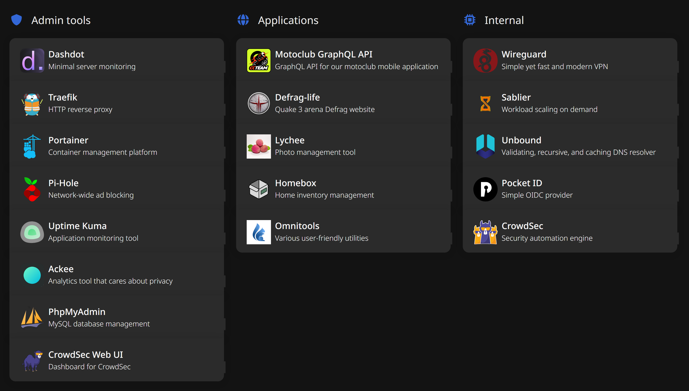

## Dashdot


**Dashdot** is a modern application to monitor server resources through a basic UI.

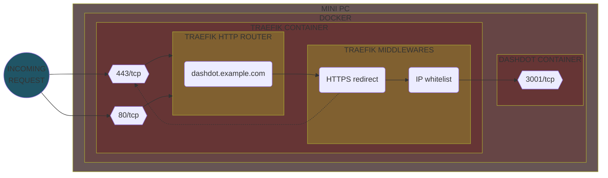
```mermaid
flowchart LR
    style INCOMING_REQUEST fill: #205566
    style TRAEFIK_CONTAINER fill: #663535
    style APP_CONTAINER fill: #663535
    style TRAEFIK_ROUTER fill: #806030
    style TRAEFIK_MIDDLEWARE fill: #806030
    style SERVER_DEVICE fill: #665555
    style CONTAINER_ENGINE fill: #664545
    DOCKER_TRAEFIK_PORT443{{443/tcp}}
    DOCKER_TRAEFIK_PORT80{{80/tcp}}
    DOCKER_APP_PORT{{3001/tcp}}
    TRAEFIK_ROUTER_APP(dashdot.example.com)
    TRAEFIK_MIDDLEWARE_REDIRECT(HTTPS redirect)
    TRAEFIK_MIDDLEWARE_IP_WHITELIST(IP whitelist)
    INCOMING_REQUEST((INCOMING\nREQUEST))
    INCOMING_REQUEST --> DOCKER_TRAEFIK_PORT443
    INCOMING_REQUEST --> DOCKER_TRAEFIK_PORT80

    subgraph SERVER_DEVICE[MINI PC]
        subgraph CONTAINER_ENGINE[DOCKER]
            subgraph APP_CONTAINER[DASHDOT CONTAINER]
                DOCKER_APP_PORT
            end

            subgraph TRAEFIK_CONTAINER[TRAEFIK CONTAINER]
                DOCKER_TRAEFIK_PORT443 --> TRAEFIK_ROUTER
                DOCKER_TRAEFIK_PORT80 --> TRAEFIK_ROUTER

                subgraph TRAEFIK_ROUTER[TRAEFIK HTTP ROUTER]
                    TRAEFIK_ROUTER_APP
                end

                subgraph TRAEFIK_MIDDLEWARE[TRAEFIK MIDDLEWARES]
                    TRAEFIK_MIDDLEWARE_REDIRECT
                    TRAEFIK_MIDDLEWARE_IP_WHITELIST
                end

                TRAEFIK_MIDDLEWARE_REDIRECT --> TRAEFIK_MIDDLEWARE_IP_WHITELIST
                TRAEFIK_MIDDLEWARE_REDIRECT -.-> DOCKER_TRAEFIK_PORT443
                TRAEFIK_MIDDLEWARE_IP_WHITELIST --> DOCKER_APP_PORT
                TRAEFIK_ROUTER_APP --> TRAEFIK_MIDDLEWARE_REDIRECT
            end

        end
    end
```

### Setting up

Create a folder to hold the configuration :

```bash
sudo mkdir /opt/apps/dashdot
```

Then :

- copy the _docker-compose.yml_ file from this project's _dashdot_ directory into the _/opt/apps/dashdot_ directory
- copy the _dashdot.yml_ file from this project's _traefik/dynamic_ directory into the _/opt/apps/traefik/dynamic_
  directory

### Details

#### Service definition

:page_facing_up: _docker-compose.yml_ :

```yaml
services:

  dashdot:
    image: mauricenino/dashdot:latest
    container_name: dashdot
    restart: unless-stopped
    volumes:
      - /:/mnt/host:ro
    networks:
      - dashdot-net
      - traefik-private-net

networks:

  dashdot-net:
    name: dashdot-net

  traefik-private-net:
    name: traefik-private-net
    external: true
```

:page_facing_up: _dashdot.yml_ :

```yaml
http:
  services:
    dashdot:
      loadBalancer:
        servers:
          - url: http://dashdot:3001

  routers:
    dashdot:
      rule: 'Host(`dashdot.example.com`)'
      entryPoints:
        - websecure
      tls:
        certResolver: default
      service: dashdot
      middlewares:
        - vpn-whitelist@file
        - sablier-dashdot@file
```

Things to notice :

- Dashdot's data is bound to the current directory (read-only)
- It uses Traefik dynamic config file to :
    - create a **service** which will point to our container application running on port `3001`
    - create an HTTP **router** that will match `dashdot.example.com` URL on our `websecure` **entrypoint** to point to
      our service
    - add a **TLS** configuration that will use our `default` **certificates resolver**, so it can generate Let's
      encrypt certificates
    - assign the `vpn-whitelist` **middleware** so that the traffic will be restricted to allowed IPs only (application
      reachable only from local network or through VPN)
    - assign the `sablier-dashdot` **middleware** so that on-demand stop/start of the container can be done through
      Sablier
- It runs in its own **network** (`dashdot-net`) but must also share the same network as Traefik (`traefik-private-net`)
  so it can be auto discovered

### Run

Finally, simply run the Compose file :

```bash
sudo docker-compose -f /opt/apps/dashdot/docker-compose.yml up -d
```

You should end-up with a running `dashdot` container.

It should also have generated the needed Let's Encrypt certificates in the _acme.json_ file in the Traefik folder.

The application is available at https://dashdot.example.com.

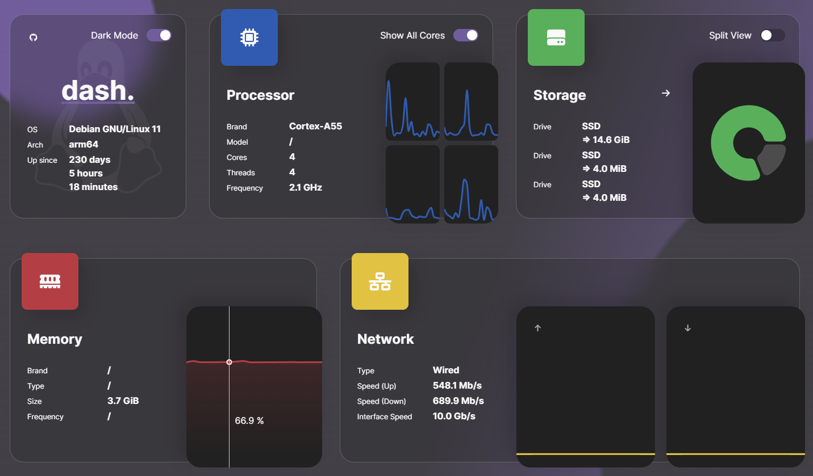

## Lychee


**Lychee** is a robust, locally hosted web-based photo management tool.
It enables you to carry out various operations on photos, including uploading, organizing, sharing, and more.

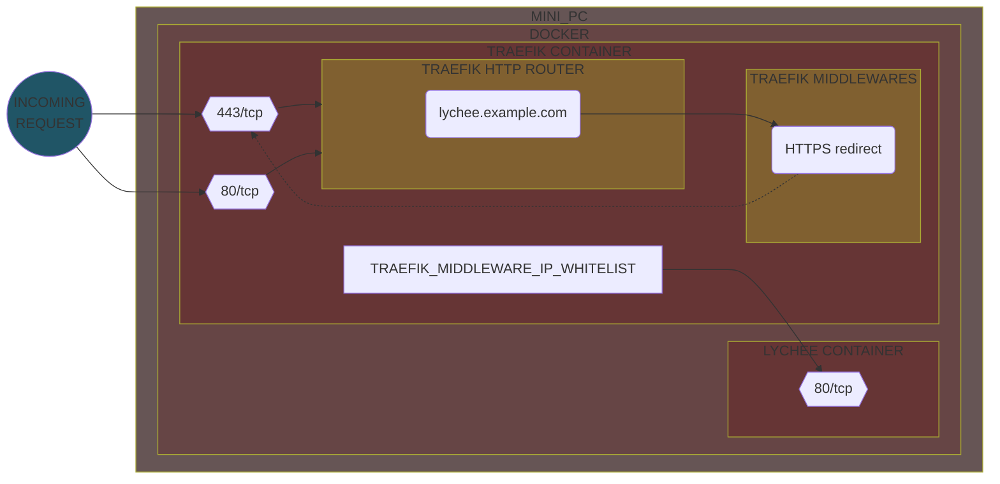
```mermaid
flowchart LR
    style INCOMING_REQUEST fill: #205566
    style TRAEFIK_CONTAINER fill: #663535
    style APP_CONTAINER fill: #663535
    style TRAEFIK_ROUTER fill: #806030
    style TRAEFIK_MIDDLEWARE fill: #806030
    style SERVER_DEVICE fill: #665555
    style CONTAINER_ENGINE fill: #664545
    DOCKER_TRAEFIK_PORT443{{443/tcp}}
    DOCKER_TRAEFIK_PORT80{{80/tcp}}
    DOCKER_APP_PORT{{80/tcp}}
    TRAEFIK_ROUTER_APP(lychee.example.com)
    TRAEFIK_MIDDLEWARE_REDIRECT(HTTPS redirect)
    INCOMING_REQUEST((INCOMING\nREQUEST))
    INCOMING_REQUEST --> DOCKER_TRAEFIK_PORT443
    INCOMING_REQUEST --> DOCKER_TRAEFIK_PORT80

    subgraph SERVER_DEVICE[MINI_PC]
        subgraph CONTAINER_ENGINE[DOCKER]
            subgraph APP_CONTAINER[LYCHEE CONTAINER]
                DOCKER_APP_PORT
            end

            subgraph TRAEFIK_CONTAINER[TRAEFIK CONTAINER]
                DOCKER_TRAEFIK_PORT443 --> TRAEFIK_ROUTER
                DOCKER_TRAEFIK_PORT80 --> TRAEFIK_ROUTER

                subgraph TRAEFIK_ROUTER[TRAEFIK HTTP ROUTER]
                    TRAEFIK_ROUTER_APP
                end

                subgraph TRAEFIK_MIDDLEWARE[TRAEFIK MIDDLEWARES]
                    TRAEFIK_MIDDLEWARE_REDIRECT
                end

                TRAEFIK_MIDDLEWARE_REDIRECT -.-> DOCKER_TRAEFIK_PORT443
                TRAEFIK_MIDDLEWARE_IP_WHITELIST --> DOCKER_APP_PORT
                TRAEFIK_ROUTER_APP --> TRAEFIK_MIDDLEWARE_REDIRECT
            end

        end
    end
```

### Setting up

First, create a folder to hold the configuration :

```bash
sudo mkdir /opt/apps/lychee
```

Then copy :

- the _docker-compose.yml_ file from this project's _lychee_ directory into the _/opt/apps/lychee_ directory.
- the _lychee.yml_ file from this project's _traefik/dynamic_ directory into the _/opt/apps/traefik/dynamic_ directory.

### Details

#### Service definition

:page_facing_up: _docker-compose.yml_ :

```yaml
services:

  lychee:
    image: lycheeorg/lychee:latest
    container_name: lychee
    volumes:
      - ./lychee/conf:/conf
      - ./lychee/uploads:/uploads
      - ./lychee/sym:/sym
      - ./lychee/logs:/logs
    environment:
      - PHP_TZ=UTC
      - TIMEZONE=UTC
      - DB_CONNECTION=mysql
      - DB_HOST=lychee-db
      - DB_PORT=3306
      - DB_DATABASE=lychee
      - DB_USERNAME=$MYSQL_USERNAME
      - DB_PASSWORD=$MYSQL_PASSWORD
      - STARTUP_DELAY=30
      - ADMIN_USER=$ADMIN_USER
      - ADMIN_PASSWORD=$ADMIN_PASSWORD
      - APP_URL=https://lychee.example.com
      - TRUSTED_PROXIES=*
    depends_on:
      - lychee-db
    restart: unless-stopped
    networks:
      - lychee-net
      - traefik-public-net

  lychee-db:
    container_name: lychee-db
    image: mariadb:latest
    restart: unless-stopped
    environment:
      - MYSQL_ROOT_PASSWORD=$MYSQL_ROOT_PASSWORD
      - MYSQL_DATABASE=lychee
      - MYSQL_USER=$MYSQL_USERNAME
      - MYSQL_PASSWORD=$MYSQL_PASSWORD
    volumes:
      - lychee-db-vol:/var/lib/mysql
    networks:
      - lychee-net

volumes:

  lychee-db-vol:
    name: lychee-db-vol

networks:

  lychee-net:
    name: lychee-net

  traefik-public-net:
    name: traefik-public-net
    external: true
```

:page_facing_up: _lychee.yml_ :

```yaml
http:
  services:
    lychee:
      loadBalancer:
        servers:
          - url: http://lychee:80

  routers:
    lychee:
      rule: 'Host(`lychee.example.com`)'
      entryPoints:
        - websecure
      tls:
        certResolver: default
      service: lychee
```

Things to notice :

- It binds some volumes for configuration, uploads, symbolic links and logs
- It sets some environment variables for timezone, database connection, admin user and password, application URL and
  trusted proxies
- It uses Traefik dynamic config file to :
    - create a **service** which will point to our container application running on port `80`
    - create an HTTP **router** that will match `lychee.example.com` URL on our `websecure` **entrypoint** to point to
      our service
    - add **TLS** configuration that will use our `default` **certificates resolver**, so it can generate Let's encrypt
      certificates
- It runs in its own network (`lychee-net`) but must also join the **public** network of Traefik (`traefik-public-net`)
  to be reachable by the reverse proxy, as it is exposed to the internet
  (see [Network segmentation](#network-segmentation))

### Run

Finally, simply run the Compose file :

```bash
sudo docker-compose -f /opt/apps/lychee/docker-compose.yml up -d
```

You should end-up with a running `lychee` container.

It should also have generated the needed Let's Encrypt certificates in the _acme.json_ file in the Traefik folder.

The application will be available at https://lychee.example.com.

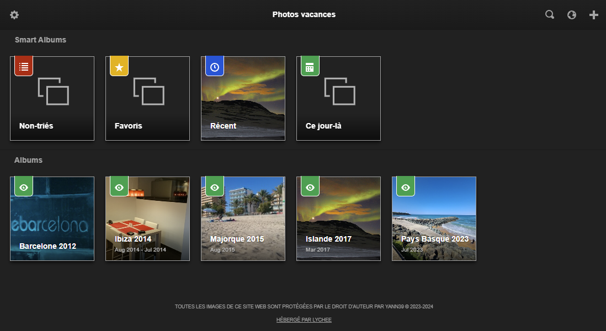

## Homebox


**Homebox** is a simple inventory for the house : what you own, where it is stored, when it was bought, the warranty,
the receipts and the manuals attached to it, with labels, a QR code per item and a full text search. Useful when the
insurance asks for a list, or just to remember in which box something ended up.

It is a small Go application with an embedded database, it needs nothing else. It is reachable from the local network
and the VPN only, and it is our example of an application doing **OIDC natively** against [PocketID](#pocketid), with
its public issuer URL.

Here is an overview of the network flow :

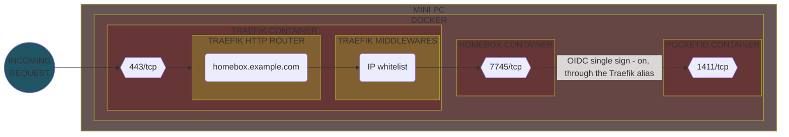
```mermaid
flowchart LR
    style INCOMING_REQUEST fill: #205566
    style TRAEFIK_CONTAINER fill: #663535
    style APP_CONTAINER fill: #663535
    style POCKETID_CONTAINER fill: #663535
    style TRAEFIK_ROUTER fill: #806030
    style TRAEFIK_MIDDLEWARE fill: #806030
    style SERVER_DEVICE fill: #665555
    style CONTAINER_ENGINE fill: #664545
    DOCKER_TRAEFIK_PORT443{{443/tcp}}
    DOCKER_APP_PORT{{7745/tcp}}
    DOCKER_POCKETID_PORT{{1411/tcp}}
    TRAEFIK_ROUTER_APP(homebox.example.com)
    TRAEFIK_MIDDLEWARE_IP_WHITELIST(IP whitelist)
    INCOMING_REQUEST((INCOMING\nREQUEST))
    INCOMING_REQUEST --> DOCKER_TRAEFIK_PORT443

    subgraph SERVER_DEVICE[MINI PC]
        subgraph CONTAINER_ENGINE[DOCKER]
            subgraph TRAEFIK_CONTAINER[TRAEFIK CONTAINER]
                DOCKER_TRAEFIK_PORT443 --> TRAEFIK_ROUTER

                subgraph TRAEFIK_ROUTER[TRAEFIK HTTP ROUTER]
                    TRAEFIK_ROUTER_APP
                end

                subgraph TRAEFIK_MIDDLEWARE[TRAEFIK MIDDLEWARES]
                    TRAEFIK_MIDDLEWARE_IP_WHITELIST
                end

                TRAEFIK_ROUTER_APP --> TRAEFIK_MIDDLEWARE_IP_WHITELIST
            end

            subgraph APP_CONTAINER[HOMEBOX CONTAINER]
                DOCKER_APP_PORT
            end

            subgraph POCKETID_CONTAINER[POCKETID CONTAINER]
                DOCKER_POCKETID_PORT
            end

            TRAEFIK_MIDDLEWARE_IP_WHITELIST --> DOCKER_APP_PORT
            DOCKER_APP_PORT -.->|OIDC single sign - on, through the Traefik alias| DOCKER_POCKETID_PORT
        end
    end
```

### Setting up

Create a folder to hold the configuration :

```bash
sudo mkdir /opt/apps/homebox
```

Then :

- copy the _.env_ and _docker-compose.yml_ files from this project's _homebox_ directory into the _/opt/apps/homebox_
  directory
- copy the _homebox.yml_ file from this project's _traefik/dynamic_ directory into the _/opt/apps/traefik/dynamic_
  directory
- create an OIDC client in [PocketID](#pocketid) with the callback URL Homebox documents, then fill
  `HBOX_OIDC_CLIENT_ID` and `HBOX_OIDC_CLIENT_SECRET`
- generate the pepper used to hash the API keys (`openssl rand -base64 32`) and put it in `HBOX_AUTH_API_KEY_PEPPER`
- add a **local DNS record** `homebox.example.com` pointing to the mini PC (see [Pi-hole](#pi-hole)), the service is not
  published on the internet

> [!IMPORTANT]
> `HBOX_OIDC_ISSUER_URL` must be the **public** URL, **without a trailing slash** (Homebox
is [sensitive to it](https://github.com/sysadminsmedia/homebox/issues/1151)), and it must match character for character
the `issuer` returned by the provider : its OIDC library refuses any difference. The internal URL `http://pocketid:1411`
therefore cannot be used, it answers with the public issuer and Homebox rejects it with
`issuer URL provided to client ... did not match`.
> That the container can nonetheless reach the public URL is exactly what the Traefik **network alias** and the
`pocketid-whitelist` middleware are for, see [PocketID](#pocketid). Without them the container does not even resolve the
name, since the private services have no public DNS record.

### Details

#### Service definition

:page_facing_up: _docker-compose.yml_ :

```yaml
services:

  homebox:
    image: ghcr.io/sysadminsmedia/homebox:latest
    container_name: homebox
    restart: always
    env_file: .env
    environment:
      - HBOX_LOG_LEVEL=debug
      - HBOX_LOG_FORMAT=text
      - HBOX_WEB_MAX_UPLOAD_SIZE=10
      - HBOX_OIDC_ENABLED=true
      - HBOX_OIDC_ISSUER_URL=https://pocketid.example.com
      - HBOX_OIDC_CLIENT_ID=f1644c44-4f50-458f-9043-2bad9224e09c
      #- HBOX_OIDC_AUTO_REDIRECT=true
      #- HBOX_OPTIONS_ALLOW_LOCAL_LOGIN=false
      - HBOX_OPTIONS_TRUST_PROXY=true
      # Please consider allowing analytics to help us improve Homebox (basic computer information, no personal data)
      - HBOX_OPTIONS_ALLOW_ANALYTICS=true
    volumes:
      - homebox-data:/data/
    networks:
      - homebox-net
      - traefik-private-net

volumes:

  homebox-data:
    name: homebox-data-vol

networks:

  homebox-net:
    name: homebox-net

  traefik-private-net:
    name: traefik-private-net
    external: true
```

:page_facing_up: _homebox.yml_ :

```yaml
http:
  services:
    homebox:
      loadBalancer:
        servers:
          - url: http://homebox:7745

  routers:
    homebox:
      rule: 'Host(`homebox.example.com`)'
      entryPoints:
        - websecure
      tls:
        certResolver: default
      service: homebox
      # Only the IP whitelist : Homebox handles the PocketID single sign-on itself (native OIDC)
      middlewares:
        - vpn-whitelist@file
```

Things to notice :

- the data (SQLite database, uploaded receipts and pictures) lives in a **Docker volume** named `homebox-data-vol`
- it runs in its own network (`homebox-net`) but must also join the **private** network of Traefik
  (`traefik-private-net`) to be reachable by the reverse proxy,
  which is also what lets it reach PocketID, see [Network segmentation](#network-segmentation)
- the Traefik dynamic config file creates the **service** pointing to the container on port `7745`, the HTTP **router**
  matching `homebox.example.com` on the `websecure` entrypoint with a Let's Encrypt certificate, and applies the IP
  whitelist. No authentication middleware : Homebox does the single sign-on itself
- `HBOX_OPTIONS_TRUST_PROXY` makes Homebox read the client address and the protocol from the headers set by Traefik,
  which is required behind a reverse proxy
- `HBOX_OPTIONS_ALLOW_LOCAL_LOGIN` and `HBOX_OIDC_AUTO_REDIRECT` are commented out : the first one disables the local
  accounts once the single sign-on works, the second one sends the user straight to PocketID without showing the login
  page. Enable them only when you are sure the OIDC login works, otherwise you lock yourself out

#### Environment variables

:page_facing_up: _.env_ :

```shell
HBOX_OIDC_CLIENT_SECRET=<client_secret>
HBOX_AUTH_API_KEY_PEPPER=<pepper_auth_api_key>
```

- `HBOX_OIDC_CLIENT_SECRET` is the secret of the PocketID client
- `HBOX_AUTH_API_KEY_PEPPER` is the value Homebox mixes into the hash of the API keys it issues. Set it once and keep
  it : changing it invalidates every existing key

### Run

Simply run the Compose file :

```bash
sudo docker-compose -f /opt/apps/homebox/docker-compose.yml up -d
```

You should end-up with a running `homebox` container, and Traefik picks up the dynamic configuration file without
restarting.

The application is available at https://homebox.example.com, with a button to log in through PocketID.

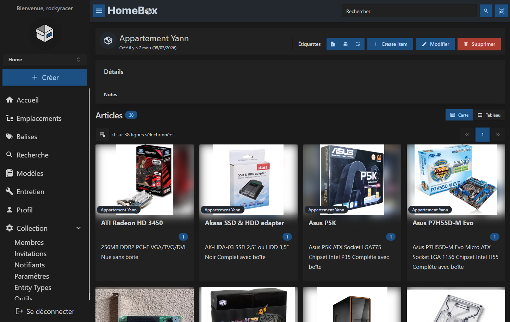

## GoatCounter


**GoatCounter** counts the visits on the public websites. It is deliberately minimal : no cookies, no tracking across
sites, no personal data stored (the visitor IP is only used to derive the country and to compute a daily hash, it is
never kept), which also means no consent banner to display.
A single Go binary with an embedded SQLite database, a few megabytes of memory.

Unlike every other tool of this guide, it is **exposed to the internet** : the tracking script and the endpoint that
collects the hits must be reachable by the visitors of the public websites. It therefore sits on the **public** network
and relies on [CrowdSec](#crowdsec) like the other public applications. Only the **collecting endpoints** are open,
the dashboard is put behind [PocketID](#pocketid) with a second router, see below.

Here is an overview of the network flow :

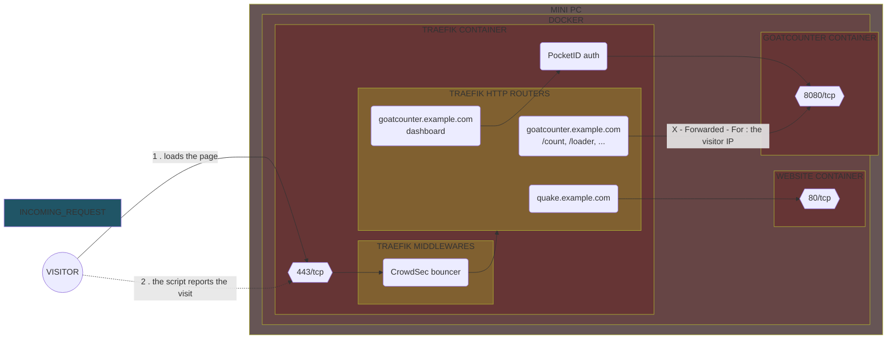
```mermaid
flowchart LR
    style INCOMING_REQUEST fill: #205566
    style TRAEFIK_CONTAINER fill: #663535
    style APP_CONTAINER fill: #663535
    style WEBSITE_CONTAINER fill: #663535
    style TRAEFIK_ROUTER fill: #806030
    style TRAEFIK_MIDDLEWARE fill: #806030
    style SERVER_DEVICE fill: #665555
    style CONTAINER_ENGINE fill: #664545
    DOCKER_TRAEFIK_PORT443{{443/tcp}}
    DOCKER_APP_PORT{{8080/tcp}}
    DOCKER_WEBSITE_PORT{{80/tcp}}
    TRAEFIK_ROUTER_APP(goatcounter.example.com\n/count, /loader, ...)
    TRAEFIK_ROUTER_DASH(goatcounter.example.com\ndashboard)
    TRAEFIK_ROUTER_SITE(quake.example.com)
    TRAEFIK_MIDDLEWARE_CROWDSEC(CrowdSec bouncer)
    VISITOR((VISITOR))
    VISITOR -->|1 . loads the page| DOCKER_TRAEFIK_PORT443
    VISITOR -.->|2 . the script reports the visit| DOCKER_TRAEFIK_PORT443

    subgraph SERVER_DEVICE[MINI PC]
        subgraph CONTAINER_ENGINE[DOCKER]
            subgraph TRAEFIK_CONTAINER[TRAEFIK CONTAINER]
                DOCKER_TRAEFIK_PORT443 --> TRAEFIK_MIDDLEWARE_CROWDSEC

                subgraph TRAEFIK_MIDDLEWARE[TRAEFIK MIDDLEWARES]
                    TRAEFIK_MIDDLEWARE_CROWDSEC
                end

                subgraph TRAEFIK_ROUTER[TRAEFIK HTTP ROUTERS]
                    TRAEFIK_ROUTER_SITE
                    TRAEFIK_ROUTER_APP
                    TRAEFIK_ROUTER_DASH
                end

                TRAEFIK_MIDDLEWARE_OIDC(PocketID auth)
                TRAEFIK_MIDDLEWARE_CROWDSEC --> TRAEFIK_ROUTER
            end

            subgraph WEBSITE_CONTAINER[WEBSITE CONTAINER]
                DOCKER_WEBSITE_PORT
            end

            subgraph APP_CONTAINER[GOATCOUNTER CONTAINER]
                DOCKER_APP_PORT
            end

            TRAEFIK_ROUTER_SITE --> DOCKER_WEBSITE_PORT
            TRAEFIK_ROUTER_APP -->|X - Forwarded - For : the visitor IP| DOCKER_APP_PORT
            TRAEFIK_ROUTER_DASH --> TRAEFIK_MIDDLEWARE_OIDC
            TRAEFIK_MIDDLEWARE_OIDC --> DOCKER_APP_PORT
        end
    end
```

### Setting up

Create a folder to hold the configuration :

```bash
sudo mkdir /opt/apps/goatcounter
```

Then :

- copy the _docker-compose.yml_ file from this project's _goatcounter_ directory into the _/opt/apps/goatcounter_
  directory
- copy the _goatcounter.yml_ file from this project's _traefik/dynamic_ directory into the _/opt/apps/traefik/dynamic_
  directory
- add a **public** DNS record for `goatcounter.example.com` (a `CNAME` to your dynamic DNS, like the other public
  services, see [Domain and subdomains](#domain-and-subdomains)), **and** a local DNS record pointing to the mini PC
  (see [Pi-hole](#pi-hole)) so that your own devices do not go through the NAT loopback of the router
- create an OIDC client and its `goatcounter-auth` middleware as described in [PocketID](#pocketid), with the callback
  URL `https://goatcounter.example.com/oidc/callback`
- start the service (see [Run](#run-11)), then create the site and its administrator account :

  ```bash
  sudo docker exec -it goatcounter goatcounter db create site -vhost=goatcounter.example.com -user.email=you@example.com
  ```

  It asks for a password. The `-vhost` **must** match the `Host()` of the router : GoatCounter is multi-site and
  dispatches on the `Host` header.

Finally, add the tracking script to the websites you want to count, just before `</body>` :

```html

<script data-goatcounter="https://goatcounter.example.com/count"
        async src="https://goatcounter.example.com/count.js"></script>
```

> [!TIP]
> The script must run on **every** page, but there is no need to edit them one by one : put it once in the shared header
or footer that all the pages already include (`include 'header.php'` and friends). If the site has no such common
template, PHP-FPM can append a file to every script without touching a single page, with
`php_value[auto_append_file] = /var/www/html/goatcounter.php` in its pool configuration, beware that it appends
to *every* PHP response, which would corrupt the ones that are not HTML (JSON, generated images, downloads).
>
> Serving the script from your own domain rather than from a third party CDN also makes it far less likely to be stopped
by ad blockers.

### Details

#### Service definition

:page_facing_up: _docker-compose.yml_ :

```yaml
services:

  goatcounter:
    image: arp242/goatcounter:latest
    container_name: goatcounter
    restart: unless-stopped
    environment:
      TZ: "Europe/Zurich"
    # The image entrypoint is the goatcounter binary, its default command being "serve -automigrate".
    # We keep -automigrate (pending migrations are applied at start, useful when pulling a new image) and add :
    #   -tls=http  serve plain HTTP, TLS is terminated by Traefik. This one is NOT optional : without it
    #              goatcounter defaults to "acme" in production and tries to get its own certificates
    #   -listen    the address Traefik forwards to
    command: [ "serve", "-automigrate", "-tls=http", "-listen=:8080" ]
    volumes:
      # SQLite database and uploaded data, in a named volume : the container runs as a non-root user,
      # a bind mount would need the right ownership on the host
      - goatcounter-data:/home/goatcounter/goatcounter-data
    networks:
      - goatcounter-net
      - traefik-public-net

volumes:

  goatcounter-data:
    name: goatcounter-data-vol

networks:

  goatcounter-net:
    name: goatcounter-net

  traefik-public-net:
    name: traefik-public-net
    external: true
```

:page_facing_up: _goatcounter.yml_ :

```yaml
http:
  services:
    goatcounter:
      loadBalancer:
        servers:
          - url: http://goatcounter:8080

  routers:
    # Public part : everything a visitor's browser needs to report a hit. No whitelist, no authentication,
    # otherwise the collection silently stops. PathPrefix(`/count`) covers /count, /count.js and /counter/...
    # The higher priority makes this router win over the one below, which matches the whole host.
    goatcounter-public:
      rule: 'Host(`goatcounter.example.com`) && (PathPrefix(`/count`) || PathPrefix(`/loader`) || PathPrefix(`/load-widget`) || Path(`/jserr`) || Path(`/csp`) || Path(`/robots.txt`) || Path(`/security.txt`))'
      priority: 100
      entryPoints:
        - websecure
      tls:
        certResolver: default
      service: goatcounter

    # Everything else : the dashboard, the settings, the login page, behind PocketID authentication
    goatcounter:
      rule: 'Host(`goatcounter.example.com`)'
      priority: 1
      entryPoints:
        - websecure
      tls:
        certResolver: default
      service: goatcounter
      # IP whitelist first : the dashboard is only meant to be used from the local network or through the VPN,
      # so it does not depend on the authentication middleware alone. This matters because the host is public
      # and GoatCounter's own login is disabled (its site is set to public) : without this, a mistake in the
      # public router's path rule above would expose the statistics to the internet.
      middlewares:
        - vpn-whitelist@file
        - goatcounter-auth@file
```

Things to notice :

- `-tls=http` is **not optional** : GoatCounter defaults to `acme` in production and would try to obtain its own Let's
  Encrypt certificates, in competition with Traefik.
  Here TLS is terminated by the reverse proxy and GoatCounter only serves plain HTTP on its port
- `-automigrate` comes from the image's default command and is kept : pending schema migrations are applied at start,
  which matters when pulling a new image
- the data (SQLite database) lives in a **named volume** rather than a bind mount : the container runs as a non-root
  user, a bind mount would need the matching ownership on the host
- there are **two routers on the same host**, split by path and separated by an explicit `priority`. The public one
  carries **no middleware** : an IP whitelist would block the visitors and an authentication middleware would block the
  collection. The other one, matching everything else, carries the IP whitelist **and** the PocketID middleware : the
  dashboard is only used from the local network or the VPN, and since the host is public it must not depend on the
  authentication middleware alone.
  The CrowdSec bouncer applies to both, since it sits on the `websecure` entrypoint
- it joins `traefik-public-net`, so it cannot reach the private services,
  see [Network segmentation](#network-segmentation)
- GoatCounter reads the visitor address from the `X-Forwarded-For` header set by Traefik, there is nothing to configure
  for that

> [!WARNING]
> Splitting a host between a public router and an authenticated one is effective but unforgiving : if a collecting path
ends up on the wrong side, the tracking request is answered with a redirection to PocketID, the browser reports nothing
and you **silently lose visits**.
Check the paths your visitors really request before and after the change, the Traefik access log gives them :
>
> ```bash
> grep '"RequestHost":"goatcounter.example.com"' /opt/apps/traefik/logs/access.log | grep -oE '"RequestPath":"[^"]+"' | sort | uniq -c | sort -rn
> ```
>
> Note also that GoatCounter has its own login : behind the middleware you would authenticate twice. To keep a single
login, mark the site as **public** in its settings so that the statistics no longer require a GoatCounter account, and
let PocketID be the only gate, at the cost of world readable statistics should a path rule ever leak.

> [!NOTE]
> About the **locations** shown in the dashboard :
>
> - a **Countries** database is built into GoatCounter, countries work out of the box. **Regions** need the *Cities*
    version of the MaxMind database, given with the `-geodb` flag (`-geodb maxmind:<account_id>:<license_key>` downloads
    and refreshes it automatically, or drop any `.mmdb` file in the data volume and it is picked up)
> - the location is resolved **when the visit is recorded**, and stored. It is never recomputed : the visits collected
    before you enable or fix anything stay `Unknown` forever
> - your own visits are always `Unknown`, since they come from the local network or from the VPN and a private address
    has no location. Testing from a phone only proves something if the **VPN is turned off** on it, otherwise the visit
    arrives from the tunnel with a `10.0.0.x` address

### Run

Simply run the Compose file :

```bash
sudo docker-compose -f /opt/apps/goatcounter/docker-compose.yml up -d
```

You should end-up with a running `goatcounter` container, and Traefik picks up the dynamic configuration file without
restarting.

The dashboard is available at https://goatcounter.example.com, with the account created above.

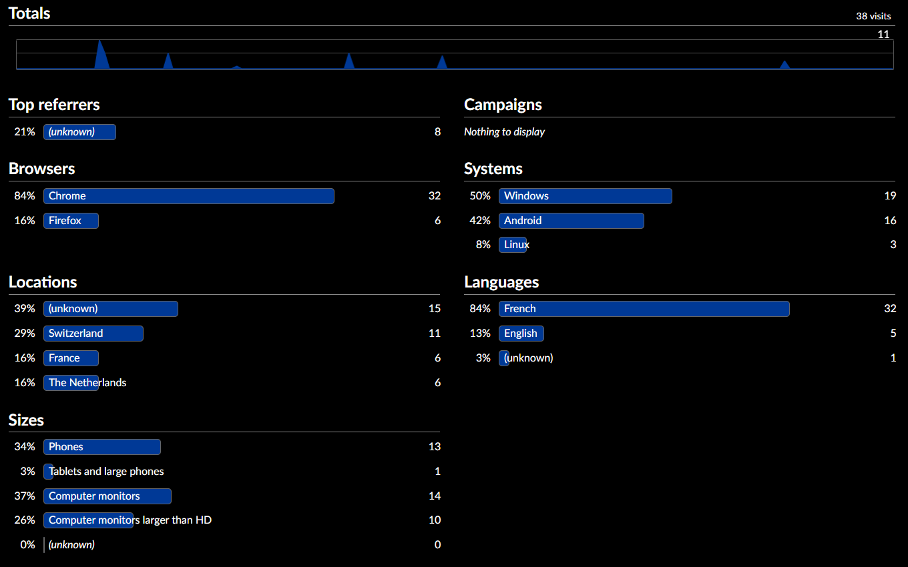

## Prometheus


**Prometheus** collects **metrics** : at a regular interval it calls (_scrapes_) an HTTP endpoint exposed by each
monitored application, and stores the values in its own time series database, queried with the **PromQL** language.
It has no real dashboard, that is the job of [Grafana](#grafana), which reads its data.

Here it monitors the **CCTeam GraphQL API** (see [CCTeam](#ccteam)) : request rate, errors and response times, per
operation and per GraphQL field, plus the JVM, the database connection pool, ... that **Spring Boot** exposes out of the
box through **Actuator** and **Micrometer**.

It is an administration tool, so it sits on the **private** network and is only reachable from the local network and
the VPN. Prometheus has **no native OIDC support** (only basic authentication and TLS, through a web configuration
file), so its web interface is put behind [PocketID](#pocketid) with the Traefik plugin, like Pi-Hole.

Here is an overview of the network flow :

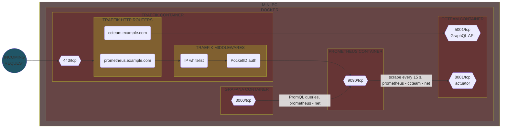
```mermaid
flowchart LR
    style INCOMING_REQUEST fill: #205566
    style TRAEFIK_CONTAINER fill: #663535
    style APP_CONTAINER fill: #663535
    style CCTEAM_CONTAINER fill: #663535
    style GRAFANA_CONTAINER fill: #663535
    style TRAEFIK_ROUTER fill: #806030
    style TRAEFIK_MIDDLEWARE fill: #806030
    style SERVER_DEVICE fill: #665555
    style CONTAINER_ENGINE fill: #664545
    DOCKER_TRAEFIK_PORT443{{443/tcp}}
    DOCKER_APP_PORT{{9090/tcp}}
    DOCKER_CCTEAM_PORT{{5001/tcp\nGraphQL API}}
    DOCKER_CCTEAM_MANAGEMENT_PORT{{8081/tcp\nactuator}}
    DOCKER_GRAFANA_PORT{{3000/tcp}}
    TRAEFIK_ROUTER_APP(prometheus.example.com)
    TRAEFIK_ROUTER_CCTEAM(ccteam.example.com)
    TRAEFIK_MIDDLEWARE_IP_WHITELIST(IP whitelist)
    TRAEFIK_MIDDLEWARE_OIDC(PocketID auth)
    INCOMING_REQUEST((INCOMING\nREQUEST))
    INCOMING_REQUEST --> DOCKER_TRAEFIK_PORT443

    subgraph SERVER_DEVICE[MINI PC]
        subgraph CONTAINER_ENGINE[DOCKER]
            subgraph TRAEFIK_CONTAINER[TRAEFIK CONTAINER]
                DOCKER_TRAEFIK_PORT443 --> TRAEFIK_ROUTER

                subgraph TRAEFIK_ROUTER[TRAEFIK HTTP ROUTERS]
                    TRAEFIK_ROUTER_APP
                    TRAEFIK_ROUTER_CCTEAM
                end

                subgraph TRAEFIK_MIDDLEWARE[TRAEFIK MIDDLEWARES]
                    TRAEFIK_MIDDLEWARE_IP_WHITELIST
                    TRAEFIK_MIDDLEWARE_OIDC
                end

                TRAEFIK_ROUTER_APP --> TRAEFIK_MIDDLEWARE_IP_WHITELIST
                TRAEFIK_MIDDLEWARE_IP_WHITELIST --> TRAEFIK_MIDDLEWARE_OIDC
            end

            subgraph APP_CONTAINER[PROMETHEUS CONTAINER]
                DOCKER_APP_PORT
            end

            subgraph CCTEAM_CONTAINER[CCTEAM CONTAINER]
                DOCKER_CCTEAM_PORT
                DOCKER_CCTEAM_MANAGEMENT_PORT
            end

            subgraph GRAFANA_CONTAINER[GRAFANA CONTAINER]
                DOCKER_GRAFANA_PORT
            end

            TRAEFIK_MIDDLEWARE_OIDC --> DOCKER_APP_PORT
            TRAEFIK_ROUTER_CCTEAM --> DOCKER_CCTEAM_PORT
            DOCKER_APP_PORT -->|scrape every 15 s, prometheus - ccteam - net| DOCKER_CCTEAM_MANAGEMENT_PORT
            DOCKER_GRAFANA_PORT -->|PromQL queries, prometheus - net| DOCKER_APP_PORT
        end
    end
```

The monitoring stack uses its own networks, on top of the Traefik ones :

| Network                 | Who                                                   | Why                                                     |
|-------------------------|-------------------------------------------------------|---------------------------------------------------------|
| `traefik-private-net`   | Traefik, Prometheus, Grafana                          | web interfaces behind Traefik, Grafana reaches PocketID |
| `prometheus-net`        | Prometheus, Grafana                                   | Grafana queries Prometheus directly                     |
| `prometheus-ccteam-net` | Prometheus, the CCTeam **application** container only | Prometheus scrapes the API                              |

The scraping network is dedicated on purpose. CCTeam is **exposed to the internet**, it is the container most likely to
be compromised one day :

- if CCTeam joined `prometheus-net`, it could reach Grafana, and the Prometheus API which has no authentication
- if Prometheus joined `ccteam-net`, it could reach the **database** of CCTeam

With `prometheus-ccteam-net`, the API and Prometheus only see each other. The database stays on `ccteam-net`, and
Grafana is not reachable from the application.
This is a deliberate, limited exception to the rules of [Network segmentation](#network-segmentation) : a compromised
CCTeam container could query Prometheus directly, but only Prometheus, and only to read metrics (the admin and lifecycle
APIs are disabled, see below). A monitored application never joins `prometheus-net`, each one gets its own
`prometheus-<app>-net`.

### Setting up

Create a folder to hold the configuration :

```bash
sudo mkdir /opt/apps/prometheus
```

Then :

- copy the _docker-compose.yml_ and _prometheus.yml_ files from this project's _prometheus_ directory into the
  _/opt/apps/prometheus_ directory
- copy the _prometheus.yml_ file from this project's _traefik/dynamic_ directory into the _/opt/apps/traefik/dynamic_
  directory
- create an OIDC client and its `prometheus-auth` middleware as described in [PocketID](#pocketid), with the callback
  URL `https://prometheus.example.com/oidc/callback` and **PKCE** enabled. Restrict the client to your administrators
  group (_Allowed user groups_), nobody else has anything to do there
- add a **local DNS record** `prometheus.example.com` pointing to the mini PC (see [Pi-hole](#pi-hole)), the service is
  not published on the internet

On the **application** side, the Spring Boot API needs the `spring-boot-starter-actuator` and
`micrometer-registry-prometheus` dependencies, and the following properties :

```properties
# Actuator on a dedicated port, not routed by Traefik : the metrics are never exposed to the internet
management.server.port=                                                     8081
management.endpoints.web.exposure.include=                                  health,prometheus
# Tag added to every metric, used by the Grafana dashboard to select the application
management.metrics.tags.application=                                        ccteam-graphql
# Histogram buckets, needed to compute percentiles (p95, p99) in Prometheus
management.metrics.distribution.percentiles-histogram.graphql.request=      true
management.metrics.distribution.percentiles-histogram.graphql.datafetcher=  true
```

And its container joins the scraping network, see the _docker-compose.yml_ file of the _ccteam_ directory :

```yaml
    networks:
      - ccteam-net
      - traefik-public-net
      # Scraped by Prometheus on the management port (8081), which is not routed by Traefik
      - prometheus-ccteam-net
```

> [!IMPORTANT]
> The **management port** is what keeps the metrics private. Without it, the actuator is served on the application port,
the one Traefik routes to the internet, and `https://ccteam.example.com/ccteam-gql/actuator/prometheus` would be
readable by anyone : GraphQL operation names, response times, JVM version, ...
>
> With a dedicated port, the metrics endpoint is only reachable from the Docker network, so it does not need any
authentication : the application does not need a Spring Security filter chain (basic authentication for instance) for
it anymore. If your application has a **catch-all** filter chain (`anyRequest().authenticated()`), permit the actuator
endpoints explicitly (`EndpointRequest.toAnyEndpoint()`), otherwise Prometheus gets a `401`.
>
> Note that the servlet `context-path` does not apply to the management port : the endpoint is `/actuator/prometheus`,
not `/ccteam-gql/actuator/prometheus`.

> [!NOTE]
> The **histograms** are what allow computing percentiles, but each one produces a few dozen series (one per bucket),
per operation, per GraphQL field and per outcome. That is fine for an API of this size, but keep an eye on the number
of series from time to time (`scrape_samples_scraped{job="ccteam-graphql"}`) : if it keeps growing, a label has too many
distinct values.

### Details

#### Service definition

:page_facing_up: _docker-compose.yml_ :

```yaml
services:

  prometheus:
    image: prom/prometheus:latest
    container_name: prometheus
    restart: unless-stopped
    command:
      - --config.file=/etc/prometheus/prometheus.yml
      - --storage.tsdb.path=/prometheus
      - --storage.tsdb.retention.time=30d
    volumes:
      - ./prometheus.yml:/etc/prometheus/prometheus.yml:ro
      - prometheus-data:/prometheus
    networks:
      # Queried by Grafana
      - prometheus-net
      # To be reachable by Traefik
      - traefik-private-net
      # To scrape the CCTeam API, shared with ccteam-app only (not with its database)
      - prometheus-ccteam-net

networks:

  prometheus-net:
    name: prometheus-net

  traefik-private-net:
    name: traefik-private-net
    external: true

  # Created by this stack, the ccteam stack joins it : start Prometheus first
  prometheus-ccteam-net:
    name: prometheus-ccteam-net

volumes:

  prometheus-data:
```

#### Configuration file

:page_facing_up: _prometheus.yml_ :

```yaml
global:
  scrape_interval: 15s
  evaluation_interval: 15s

scrape_configs:

  - job_name: prometheus
    static_configs:
      - targets: [ localhost:9090 ]

  # CCTeam GraphQL (Spring Boot)
  # The actuator listens on a dedicated management port (management.server.port=8081), not routed by Traefik,
  # so the metrics are never exposed to the internet. The servlet context-path does not apply on this port.
  - job_name: ccteam-graphql
    metrics_path: /actuator/prometheus
    static_configs:
      - targets: [ ccteam-app:8081 ]
```

#### Traefik routing

:page_facing_up: _prometheus.yml_ (Traefik dynamic configuration) :

```yaml
http:
  services:
    prometheus:
      loadBalancer:
        servers:
          - url: http://prometheus:9090

  routers:
    prometheus:
      rule: 'Host(`prometheus.example.com`)'
      entryPoints:
        - websecure
      tls:
        certResolver: default
      service: prometheus
      # Prometheus has no native OIDC support, the authentication is done by Traefik (see PocketID)
      middlewares:
        - vpn-whitelist@file
        - prometheus-auth@file
```

And the middleware, in _pocketid.yml_ :

```yaml
    prometheus-auth:
      plugin:
        traefik-oidc-auth:
          Secret: "<secret>"
          Provider:
            Url: "http://pocketid:1411/"
            ClientId: "<oidc_client_id>"
            ClientSecret: "<oidc_client_secret>"
            UsePkce: true
          Scopes: [ "openid", "profile", "email" ]
```

Things to notice :

- the targets are reached **by container name** (`ccteam-app:8081`) on the shared network, nothing is published on the
  host
- the data is kept **30 days** (`--storage.tsdb.retention.time`), in the `prometheus-data` volume
- `--web.enable-lifecycle` is deliberately **not** set : it would let anyone who reaches port 9090 stop Prometheus
  (`POST /-/quit`) without any authentication. To reload the configuration after a change, send it a signal instead :
  `sudo docker kill -s HUP prometheus`
- the admin API (deleting series, snapshots) is not enabled either, the API only allows reading
- Grafana does not go through Traefik nor through the PocketID middleware : it queries `http://prometheus:9090`
  directly on `prometheus-net`
- adding an application to monitor means : a scrape job in _prometheus.yml_, and a new `prometheus-<app>-net` network
  shared between Prometheus and that application only

### Run

Prometheus creates the `prometheus-net` and `prometheus-ccteam-net` networks, so start it **before** CCTeam and
Grafana, which join them as external networks :

```bash
sudo docker-compose -f /opt/apps/prometheus/docker-compose.yml up -d
```

You should end-up with a running `prometheus` container, and Traefik picks up the dynamic configuration file without
restarting.

The web interface is available at https://prometheus.example.com, after the PocketID login. Check the
**Status -> Targets** page : the `ccteam-graphql` job must be **UP**.

Then check that the metrics are **not** reachable from the internet : from a phone on mobile data (VPN turned off),
https://ccteam.example.com/ccteam-gql/actuator/prometheus must answer `404`.

## Grafana


**Grafana** is the dashboard tool on top of [Prometheus](#prometheus) : it runs the PromQL queries and displays the
results as graphs, tables, gauges, ... with alerting capabilities if needed.

Nothing is configured by hand : the Prometheus **data source** and the **dashboards** are _provisioned_ from files at
startup, so the whole configuration lives in this repository and a fresh container comes up ready to use.

Like the other administration tools it sits on the **private** network. Unlike Prometheus, it supports **OIDC
natively** (generic OAuth), so it authenticates its users against [PocketID](#pocketid) itself, with roles mapped from
the PocketID groups. The local login form is disabled : PocketID is the only way in.

Here is an overview of the network flow :

```mermaid
flowchart LR
    style INCOMING_REQUEST fill: #205566
    style TRAEFIK_CONTAINER fill: #663535
    style APP_CONTAINER fill: #663535
    style PROMETHEUS_CONTAINER fill: #663535
    style POCKETID_CONTAINER fill: #663535
    style TRAEFIK_ROUTER fill: #806030
    style TRAEFIK_MIDDLEWARE fill: #806030
    style SERVER_DEVICE fill: #665555
    style CONTAINER_ENGINE fill: #664545
    DOCKER_TRAEFIK_PORT443{{443/tcp}}
    DOCKER_APP_PORT{{3000/tcp}}
    DOCKER_PROMETHEUS_PORT{{9090/tcp}}
    DOCKER_POCKETID_PORT{{1411/tcp}}
    TRAEFIK_ROUTER_APP(grafana.example.com)
    TRAEFIK_MIDDLEWARE_IP_WHITELIST(IP whitelist)
    INCOMING_REQUEST((INCOMING\nREQUEST))
    INCOMING_REQUEST --> DOCKER_TRAEFIK_PORT443

    subgraph SERVER_DEVICE[MINI PC]
        subgraph CONTAINER_ENGINE[DOCKER]
            subgraph TRAEFIK_CONTAINER[TRAEFIK CONTAINER]
                DOCKER_TRAEFIK_PORT443 --> TRAEFIK_ROUTER

                subgraph TRAEFIK_ROUTER[TRAEFIK HTTP ROUTER]
                    TRAEFIK_ROUTER_APP
                end

                subgraph TRAEFIK_MIDDLEWARE[TRAEFIK MIDDLEWARES]
                    TRAEFIK_MIDDLEWARE_IP_WHITELIST
                end

                TRAEFIK_ROUTER_APP --> TRAEFIK_MIDDLEWARE_IP_WHITELIST
            end

            subgraph APP_CONTAINER[GRAFANA CONTAINER]
                DOCKER_APP_PORT
            end

            subgraph PROMETHEUS_CONTAINER[PROMETHEUS CONTAINER]
                DOCKER_PROMETHEUS_PORT
            end

            subgraph POCKETID_CONTAINER[POCKETID CONTAINER]
                DOCKER_POCKETID_PORT
            end

            TRAEFIK_MIDDLEWARE_IP_WHITELIST --> DOCKER_APP_PORT
            DOCKER_APP_PORT -->|PromQL queries, prometheus - net| DOCKER_PROMETHEUS_PORT
            DOCKER_APP_PORT -.->|OIDC single sign - on, through the Traefik alias| DOCKER_POCKETID_PORT
        end
    end
```

### Setting up

Create a folder to hold the configuration :

```bash
sudo mkdir /opt/apps/grafana
```

Then :

- copy the _.env_ and _docker-compose.yml_ files, and the _provisioning_ and _dashboards_ folders, from this project's
  _grafana_ directory into the _/opt/apps/grafana_ directory
- copy the _grafana.yml_ file from this project's _traefik/dynamic_ directory into the _/opt/apps/traefik/dynamic_
  directory
- create an OIDC client in [PocketID](#pocketid) with the callback URL of the **application** :
  `https://grafana.example.com/login/generic_oauth`, and **PKCE** enabled. Restrict it to your administrators group
  (_Allowed user groups_), then put its client ID and secret in `OIDC_CLIENT_ID` and `OIDC_CLIENT_SECRET` of the _.env_
  file. No middleware on the router : the application talks to PocketID itself
- give the local admin account a strong random password in the _.env_ file (`openssl rand -base64 32`), you will never
  have to type it
- add a **local DNS record** `grafana.example.com` pointing to the mini PC (see [Pi-hole](#pi-hole)), the service is
  not published on the internet

> [!NOTE]
> The **roles** come from the PocketID groups, through `GF_AUTH_GENERIC_OAUTH_ROLE_ATTRIBUTE_PATH` : the members of
`super_admins` are **Grafana server admins**, everybody else is a **viewer**.
>
> Grafana has two levels of permissions : the **organization** roles (`Viewer`, `Editor`, `Admin`), which manage the
dashboards, the data sources and the members of an organization, and the **server admin**, which manages the whole
instance (organizations, all the users, server settings). The `GrafanaAdmin` value gives both, and requires
`GF_AUTH_GENERIC_OAUTH_ALLOW_ASSIGN_GRAFANA_ADMIN`. `Admin` alone would not be enough here, since the local admin account
is not usable anymore.
>
> A few things to know about it :
>
> - the `groups` claim contains the **name** of the PocketID group, not its friendly name
> - the role is computed again at **every login** : a role changed from the Grafana interface is overwritten at the next
    login, PocketID is the source of truth
> - if the group does not match (wrong name, `groups` scope not allowed on the client), the login still works, but as
    a **viewer**, with no admin left to fix it : check the group before the first login

> [!NOTE]
> Grafana always creates a **local admin** account on its first start, it cannot be removed. It is made unusable
instead : no login form (`GF_AUTH_DISABLE_LOGIN_FORM`) and no basic authentication on the API
(`GF_AUTH_BASIC_ENABLED`), otherwise `admin:<password>` would still open `/api/...`. `GF_AUTH_OAUTH_AUTO_LOGIN` redirects
straight to PocketID, without an intermediate login page.
>
> If the OIDC login ever breaks, comment these three lines, recreate the container, and log in with the local admin.
> Also note that `GF_SECURITY_ADMIN_PASSWORD` is only applied on the **first** start, it is then stored in the Grafana
database.

> [!NOTE]
> The token and user info endpoints are the **public** URLs of PocketID : Grafana calls them from its container,
through the Traefik network alias and the `pocketid-whitelist` middleware described in [PocketID](#pocketid).

### Details

#### Service definition

:page_facing_up: _docker-compose.yml_ :

```yaml
services:

  grafana:
    image: grafana/grafana:latest
    container_name: grafana
    restart: unless-stopped
    environment:
      # Grafana always creates a local admin account on the first start, it cannot be removed.
      # It is unusable since the login form and basic authentication are disabled (see below), but it must
      # still have a strong password : it is only applied on the first start (then stored in the Grafana database)
      GF_SECURITY_ADMIN_USER: ${GRAFANA_ADMIN_USER:-admin}
      GF_SECURITY_ADMIN_PASSWORD: ${GRAFANA_ADMIN_PASSWORD:?set GRAFANA_ADMIN_PASSWORD in .env}
      GF_USERS_ALLOW_SIGN_UP: "false"
      GF_ANALYTICS_REPORTING_ENABLED: "false"
      GF_SERVER_ROOT_URL: https://grafana.example.com

      # Native OIDC authentication against PocketID (callback URL : https://grafana.example.com/login/generic_oauth)
      # The container resolves pocketid.example.com to Traefik thanks to the alias on traefik-private-net (see PocketID)
      GF_AUTH_GENERIC_OAUTH_ENABLED: "true"
      GF_AUTH_GENERIC_OAUTH_NAME: PocketID
      GF_AUTH_GENERIC_OAUTH_CLIENT_ID: ${OIDC_CLIENT_ID:?set OIDC_CLIENT_ID in .env}
      GF_AUTH_GENERIC_OAUTH_CLIENT_SECRET: ${OIDC_CLIENT_SECRET:?set OIDC_CLIENT_SECRET in .env}
      GF_AUTH_GENERIC_OAUTH_SCOPES: openid email profile groups
      GF_AUTH_GENERIC_OAUTH_AUTH_URL: https://pocketid.example.com/authorize
      GF_AUTH_GENERIC_OAUTH_TOKEN_URL: https://pocketid.example.com/api/oidc/token
      GF_AUTH_GENERIC_OAUTH_API_URL: https://pocketid.example.com/api/oidc/userinfo
      GF_AUTH_GENERIC_OAUTH_USE_PKCE: "true"
      GF_AUTH_GENERIC_OAUTH_ALLOW_SIGN_UP: "true"
      # Members of the PocketID group "super_admins" are Grafana server admins (the local admin is not usable),
      # everybody else is a viewer
      GF_AUTH_GENERIC_OAUTH_ROLE_ATTRIBUTE_PATH: "contains(groups[*], 'super_admins') && 'GrafanaAdmin' || 'Viewer'"
      GF_AUTH_GENERIC_OAUTH_ALLOW_ASSIGN_GRAFANA_ADMIN: "true"

      # PocketID only : no local login form, no basic authentication on the API, direct redirection to PocketID.
      # If the OIDC login is broken, comment these three lines temporarily to log in with the local admin
      GF_AUTH_DISABLE_LOGIN_FORM: "true"
      GF_AUTH_BASIC_ENABLED: "false"
      GF_AUTH_OAUTH_AUTO_LOGIN: "true"
    volumes:
      - ./provisioning:/etc/grafana/provisioning:ro
      - ./dashboards:/var/lib/grafana/dashboards:ro
      - grafana-data:/var/lib/grafana
    networks:
      # To query Prometheus directly, without going through Traefik
      - prometheus-net
      # To be reachable by Traefik, and to reach PocketID
      - traefik-private-net

networks:

  prometheus-net:
    name: prometheus-net
    external: true

  traefik-private-net:
    name: traefik-private-net
    external: true

volumes:

  grafana-data:
```

#### Environment variables

:page_facing_up: _.env_ :

```shell
# Local admin account, unusable (no login form) but it must have a strong password : openssl rand -base64 32
GRAFANA_ADMIN_USER=<username>
GRAFANA_ADMIN_PASSWORD=<password>

# PocketID OIDC client
OIDC_CLIENT_ID=<oidc_client_id>
OIDC_CLIENT_SECRET=<oidc_client_secret>
```

#### Provisioning

:page_facing_up: _provisioning/datasources/prometheus.yml_ :

```yaml
apiVersion: 1

datasources:
  - name: Prometheus
    uid: prometheus
    type: prometheus
    access: proxy
    url: http://prometheus:9090
    isDefault: true
    editable: false
```

:page_facing_up: _provisioning/dashboards/dashboards.yml_ :

```yaml
apiVersion: 1

providers:
  - name: homelab
    folder: Homelab
    type: file
    allowUiUpdates: true
    options:
      path: /var/lib/grafana/dashboards
```

The _dashboards_ folder holds the dashboards as JSON files, loaded into the **Homelab** folder of Grafana. The
_spring-graphql.json_ dashboard shows, for the selected application :

- the **GraphQL requests** : requests per second, error rate, average and p95 response time, requests by outcome and
  operation type, p50 / p95 / p99 percentiles over time
- the **GraphQL fields** (data fetchers) : the most called fields, the slowest ones (average and p95), calls, response
  time and errors per field

#### Traefik routing

:page_facing_up: _grafana.yml_ :

```yaml
http:
  services:
    grafana:
      loadBalancer:
        servers:
          - url: http://grafana:3000

  routers:
    grafana:
      rule: 'Host(`grafana.example.com`)'
      entryPoints:
        - websecure
      tls:
        certResolver: default
      service: grafana
      middlewares:
        - vpn-whitelist@file
```

Things to notice :

- the router only carries the IP whitelist : the single sign-on is done by the application itself, adding an
  authentication middleware would mean logging in twice
- the data source reaches Prometheus by container name on `prometheus-net`, with `access: proxy` : the queries are
  made by the Grafana server, the browser never talks to Prometheus
- the data source has a fixed `uid` (`prometheus`), referenced by the dashboards : keep it if you import other
  dashboards, or adapt their JSON
- `editable: false` locks the data source in the interface, the file is the only place to change it
- with `allowUiUpdates: true` a provisioned dashboard can be modified and saved from the interface, but the change only
  lives in the Grafana database : to keep it, export the JSON (_Share -> Export_) and replace the file in the
  _dashboards_ folder
- the provisioning and dashboards folders are mounted **read-only**, the `grafana-data` volume holds the database
  (users, preferences, sessions)

### Run

Prometheus must be started first, it creates the `prometheus-net` network (see [Prometheus](#prometheus)) :

```bash
sudo docker-compose -f /opt/apps/grafana/docker-compose.yml up -d
```

You should end-up with a running `grafana` container, and Traefik picks up the dynamic configuration file without
restarting.

Open https://grafana.example.com : you are redirected straight to PocketID, then back to Grafana, where the
**Spring GraphQL** dashboard is waiting in the **Homelab** folder. Check your role in your profile : it must be
**Grafana Admin**.

## Defrag-life

<table>
  <tr>
    <td>
      
    </td>
    <td>
      
    </td>
  </tr>
</table>

**Defrag-life** is a **PHP** / **MySQL** website I made in the early 2000's, about the **DeFRaG** mod of the **Quake 3
arena** game.
The project can be found here : https://github.com/Yann39/defrag-life
I simply keep hosting it as a _souvenir_, but it is a static snapshot, it is not intended to be used anymore.

We will use **Nginx** as **HTTP server** along with the **PHP-FPM** module (**FastCGI Process Manager**) for processing
PHP files.
At the time of writing this is the preferred method of processing PHP pages with Nginx and is faster than traditional
CGI-based methods.

The website also requires a **MySQL** or **MariaDB** database, we will use MariaDB.

```mermaid
flowchart LR
    style INCOMING_REQUEST fill: #205566
    style TRAEFIK_CONTAINER fill: #663535
    style NGINX_CONTAINER fill: #663535
    style PHP_CONTAINER fill: #663535
    style MARIADB_CONTAINER fill: #663535
    style TRAEFIK_ROUTER fill: #806030
    style TRAEFIK_MIDDLEWARE fill: #806030
    style SERVER_DEVICE fill: #665555
    style CONTAINER_ENGINE fill: #664545
    DOCKER_TRAEFIK_PORT443{{443/tcp}}
    DOCKER_TRAEFIK_PORT80{{80/tcp}}
    DOCKER_NGINX_PORT{{80/tcp}}
    DOCKER_PHP_PORT{{9000/tcp}}
    DOCKER_MARIADB_PORT{{3306/tcp}}
    TRAEFIK_ROUTER_APP(quake.example.com)
    TRAEFIK_MIDDLEWARE_REDIRECT(HTTPS redirect)
    INCOMING_REQUEST((INCOMING\nREQUEST))
    INCOMING_REQUEST --> DOCKER_TRAEFIK_PORT443
    INCOMING_REQUEST --> DOCKER_TRAEFIK_PORT80

    subgraph SERVER_DEVICE[MINI_PC]
        subgraph CONTAINER_ENGINE[DOCKER]
            subgraph NGINX_CONTAINER[NGINX CONTAINER]
                DOCKER_NGINX_PORT
            end

            subgraph PHP_CONTAINER[PHP-FPM CONTAINER]
                DOCKER_PHP_PORT
            end

            subgraph MARIADB_CONTAINER[MARIADB CONTAINER]
                DOCKER_MARIADB_PORT
            end

            subgraph TRAEFIK_CONTAINER[TRAEFIK CONTAINER]
                DOCKER_TRAEFIK_PORT443 --> TRAEFIK_ROUTER
                DOCKER_TRAEFIK_PORT80 --> TRAEFIK_ROUTER

                subgraph TRAEFIK_ROUTER[TRAEFIK HTTP ROUTER]
                    TRAEFIK_ROUTER_APP
                end

                subgraph TRAEFIK_MIDDLEWARE[TRAEFIK MIDDLEWARES]
                    TRAEFIK_MIDDLEWARE_REDIRECT
                end

                TRAEFIK_MIDDLEWARE_REDIRECT -.-> DOCKER_TRAEFIK_PORT443
                TRAEFIK_ROUTER_APP --> TRAEFIK_MIDDLEWARE_REDIRECT
                TRAEFIK_MIDDLEWARE_REDIRECT --> DOCKER_NGINX_PORT
                DOCKER_NGINX_PORT --> DOCKER_PHP_PORT
                DOCKER_PHP_PORT --> DOCKER_MARIADB_PORT
            end

        end
    end
```

### Setting up

First, create a folder to hold the configuration :

```bash
sudo mkdir /opt/apps/defrag-life
```

Also create a _data_ directory to hold the application files (PHP, HTML, CSS, JavaScript files) :

```bash
mkdir /opt/apps/defrag-life/data
```

and copy inside that folder the content from https://github.com/Yann39/defrag-life.

Then copy the following files from this project's _defrag-life_ directory into the _/opt/apps/defrag-life_ directory :

- _Dockerfile_ : The file responsible for building image of PHP-FPM
- _docker-compose.yml_ : The definition of the services
- _.env_ : The environment variables (for database connection)
- _default.conf_ : The Nginx configuration
- _www\.conf_ : The PHP-FPM pool configuration

And copy the _defrag-life.yml_ file from this project's _traefik/dynamic_ directory into the _/opt/apps/traefik/dynamic_
directory.

### Details

#### Dockerfile

:page_facing_up: _Dockerfile_ :

```dockerfile
FROM php:8.2-fpm-alpine

LABEL maintainer="Yann39"

# Install mysqli extension
RUN docker-php-ext-install mysqli

RUN addgroup --gid 1000 --system phpuser && \
    adduser --uid 1000 --system phpuser --ingroup phpuser && \
    chown -R phpuser:phpuser /var/www/html && \
    chmod -R 644 /var/www/html

USER 1000

# Start PHP-FPM
CMD ["php-fpm"]
```

This **Dockerfile** allows us to create the Docker image for the **PHP-FPM** service,
the image is based on the popular **Alpine Linux** project, which is much smaller than most distribution base images.

In this Dockerfile we also install the **mysqli** extension which will be required to connect to the MariaDB database
from PHP.

Finally, we create a `phpuser` user that will run the process (for security purposes we always ensure that our images
run as non-root).

In order to use this image, an **HTTP server** or a **reverse proxy** (such as **Nginx**, **Apache**, or other tool
which speaks the **FastCGI** protocol) is required, that's why we use Nginx.

#### Service definition

:page_facing_up: _docker-compose.yml_ :

```yaml
services:

  nginx:
    image: nginx:latest
    container_name: defrag-life-nginx
    volumes:
      - ./data/:/var/www/html/
      - ./default.conf:/etc/nginx/conf.d/default.conf
    restart: unless-stopped
    networks:
      - defrag-life-net
      - traefik-public-net

  php-fpm:
    build:
      context: .
      dockerfile: ./Dockerfile
    container_name: defrag-life-php
    restart: unless-stopped
    networks:
      - defrag-life-net
    volumes:
      - ./data/:/var/www/html/
      - ./www.conf:/usr/local/etc/php-fpm.d/www.conf

  mariadb:
    image: mariadb:latest
    container_name: defrag-life-db
    restart: unless-stopped
    env_file: ./.env
    environment:
      - MARIADB_AUTO_UPGRADE="1"
      - MARIADB_ROOT_PASSWORD=$MARIADB_ROOT_PASSWORD
      - MARIADB_DATABASE=$MARIADB_DATABASE
      - MARIADB_USER=$MARIADB_USER
      - MARIADB_PASSWORD=$MARIADB_PASSWORD
    volumes:
      - defrag-life-db-vol:/var/lib/mysql
    networks:
      - defrag-life-net
      - phpmyadmin-net

volumes:

  defrag-life-db-vol:
    name: defrag-life-db-vol

networks:

  defrag-life-net:
    name: defrag-life-net

  traefik-public-net:
    name: traefik-public-net
    external: true

  phpmyadmin-net:
    name: phpmyadmin-net
    external: true
```

:page_facing_up: _defrag-life.yml_ :

```yaml
http:
  services:
    defrag-life:
      loadBalancer:
        servers:
          - url: http://defrag-life:80

  routers:
    defrag-life:
      rule: 'Host(`quake.example.com`)'
      entryPoints:
        - websecure
      tls:
        certResolver: default
      service: defrag-life
```

Here we define 3 services :

- `nginx` : the HTTP server which will speak with the PHP-FPM service to interpret PHP files (whenever the server gets a
  PHP script request, it utilizes a proxy, FastCGI connection to pass that request on to the PHP-FPM service)
    - It defines 2 volumes to bind the website files and the Nginx configuration file
      (see [Nginx configuration file](#nginx-configuration-file))
- `php-fpm` : the PHP-FPM service responsible for processing PHP scripts
    - It uses our own Dockerfile, see [Dockerfile](#dockerfile)
    - It defines 2 volumes to bind the website files and the PHP-FPM pool configuration file
      (see [PHP-FPM configuration file](#php-fpm-configuration-file))
    - It will run by default on port `9000`
- `mariadb` : The MariaDB database that will hold the application data
    - It uses our _.env_ file to retrieve environment variables values for database connection
    - It defines a named volume `defrag-life-db-vol` that will hold the database data
    - It will run by default on port `3306`

Then we use Traefik dynamic config file to :

- create a **service** which will point to our container application running on port `80`
- create an HTTP **router** that will match `quake.example.com` URL on our `websecure` **entrypoint** to point to our
  service
- add **TLS** configuration that will use our `default` **certificates resolver**, so it can generate Let's encrypt
  certificates

All services run in a `defrag-life-net` **network**, the `nginx` front must also join the **public** network of Traefik
(`traefik-public-net`) to be reachable by the reverse proxy, as the website is exposed to the internet
(see [Network segmentation](#network-segmentation)), and `phpmyadmin-net` so that the database is reachable from
PhpMyAdmin, see [PhpMyAdmin](#phpmyadmin).

#### Environment variables

:page_facing_up: _.env_ :

```env
MARIADB_ROOT_PASSWORD=<root_password>
MARIADB_DATABASE=<db_name>
MARIADB_USER=<username>
MARIADB_PASSWORD=<password>
```

It simply set environment variable values (used in the `mariadb` service in the Compose file).

#### Nginx configuration file

:page_facing_up: _www\.conf_ :

```conf
; Start a new pool named 'www'.
[www]
; Unix user/group of the child processes.
user = www-data
group = www-data
; The address on which to accept FastCGI requests.
listen = 127.0.0.1:9000
; Choose how the process manager will control the number of child processes.
pm = dynamic
pm.max_children = 5
pm.start_servers = 2
pm.min_spare_servers = 1
pm.max_spare_servers = 3
; The ping URI to call the monitoring page of FPM.
ping.path = /ping
; This directive may be used to customize the response of a ping request.
ping.response = pong
```

This is a quite basic configuration file for Nginx, we just enabled **ping**,
so we can ping the service from any monitoring tool.

#### PHP-FPM configuration file

:page_facing_up: _default.conf_ :

```conf
server {
    listen 80 default_server;
    listen [::]:80 default_server;
    server_name _;

    root /var/www/html;
    index index.php index.html;

    error_log  /var/log/nginx/error.log;
    access_log /var/log/nginx/access.log;

    location ~ \.php$ {
        include fastcgi_params;
        try_files $uri =404;
        fastcgi_index index.php;
        fastcgi_param SCRIPT_FILENAME $document_root$fastcgi_script_name;
        fastcgi_param PATH_INFO $fastcgi_path_info;
        fastcgi_pass php-fpm:9000;
        fastcgi_split_path_info ^(.+\.php)(/.+)$;
    }

    location ~ ^/ping$ {
        access_log off;
        include fastcgi_params;
        fastcgi_param SCRIPT_FILENAME $document_root$fastcgi_script_name;
        fastcgi_pass php-fpm:9000;
    }
}
```

This is also a quite basic configuration file for PHP-FPM :

- it listens for incoming requests on port `80` (and set it as default server, although it is the only one)
- it sets the server name to an invalid server names which never intersect with any real name (as they are only one
  server blocks for port `80`, Nginx will not even bother comparing `server_name` with a request's Host header,
  all the requests would be directed there anyway)
- it sets the root directory to `/var/www/html` for static content in the file system
- it defines files that will be used as an index (_index.php_ and _index.html_)
- it defines the location of error and access log files
- it sets a location to match PHP files (`.php$` will match files ending with _.php_, _.php3_, etc.) to be processed by
  our PHP-FPM service
- it sets a location to match _/ping_ endpoint to ping our PHP-FPM service

### Run

Finally, simply run the Compose file :

```bash
sudo docker-compose -f /opt/apps/defrag-life/docker-compose.yml up -d
```

You should end-up with 3 running containers :

- `defrag-life-nginx` : The HTTP server
- `defrag-life-php` : The PHP-FPM service
- `defrag-life-mariadb` : The MariaDB database

It should also have generated the needed Let's Encrypt certificates in the _acme.json_ file in the Traefik folder.

The application will be available at https://quake.example.com.

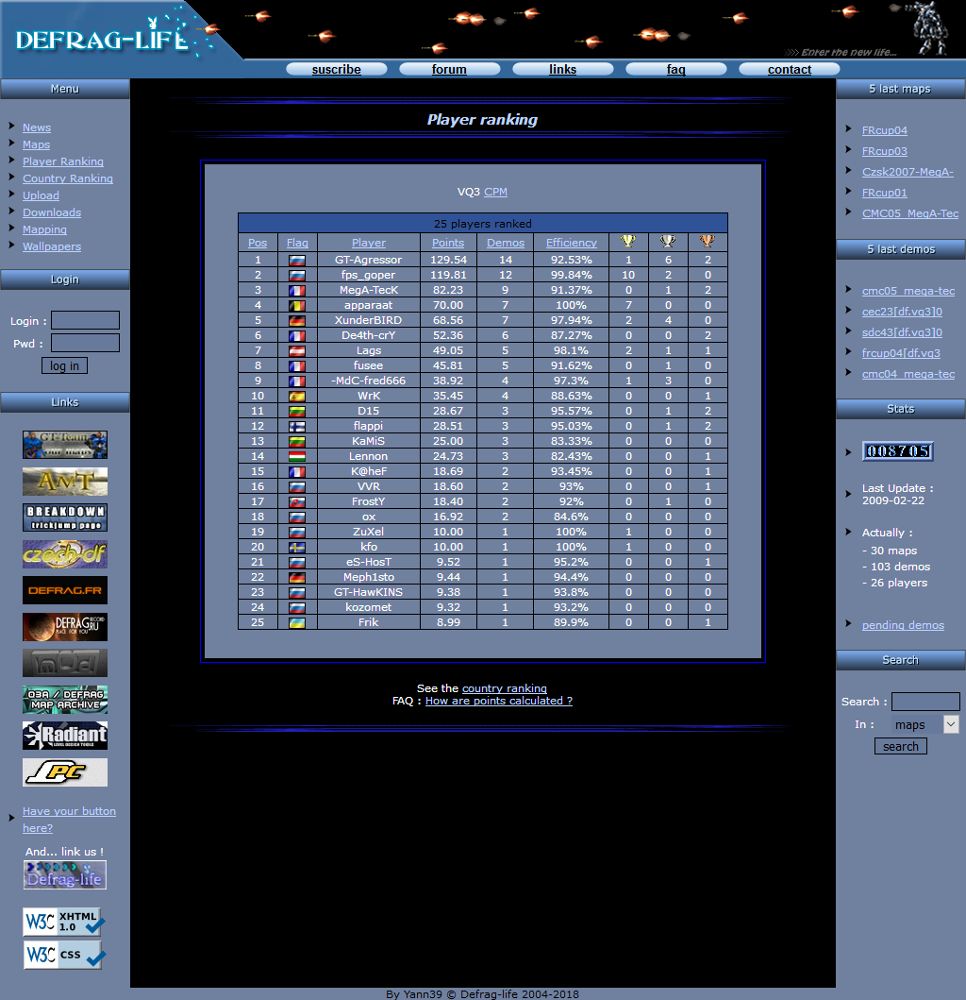

## CCTeam


Create a directory to hold the app :

```bash
mkdir /opt/apps/ccteam
cd /opt/apps/ccteam
```

Create the _Dockerfile_ and _docker-compose.yml_ files based on the files in the _ccteam_ folder in this project.

> [!NOTE]
> The application container joins the `prometheus-ccteam-net` network, created by the Prometheus stack : start
[Prometheus](#prometheus) first, or remove that network from the _docker-compose.yml_ file if you do not monitor the
API.

In the same directory, create a _.env_ file to hold the environment variables :

```env
MARIADB_ROOT_PASSWORD=<root_password>
MARIADB_DATABASE=<db_name>
MARIADB_USER=<username>
MARIADB_PASSWORD=<password>
MAIL_SERVER_HOST=<mail_server_host>
MAIL_SERVER_PORT=<mail_server_port>
MAIL_SERVER_USERNAME=<mail_server_username>
MAIL_SERVER_PASSWORD=<mail_server_password>
JWT_SECRET=<jwt_secret>
JWT_EXPIRATION_TIME=<jwt_expiration_time>
```

Move the application JAR file (_ccteam-graphql.jar_) into the current directory.

Start :

```bash
sudo docker-compose up -d
```

This will create 2 containers :

- A container holding the **MariaDB** database
- A container holding the **Java** application (based on the provided _Dockerfile_), exposed on port **5001**

Then the API is available at : https://ccteam.example.com/ccteam-gql/graphql

You will get access denied as you need a valid **JWT token**, but it confirms that the service is running correctly :

```json
{
  "errors": [
    {
      "cause": null,
      "stackTrace": null,
      "extensions": {
        "errorCode": "no_token"
      },
      "errorType": "DataFetchingException",
      "locations": null,
      "message": "Full authentication is required to access this resource",
      "path": null,
      "suppressed": [],
      "localizedMessage": "Full authentication is required to access this resource"
    }
  ],
  "data": null
}
```

# Scale to zero with Sablier


Some of our services will be accessed quite rarely (i.e. UIs of monitoring tools, websites open only to family through
VPN, etc.), it would be a shame to leave them running for days and waste resources while there are no requests, wouldn't
it ?

That's why we're going to use **Sablier**, a little tool that lets you start / stop containers on demand (also known as
"scale-to-zero").
Basically it allows to start a container when a request arrives, and stop it after a period of inactivity.

Sablier provides 2 strategies, a **dynamic strategy** which provides a waiting page while the container is not ready,
and a **blocking strategy** which hangs the request until the container is ready.

We will use the dynamic strategy, well suited for a user that would access a frontend directly and expects to see a
loading page.
The blocking strategy is better suited for API communication.

Basically here is how it works when using the dynamic strategy with Traefik :

```mermaid
flowchart LR
    style INCOMING_REQUEST fill: #205566, color: #fff
    style TRAEFIK_CONTAINER fill: #663535, color: #fff
    style SABLIER_CONTAINER fill: #663535, color: #fff
    style APP_CONTAINER fill: #663535, color: #fff
    style TRAEFIK_MIDDLEWARE fill: #806030, color: #fff
    DOCKER_SABLIER_PORT{{10000/tcp}}
    DOCKER_APP_PORT{{myapp port}}
    WAITING_PAGE(waiting page)
    TRAEFIK_MIDDLEWARE_APP(sablier-myapp)
    INCOMING_REQUEST((INCOMING<br/>REQUEST))
    INCOMING_REQUEST --> TRAEFIK_MIDDLEWARE_APP

    subgraph SABLIER_CONTAINER[SABLIER CONTAINER]
        DOCKER_SABLIER_PORT
        WAITING_PAGE
    end

    subgraph APP_CONTAINER[APP CONTAINER]
        DOCKER_APP_PORT
    end

    subgraph TRAEFIK_CONTAINER[TRAEFIK CONTAINER]
        subgraph TRAEFIK_MIDDLEWARE[TRAEFIK MIDDLEWARES]
            TRAEFIK_MIDDLEWARE_APP
        end

        TRAEFIK_MIDDLEWARE_APP -.->|request session status| DOCKER_SABLIER_PORT
        DOCKER_SABLIER_PORT -.->|" return status header "| TRAEFIK_MIDDLEWARE_APP
        TRAEFIK_MIDDLEWARE_APP -->|" ready "| DOCKER_APP_PORT
        TRAEFIK_MIDDLEWARE_APP -->|" not ready "| WAITING_PAGE
        DOCKER_APP_PORT -.->|return instance status| DOCKER_SABLIER_PORT
        DOCKER_SABLIER_PORT -.->|" check instance status "| DOCKER_APP_PORT
    end
```

When a request arrives, a **Traefik middleware** is responsible to contact Sablier to know if the target container is
ready or not.
Sablier asks for the container status to the **Docker provider**, then return the result to the proxy, to either serve
the waiting page or redirect to the application.
It is done through a `X-Sablier-Status` request header value :

```mermaid
sequenceDiagram
    User ->> Proxy: Website Request
    Proxy ->> Sablier: Reverse Proxy Plugin Request Session Status
    Sablier ->> Provider: Request Instance Status
    Provider -->> Sablier: Response Instance Status
    Sablier -->> Proxy: Returns the X-Sablier-Status Header
    alt X-Sablier-Status` value is `not-ready`
        Proxy -->> User: Serve the waiting page
        loop until `X-Sablier-Status` value is `ready`
            User ->> Proxy: Self-Reload Waiting Page
            Proxy ->> Sablier: Reverse Proxy Plugin Request Session Status
            Sablier ->> Provider: Request Instance Status
            Provider -->> Sablier: Response Instance Status
            Sablier -->> Proxy: Returns the waiting page
            Proxy -->> User: Serve the waiting page
        end
    end
    Proxy -->> User: Content
```

As you see it continuously checks for instance status until it is ready, and will intend to start the underlying
container if not started, or shut it down if it has reached the configured period of inactivity.

> [!NOTE]
> Note that you need one plugin configuration (one middleware) per application set if you want to start/stop them
independently or if you want to have different theme, display name, loading strategy or session duration.
> In the flow chart above, `sablier-app` is a dedicated middleware for "myapp" application, but you could have several
of them.

## Install Sablier

**Sablier** can be installed using the binary distribution, or through Docker.
We will use the Docker image.

### Setting up

Create a folder to hold the configuration :

```bash
sudo mkdir /opt/apps/sablier
```

Then copy the _docker-compose.yml_ file from this project's _sablier_ directory into the _/opt/apps/sablier_ directory.

### Details

#### Service definition

:page_facing_up: _docker-compose.yml_ :

```yaml
version: "3.7"

services:
  sablier:
    image: sablierapp/sablier:latest
    container_name: sablier
    volumes:
      - /var/run/docker.sock:/var/run/docker.sock
    restart: unless-stopped
    command:
      - start
      - --provider.name=docker
    networks:
      - sablier-net
      - traefik-net
    labels:
      - "traefik.enable=true"
      # here we will add middleware configuration, see later in this guide

networks:

  sablier-net:
    name: sablier-net

  traefik-net:
    name: traefik-net
    external: true
```

Essentially :

- We bind the Docker **socket** to the container because the Docker provider communicates with the _docker.sock_ socket
  to start and stop containers on demand
- We specify the command to start the server with the parameter to set the provider name (docker)
- It runs in its own **network** (`sablier-net`) but must also share the same network as Traefik (`traefik-net`) so it
  can be discovered

## Install Traefik plugin

There are **plugins** available for easier integration with major reverse proxies, Traefik in particular.
Sablier is designed as an API that can be used on its own, reverse proxy integrations acts as a client of that API.

Thus, simply add the following into the Traefik static configuration file (_traefik.yml_) to load the plugin :

```yaml
experimental:
  plugins:
    sablier:
      moduleName: "github.com/sablierapp/sablier"
      version: "v1.7.0"
```

You can take a look at the _apps/traefik/traefik.yml_ file from this repository.

## Configure target applications

In order for Sablier to be able to contact the containers to start and stop them, we need to change the configuration of
the target service to use a **dynamic configuration file** instead of **Docker labels**.
Indeed, Traefik no longer has access to container labels when a container is not running.

We will configure Sablier for the Dashdot application as an example, but it can be applied to any container :

```mermaid
flowchart LR
    style INCOMING_REQUEST fill: #205566, color: #fff
    style TRAEFIK_CONTAINER fill: #663535, color: #fff
    style SABLIER_CONTAINER fill: #663535, color: #fff
    style DASHDOT_CONTAINER fill: #663535, color: #fff
    style TRAEFIK_ROUTER fill: #806030, color: #fff
    style TRAEFIK_MIDDLEWARE fill: #806030, color: #fff
    style SERVER_DEVICE fill: #665555, color: #fff
    style CONTAINER_ENGINE fill: #664545, color: #fff
    DOCKER_TRAEFIK_PORT443{{443/tcp}}
    DOCKER_TRAEFIK_PORT80{{80/tcp}}
    DOCKER_SABLIER_PORT{{10000/tcp}}
    DOCKER_DASHDOT_PORT{{3001/tcp}}
    WAITING_PAGE(Waiting page)
    TRAEFIK_ROUTER_APP(dashdot.example.com)
    TRAEFIK_MIDDLEWARE_REDIRECT(HTTPS redirect)
    TRAEFIK_MIDDLEWARE_DASHDOT(sablier-dashdot)
    INCOMING_REQUEST((INCOMING<br/>REQUEST))
    INCOMING_REQUEST --> DOCKER_TRAEFIK_PORT443
    INCOMING_REQUEST --> DOCKER_TRAEFIK_PORT80

    subgraph SERVER_DEVICE[MINI_PC]
        subgraph CONTAINER_ENGINE[DOCKER]
            subgraph SABLIER_CONTAINER[SABLIER CONTAINER]
                DOCKER_SABLIER_PORT
                WAITING_PAGE
            end

            subgraph DASHDOT_CONTAINER[DASHDOT CONTAINER]
                DOCKER_DASHDOT_PORT
            end

            subgraph TRAEFIK_CONTAINER[TRAEFIK CONTAINER]
                DOCKER_TRAEFIK_PORT443 --> TRAEFIK_ROUTER
                DOCKER_TRAEFIK_PORT80 ---> TRAEFIK_ROUTER

                subgraph TRAEFIK_ROUTER[TRAEFIK HTTP ROUTER]
                    TRAEFIK_ROUTER_APP
                end

                subgraph TRAEFIK_MIDDLEWARE[TRAEFIK MIDDLEWARES]
                    TRAEFIK_MIDDLEWARE_REDIRECT
                    TRAEFIK_MIDDLEWARE_DASHDOT
                end

                TRAEFIK_MIDDLEWARE_REDIRECT --> TRAEFIK_MIDDLEWARE_DASHDOT
                TRAEFIK_MIDDLEWARE_REDIRECT -.-> DOCKER_TRAEFIK_PORT443
                TRAEFIK_ROUTER_APP --> TRAEFIK_MIDDLEWARE_REDIRECT
                TRAEFIK_MIDDLEWARE_DASHDOT -->|check status| DOCKER_SABLIER_PORT
                DOCKER_SABLIER_PORT -->|return status| TRAEFIK_MIDDLEWARE_DASHDOT
                TRAEFIK_MIDDLEWARE_DASHDOT -->|ready| DOCKER_DASHDOT_PORT
                TRAEFIK_MIDDLEWARE_DASHDOT -->|not ready| WAITING_PAGE
            end

        end
    end
```

In the above flow chart we have named the Traefik middleware `sablier-dashdot` because it is specific to the Dashdot
application, but you can absolutely create one to manage several services, or one for each service.

So let's transfer the labels from the service configuration file to a file in our Traefik dynamic configuration.
I personally use a file per service, for example for Dashdot, the configuration will be held in a file _dashdot.yml_ in
the dynamic folder :

Note that you need to define a volume to bind Traefik dynamic configuration to the container,
in addition to the static configuration (simply create a _dynamic_ folder in _/opt/apps/traefik_) :

```bash
sudo mkdir /opt/apps/traefik/dynamic
sudo vi /opt/apps/traefik/dynamic/dashdot.yml
```

Then add the volume in the Traefik service configuration (_docker-compose.yml_) :

```yaml
volumes:
  - ./dynamic:/etc/traefik/dynamic:ro
```

So Traefik will handle every YAML file placed in the _dynamic_ directory.

That's it, the following labels :

```yaml
    labels:
      - "traefik.enable=true"
      - "traefik.http.routers.dashdot.rule=Host(`dashdot.example.com`)"
      - "traefik.http.routers.dashdot.entrypoints=websecure"
      - "traefik.http.routers.dashdot.tls.certresolver=default"
      - "traefik.http.routers.dashdot.middlewares=vpn-whitelist"
      - "traefik.http.services.dashdot.loadbalancer.server.port=3001"
      - "traefik.docker.network=traefik-net"
```

becomes the following inside _dashdot.yml_ :

```yaml
http:
  services:
    dashdot:
      loadBalancer:
        servers:
          - url: http://dashdot:3001

  routers:
    dashdot:
      rule: 'Host(`dashdot.example.com`)'
      entryPoints:
        - websecure
      tls:
        certResolver: default
      service: dashdot
      middlewares:
        - vpn-whitelist@docker
        - sablier-dashdot@docker
```

As you see, the only thing we added is the `sablier-dashdot` **middleware** reference, which defines the strategy to use
to respond to any incoming HTTP request when the corresponding container is not running :

Then add the labels for the `sablier-dashdot` middleware configuration into the `sablier` service configuration
(_docker_compose.yml_ file) :

```yaml
    labels:
      - "traefik.enable=true"
      # Dashdot
      - "traefik.http.middlewares.sablier-dashdot.plugin.sablier.names=dashdot"
      - "traefik.http.middlewares.sablier-dashdot.plugin.sablier.sablierUrl=http://sablier:10000"
      - "traefik.http.middlewares.sablier-dashdot.plugin.sablier.sessionDuration=5m"
      - "traefik.http.middlewares.sablier-dashdot.plugin.sablier.dynamic.theme=hacker-terminal"
      - "traefik.http.middlewares.sablier-dashdot.plugin.sablier.dynamic.displayName=Dashdot"
      - "traefik.http.middlewares.sablier-dashdot.plugin.sablier.dynamic.refreshFrequency=1s"
      - "traefik.http.middlewares.sablier-dashdot.plugin.sablier.dynamic.showDetails=true"
```

Add here any other middleware that would need a different configuration for other services.

Basically, it defines a **Traefik middleware** to configure the Sablier plugin to :

- Provide the name of the service (s) to be checked
- The URL to Sablier
- The session duration (will stop the container after that period)
- The theme for the waiting page
- The display name of the target service (s), to be displayed on the waiting page
- The refresh frequency of the waiting page
- Show the loading instances details

Here is how the "hacker-terminal" waiting page looks like while starting the Dashdot container :


# Backup

We have so far set up a structure with a folder per stack/container (in _/opt/apps_).
That way each stack definition (Docker Compose file) and bind mount data is fully contained in that single folder.

The only exception is **named volumes**, which store data in the _/var/lib/docker/volumes_ directory.
This includes the databases of some applications, which could also be backed up separately using the tool associated
with the database management system.

This is the only data that really concerns us, thanks to Docker, the system has hardly been modified at all, so there's
no need to back it up completely (like doing entire system image backup).

So there are three things we have to worry about in terms of backup :

- the content of the _/opt/apps_ directory, holding services configuration and containers bound data
- the content of the _/var/lib/docker/volumes_, holding the Docker container named volumes data
- the databases (i.e. MySQL for Defrag-Life website, MongoDB for Ackee application, ...)

Later we can even place volume backups and database exports in the _/opt/apps_ directory so that we can back up
everything in one place easily.

## Files

### Rsync


The simplest way to back up the content of our N100 server is by using `rsync`.

`rsync` (remote sync) is a utility for **transferring** and **synchronizing** files between a computer and a storage
drive and across networked computers by comparing the modification times and sizes of files.

We can use it to copy the file system (actually only required files) to another machine (such as a Windows computer on
the local network, or any external drive connected to it) through a mount point.

1. First, make sure to have a folder on the machine that will hold the backup (Windows in my case) that is shared and
   have enough storage for the server backup :

    - Create a folder to hold the backup data (i.e. _E:\data\N100 backup_),
    - Right-click on the folder
    - Select _Properties > Sharing tab_
    - Click _Share..._ and choose the user with whom you want to share the folder (you can either use your default
      Windows user or create a specific user for that)
    - Assign the appropriate permissions (at least Read access).
    - Click Share, then Done.
    - Take note of the network path of the share (i.e. \\DESKTOP-ABCDEF\N100 backup).

2. Secondly, mount the shared Windows folder on the server :

   To mount a Windows share, you need to install the _cifs-utils_ package :

   ```bash
   sudo apt install cifs-utils
   ```

   Then create a directory where you will mount the shared folder. For example:

   ```bash
   sudo mkdir /mnt/windows
   ```

   And mount the shared folder from the Windows machine to the server :

   ```bash
   sudo mount -t cifs -o username=my_windows_user "//DESKTOP-ABCDEF/N100 backup" /mnt/windows
   ```

   Explanation:
    - `-t cifs`: Specifies that you’re using the **CIFS** protocol
    - `//DESKTOP-ABCDEF/N100 backup`: The network path to the Windows share
    - `/mnt/windows`: The mount point on the server

   > [!NOTE]
   > You can create a file to hold the credentials for authentication, instead of specifying it in the command line
   > (so you can protect the credentials file by setting the appropriate permissions),
   > this can be done by using the `-o credentials` option of the `mount` command

3. Finally, use `rsync` to synchronize the files to the mount point :

   Install `rsync`:

   ```bash
   sudo apt install rsync
   ```

   Then either sync all the file system or only some folders :

   ```bash
   # all file system with some exceptions
   sudo rsync -aAXv --exclude={"/dev/*","/proc/*","/sys/*","/tmp/*","/run/*","/mnt/*","/media/*","/lost+found"} / /mnt/windows
   # only specified paths
   sudo rsync -aAXv /home /opt/apps /var/lib/docker/volumes /var/log /mnt/windows
   ```

   Explanation:
    - `-aAXv`: Preserve permissions, ownership, timestamps, and device files, with verbose output
    - `--exclude`: Exclude certain directories
    - `/`: The root of the server, to be backed up (without excluded directories)
    - `/home /opt/apps /var/lib/docker/volumes /var/log`: The 4 directories to be backed up
    - `/mnt/windows`: The mount point on the server

Once the backup is complete, you can verify that the backup files are on the destination machine and that they contain
all your server data.

> [!NOTE]
> If you want to make a bit-for-bit clone of your entire disk, you can use the `dd` command.
> However, it requires more storage and time, for the time being I prefer `rsync` for flexibility, file-based backups,
and faster cloning of only necessary files

### FreeFileSync


Another solution than [rsync](#rsync) is to simply use a tool from the Windows machine, to copy the _/opt/apps_ folder
regularly through **SFTP**.

One awesome tool which I've been using for years for synchronizing my disks, is named **FreeFileSync**.

**FreeFileSync** is a **folder comparison** and **synchronization** software that creates and manages backup copies of
target files.
Instead of copying every file every time, FreeFileSync determines the differences between a source and a target folder
and transfers only the minimum amount of data needed.

Source and target folders can be **remote** folders (support for **Google Drive** and **FTP/SFTP**).

FreeFileSync is Open Source software, available for Windows, macOS, and Linux.

I will install the Windows version on my home Windows machine, which will be used as client to connect to the Banana Pi
board through SFTP (SSH File Transfer Protocol, allows secure file transfer trough SSH encrypted connections).

To do a mirror synchronization :

1. Download the software for your operating system at https://freefilesync.org/
2. Install and start it
3. Choose left and right folders :

   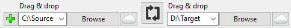

   Click the cloud icon to connect to the Banana Pi board via SFTP and select the _/opt/apps_ folder

4. Compare them :

   

5. Adapt synchronization settings if needed :

   

6. Start synchronization :

   

Refer to the documentation and tutorials on the software's website for more information.

## Volumes

### Backup

We can back up Docker volumes using `docker run` and `tar` command.
This method involves creating a temporary container that mounts the named volume we want to back up, then using tar to
produce an archive of the volume content.

For example to back up the Portainer volume `portainer-vol` to the current directory :

```bash
sudo docker run --rm --mount source=portainer-vol,target=/mybackup -v $(pwd):/backup busybox tar cvf /backup/portainer-vol-backup.tar /mybackup
```

- `--rm` will remove the container when it exits
- `--mount source=portainer-vol,target=/mybackup` will mount the `portainer-vol` volume to the container mount point
  `/mybackup`
- `-v $(pwd):/backup` bind mount the current directory into the container's `backup` directory to write the tar file to
- `busybox` is an image of a lightweight Linux distribution with basic Unix utilities, good for that kind of quick
  maintenance
- `tar cvf /backup/portainer-vol-backup.tar /mybackup` will create an uncompressed tar file of all the files in the
  `/mybackup` directory

This will create a _portainer-vol-backup.tar_ archive in the current directory.
The tar will contain a _mybackup_ directory containing all volume data.

Then feel free to move it to the _/opt/apps/portainer_ directory if you want to back it up along with that directory
when using FreeFileSync (see [Files](#files)), or simply move the backup file to an external server.

> [!IMPORTANT]
> Some services may need to be stopped during backup or restore to ensure data consistency

### Restore

To restore the volume :

1. Create a new container (this represents the container in which you wish to restore the backup) :

   ```bash
   sudo docker create -v /data --name newcontainer busybox /bin/bash
   ```

2. Untar the backup files into the new container volume :

   ```bash
   sudo docker run --rm --volumes-from newcontainer -v $(pwd):/backup busybox tar -xvf /backup/portainer-vol-backup.tar --strip 1 -C /data
   ```

- `--rm` will remove the container when it exits
- `--volumes-from newcontainer` mounts all the volumes from the `newcontainer` container into the new container being
  started
- `-v $(pwd):/backup` bind mount the current directory into the container's `/backup` directory to write the tar file to
- `busybox` is an image of a lightweight Linux distribution with basic Unix utilities, good for that kind of quick
  maintenance
- `tar xvf /backup/portainer-vol-backup.tar --strip 1 -C /data` will extract the files from the tar archive in the
  `/data` directory of the container's filesystem (without the parent directory thanks to `--strip 1`)

Finally, you can compare the 2 volumes content to check that everything has been copied correctly :

```bash
sudo diff -qr /var/lib/docker/volumes/portainer-vol /var/lib/docker/volumes/0862be139e8b9e8137c02005739071d2338fd04f6090b8a89d6b5012fc5fb33a
```

## Databases

When applicable, we can also back up the database directly.

### MySQL

For **MySQL**, we can use **mysqldump**, a command-line utility that is used to generate or restore logical backups of
MySQL databases.

To export data :

```shell
mysqldump --complete-insert --skip-comments --skip-tz-utc --skip-opt --hex-blob --no-set-names --set-charset --column-statistics=0 --set-gtid-purged=OFF -P 3306 -h localhost -u <user> -p <dbname> > db_backup.sql
```

If you don't have the **mysqldump** utility installed on your environment, you can use the one embedded in the MySQL
container :

```shell
docker exec <container_id> /usr/bin/mysqldump --complete-insert --skip-comments --skip-tz-utc --skip-opt --hex-blob --no-set-names --set-charset --column-statistics=0 --set-gtid-purged=OFF -P 6033 -h prdmysql.unil.ch -u <user> --password=<password_here> <dbname> > db_backup.sql
```

> [!IMPORTANT]
> Again there is a slight chance that a database gets inconsistent when backing up hot files, so prefer to stop services
before proceeding, but in a home lab with minimal load this is usually not an issue

To import data :

```shell
mysql -P 3306 -h localhost -u <user> -p <dbname> < db_backup.sql
```

Or again if you don't have the **mysqldump** utility installed on your environment, you can use the one from the MySQL
container :

```shell
docker exec -i <container_id> /usr/bin/mysql -P 3306 -h localhost -u <user> --password=<password_here> <dbname> < db_backup.sql
```

# Contributing

You are invited to contribute fixes or updates.
I'm also open to any criticism or suggestion for improvement.

Please familiarize yourself with the README file before attempting a pull request.
Also make sure to not include any sensitive information.

You can also simply fork the project and continue on your own.

# Acknowledgments

Mainly :

- Some cool **GitHub** projects related to self-hosting :
    - https://github.com/awesome-selfhosted/awesome-selfhosted
    - https://github.com/awesome-foss/awesome-sysadmin
    - https://github.com/mikeroyal/Self-Hosting-Guide
- Various threads on **Reddit**, but especially in :
    - [r/selfhosted](https://www.reddit.com/r/selfhosted/)
    - [r/homelab](https://www.reddit.com/r/homelab/)
    - [r/pihole](https://www.reddit.com/r/pihole/)
    - [r/raspberry_pi](https://www.reddit.com/r/raspberry_pi/)
- **StackExchange** network (particularly **Stack Overflow**, **Superuser**, and **Server Fault**):
    - [Q&A communities](https://stackexchange.com/sites)
- Blog post about WireGuard performance tuning :
    - https://www.procustodibus.com/blog/2022/12/wireguard-performance-tuning/
- Lots of **Google** searches
- Recently some AI for WireGuard and CrowdSec tweaks, mainly Claude (Opus/Fable)

Of course every upstream project (especially the ones with good documentation :grin:) also deserve credit :beer:

# License

Please refer to the license of each product mentioned in this guide.

Otherwise, the **GPL v3** license applies.

[General Public License (GPL) v3](https://www.gnu.org/licenses/gpl-3.0.en.html)

This program is free software: you can redistribute it and/or modify it under the terms of the GNU
General Public License as published by the Free Software Foundation, either version 3 of the
License, or (at your option) any later version.

This program is distributed in the hope that it will be useful, but WITHOUT ANY WARRANTY; without
even the implied warranty of MERCHANTABILITY or FITNESS FOR A PARTICULAR PURPOSE. See the GNU
General Public License for more details.

You should have received a copy of the GNU General Public License along with this program. If not,
see <http://www.gnu.org/licenses/>.